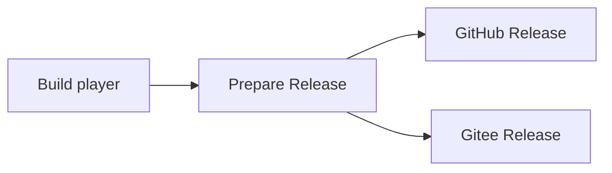

# 手动构建

## 测试子模块

测试源码由 [TTPlayer_Tests](https://github.com/Sonic853/TTPlayer_Tests) 独立管理，
通过子模块放在本仓库的 `tests/` 中。在本仓库根目录（本地即 `rebuild`）执行：

```powershell
git submodule update --init --recursive -- tests
```

子模块使用 SSH 地址，需要配置 GitHub SSH 访问。测试沿用父仓库的 CMake 目标和
相对路径；获取测试源码后按需启用 `BUILD_TESTING` 或对应的独立测试选项。
部分测试还依赖本地 `tools/`、反编译输入或原版运行资源。
默认播放器构建和 Actions 仍关闭测试，不需要检出测试子模块。

## GitHub Actions

### 默认使用最新 TTPCOMM

手动构建的 `ttpcomm_version` 默认值为 `latest`；省略或留空也使用
TTPlayerComm 的最新正式 Release。仍可填写日期版本（例如 `2026.10.08p3`）固定核心版本。
普通构建、GitHub 发布和 Gitee 发布均下载并打包 `ttpcomm.dll`，下载失败或校验失败时停止构建。

下载沿用 ZIP/DLL SHA256、导出 ABI 和 XP／Win7 导入校验，实际核心版本及摘要记入
`build-info.json`。`latest` 指已发布的正式版本，不包含草稿、预发布或尚未发布的源码修改。

新版播放器要求 `ttpcomm_query_runtime`（ordinal 501）的运行 ABI 1；必须先发布带该接口的
TTPlayerComm，再运行播放器构建。旧核心或缺少核心会使打包失败。首次升级按已确认方式
手动替换完整发行包，详见 [核心运行接口与体积优化](TTPCOMM_REQUIRED_RUNTIME.md)。

本地 `TTPLAYER_STAGE_RUNTIME=ON` 时，默认从同级 `ttpcomm/build/Release/ttpcomm.dll`
复制重建核心；先构建该项目，或用 `TTPLAYER_TTPCOMM_DLL` 指定兼容的新核心路径。
不再自动复制工作区根目录的原版 DLL。`STAGE_RUNTIME=OFF` 仍允许独立编译，
运行和打包前需要显式准备经校验的核心。

### GitHub API 认证

在仓库 **Settings → Secrets and variables → Actions** 配置 `GH_TOKEN` Secret。
工作流将 `${{ secrets.GH_TOKEN }}` 传给需要访问 GitHub API 的步骤：版本分配、
HTTPS／TTPCOMM 组件下载、两组插件包下载、Gitee CLI 的 GitHub Release 查询和 GitHub 发布。
缺少令牌时在构建开始即提示，避免这些请求意外使用匿名配额。
令牌需能读取上游公开 Release；勾选 GitHub 发布时还需对播放器仓库创建 Release／上传附件的权限。

HTTPS 下载脚本现在会为 API 请求添加 `Authorization: Bearer`；此前该步骤没有注入令牌，
脚本也没有读取令牌，是已确认的匿名请求遗漏。附件下载不携带令牌，跨站重定向移除认证头，
令牌不写入构建产物和来源清单。`GH_TOKEN` 与 `GITEE_TOKEN`、`GITEE_TOKEN_UPDATER` 独立。

本地验证覆盖 API 认证头、附件不携带认证、跨站重定向、403 不回退匿名、工作流令牌注入
及缺失令牌的提前检查；原 HTTPS 组件打包校验和 Actionlint 通过。测试使用虚构令牌，
仅位于 `tests/github_api_auth` 和 `tests/update`，不在 Actions 运行；未重新触发远程发布。

### Gitee 更新通道预检失败（2026-10-08 修复）

`prepare_update_access.py` 在 Configure／Build 之前运行，用于决定播放器是否需要嵌入
已允许公开分发的专用只读 `GITEE_TOKEN_UPDATER`。它不负责下载 `ttpcomm.dll`，也不使用
发布令牌 `GITEE_TOKEN` 或 GitHub 的 `GH_TOKEN`。

旧日志 `Gitee anonymous and read-only fallback probes failed` 只能说明：匿名的整条
API → 校验文件 → ZIP 探测失败，随后使用已配置令牌的探测也失败。旧代码用
`except Exception` 丢弃了具体异常，无法据此区分 HTTP 401/403/429、超时、附件不完整、
JSON/摘要解析错误或哈希不匹配；不能仅凭这条日志断定令牌失效。旧版没有重试，并把
更新服务的临时可用性设为了编译的强制前提。

本次从本机匿名访问公开 Gitee API、`2026.10.06` 的摘要和播放器 ZIP 均成功。ZIP 为
2,267,935 字节，SHA256 为
`2586a89db27d3ade6653e4d9d6033d75b6f33ec81e5d1dada310c9eb4fd4ed69`，与清单一致。
这验证了当前公开附件；不能倒推失败时 GitHub runner 的网络状态。下载实际重定向至
`foruda.gitee.com`，修复后的完整脚本亦实测通过，生成空令牌头文件。

修复后的行为：

- 按 `release-api`、`checksum`、`package` 输出失败阶段、固定错误码、HTTP 状态和尝试次数，
  不输出令牌、带凭据的 URL、服务器响应正文或原始异常文本。
- 超时、连接错误、短读、HTTP 408/425/429/5xx 最多尝试 3 次，间隔 1、2 秒。
- 仅对 401/403/404 尝试专用只读令牌，与运行时更新器规则一致；API、摘要和 ZIP 全部
  验证成功且确实使用了认证，才嵌入令牌。跨域 CDN 重定向去除认证，保留签名参数原样。
- 从最近 20 条记录选择最新完整正式版本，跳过草稿、预发布和附件尚未齐全的记录。
  空清单或没有完整版本会报告“未验证”，不会再声称已验证 ZIP。
- 摘要解析支持 BOM、空行和二进制 `*` 标记，拒绝缺失、重复或非法的目标摘要。
- Action 显式使用 `--allow-unverified-public`：服务不可达、访问被拒绝且回退仍失败、
  或暂无完整 Release 时，发出 warning 并生成空凭据头文件继续构建。未经验证的令牌
  不会进入程序。SHA256 不匹配、非法来源和畸形内容仍然失败；不传该参数则保留严格预检。
- 开始预检时清理指定输出的旧头文件，防止失败后误用上次构建的凭据；成功输出原子替换。

继续构建不表示 Gitee 服务已恢复，也不改变播放器实际下载/安装时的校验规则。发布任务
和 HTTPS／TTPCOMM 组件下载仍执行各自的校验，未设置 `continue-on-error`。

本地 15 项回归覆盖上述分支及日志脱敏，脚本位于 `tests/update/test_prepare_update_access.py`，
不进入 Actions。Python 语法、Actionlint、公开网络实测均通过。提交修复后应从包含新代码的
分支发起新的 **Run workflow**；直接重跑旧记录仍使用旧脚本。

### 构建与发布

本地 `rebuild` 是独立 Git 仓库；它在 GitHub 上就是仓库根目录。
工作流位于 `.github/workflows/manual-build.yml`，不配置 push/PR 自动触发，
默认只构建；可勾选 **Release a Version (GitHub)** 或 **Publish Release to Gitee**
在构建成功后发布版本。两个选项相互独立，可同时勾选，不推送源码。

Actions 流程图中的发布任务已分开：



`Build player` 在编译前分配最终版本号，再写入通用 EXE 并打包；勾选 Gitee 时
在此下载上游最新正式版 CLI，用于查询已有版本并随 Artifact 传递。
`Prepare Release` 校验构建版本及附件、生成说明，通过同一份 Artifact 交给两个发布任务。
`GitHub Release`、`Gitee Release` 分别按对应勾选项运行，同时勾选时并行发布，
各自显示成功或失败状态；其中一个发布失败不会阻止另一个发布任务。
准备任务失败时，两边都不会开始发布。

1. 将工作流及配套构建文件提交到远程仓库的默认分支。
2. 打开 **Actions → Manual Windows Build → Run workflow**。
3. 选择分支，配置固定为 `Release`（VC-LTL 发布运行库）。
4. 构建完成后，从该次运行的 **Artifacts** 下载
   `TTPlayer-Windows-x86-配置-运行编号`，产物保留 14 天。
   其中包含通用包 `TTPlayerRebuild-版本号.zip`，日期取构建开始时的北京时间；
   勾选发布时，名称包含最终分配的 `pN` 补丁号。

如需发布，选择 `Release` 配置并勾选对应平台，不需要输入版本号。
在构建任务开始时记录北京时间（UTC+08:00）的日期，版本号和 Release 标题使用
`yyyy.MM.dd`（例如 `2026.09.05`，不加 `v`）。同一天已有 tag 或 Release 时，按当天
最大补丁号加一：`2026.09.05` → `2026.09.05p1` → `2026.09.05p2`，不复用中间空号。
草稿 Release 也占用版本号。勾选发布的工作流共用并发锁，锁覆盖构建、准备及两个
发布任务，避免准备结束后另一次运行分配到相同版本号。只构建的运行保持独立。
构建任务在编译前、并发锁内分页读取全部
GitHub tag/Release；勾选 Gitee 时还会分页读取 Gitee tag/Release，把两边已有
版本一起计入占用范围。两个平台同时发布时使用同一个新版本号和相同附件。
新标签始终指向本次构建提交，不移动旧标签、不覆盖已有 Release。
通用构建只生成 Release。Release 附件为 `TTPlayerRebuild-版本号.zip`、
`CodecAddIn-Rebuild-版本号.zip`、`ExtraAddIn-版本号.zip`，以及记录三个 ZIP
校验值的 `SHA256SUMS.txt`，不再额外构建或分发 XP-Win7 专用包。
两组插件包仅在勾选 GitHub 或 Gitee 发布时生成；从各插件仓库最新正式 Release 下载，
校验包内外 SHA-256、x86 架构与 XP／Win7 导入后打包。I18n 的翻译资源随 ExtraAddIn 分发。
具体仓库、文件布局、来源记录和本地命令见 [Release 插件包](ADDIN_RELEASE_BUNDLES.md)。
例如 `2026.09.05p1` 对应 `TTPlayerRebuild-2026.09.05p1.zip`。EXE 文件版本、产品版本、
ZIP 名称、校验清单及正文说明保持一致；包内程序名仍为 `TTPlayerRebuild.exe`。
**XP SP3／Win7／Win10／Win11 使用同一份 EXE**，由实际系统版本与组件可用性选择功能。
Win10／11 上保留 [SMTC 系统媒体控件](SMTC.md)，XP／Win7 在进入 WinRT 前跳过该模块。
构建与功能矩阵见 [通用构建调整记录](UNIFIED_WINDOWS_BUILD.md)。
完整更新日志链接自动使用仓库中最近的版本 tag 与本次新 tag 对比，例如
`compare/2026.09.05...2026.09.05p1`。历史版本 tag 必须符合 `yyyy.MM.dd` 或
`yyyy.MM.ddpN`，按日期和数值补丁号排序（`p10` 晚于 `p2`），不依赖 API 返回顺序。
若还没有符合规则的历史 tag，则链接到 `commits/本次版本`，不生成无效对比链接。
只发布 Gitee 时，GitHub 更新日志链接的终点使用本次提交 SHA，因为该操作
不会在 GitHub 上创建同名 tag。
正文安装说明统一使用通用包，不自动追加 GitHub 生成的说明。

### EXE 文件属性

通用版 `TTPlayerRebuild.exe` 包含 Windows `VERSIONINFO` 资源：

| 字段 | 内容 |
| --- | --- |
| 作者（自定义 `Author` 字段） | `Sonic853` |
| 公司（`CompanyName`） | `Sonic853` |
| 备注（`Comments`） | `作者：Sonic853` |
| 文件说明 | `千千静听 社区版` |
| 文件版本、产品版本 | Actions 最终版本，例如 `2026.09.23p12` |
| 产品名称、内部名称 | `TTPlayerRebuild` |
| 原始文件名 | `TTPlayerRebuild.exe` |

资源管理器对 EXE 通常显示公司、备注等标准版本字段，未必显示自定义作者字段。
固定数值版本使用四个 16 位无符号整数：上述例子对应 `2026.9.23.12`；
无补丁号时第四段为 `0`，补丁号最大为 `65535`。字符串版本保留日期补零及 `pN`。
字段格式参见 [Microsoft VERSIONINFO 文档](https://learn.microsoft.com/en-us/windows/win32/menurc/versioninfo-resource)。

Actions 在编译前将版本传入 `TTPLAYER_BUILD_VERSION`，打包前核对通用 EXE 的
字符串版本、数值版本、作者公司和文件说明。构建与发布之间不再修改版本或重命名 ZIP。
只构建、不发布时，版本使用北京时间日期，不查询远程版本。

本地默认使用每次构建时的北京时间日期；也可指定与 Actions 相同格式的版本：

```powershell
cmake -S . -B build "-DTTPLAYER_BUILD_VERSION=2026.09.23p12"
cmake --build build --config Release --target ttplayer_rebuild --parallel 4
# 清除固定版本，恢复按北京时间自动生成。
cmake -S . -B build "-DTTPLAYER_BUILD_VERSION="
```

生成脚本验证真实日期及数值范围；版本未变化时不重复写入资源，避免无意义的重新链接。
该资源只编入播放器 EXE，不增加运行时依赖，也不改变“选项 → 关于”的构建日期格式。
本地验证脚本 `tests/cmake/test_file_version.ps1` 检查生成规则及实际 EXE 的作者和版本；
`tests/cmake/test_manual_release.ps1` 覆盖编译前版本分配、同日补丁号、实际打包和模拟发布。
测试仅在本地运行，Actions 继续使用 `BUILD_TESTING=OFF`。

### Gitee 发布

在仓库 **Settings → Secrets and variables → Actions** 配置：

- `GITEE_REPO`：目标仓库的 `owner/repo`；CLI 也接受完整 Gitee 仓库 URL。
- `GITEE_TOKEN`：对目标仓库有 Release 创建和附件上传权限的 Gitee 令牌。

已配置这两个 secrets 后，运行工作流时选择 `Release`，勾选
**Publish Release to Gitee** 即可；无需同时勾选 GitHub 发布。
工作流只接受 Release，传入其它配置会在构建前报错。

目标 Gitee 仓库必须已经包含本次 GitHub 构建的提交 SHA，例如通过已有镜像同步。
发布命令显式传入该 SHA，避免 Release 标签与二进制所用源码不一致；工作流不
推送源码，也不自动改用 Gitee 分支的最新提交。Gitee 缺少该提交时，需先完成同步。

工作流使用 [gitee-release-cli-rust 最新正式版](https://github.com/Sonic853/gitee-release-cli-rust/releases/latest)
提供的 `gitee-release-rs.exe`。仅勾选 Gitee 时调用
[`download_gitee_cli.ps1`](../cmake/download_gitee_cli.ps1)，通过 GitHub `/releases/latest`
动态确定版本，下载 Windows 执行文件；不固定版本，不再检出 CLI 源码或运行 Cargo。
下载前检查附件来源和大小，下载后核对 GitHub 提供的 SHA-256，并用 `--version` 检查启动。
GitHub Token 只用于查询 API；Gitee 发布令牌仍通过环境变量注入，不放在命令参数中。

同一次工作流只解析一次最新版本。版本、Release／附件 ID、下载地址、大小和摘要记录在
`artifact/cli/gitee-cli.json`，与 EXE 和校验脚本一起通过 Artifact 传递；准备任务和
Gitee 发布任务使用 `-VerifyOnly` 再次验证，不重新下载，以保证版本查询与发布使用同一份 CLI。
这些构建工具不会进入播放器 ZIP、两个插件 ZIP 或最终的四个 Release 附件。

先创建 Release，校验返回的 ID 和 tag，再使用该 ID 上传播放器 ZIP、两组插件 ZIP 与 `SHA256SUMS.txt` 共四个附件。创建或任一上传失败都会使任务失败，不会自动删除
已经成功发布的版本或覆盖旧附件。日志会记录成功创建的 Release ID，便于补传
缺失附件；重新运行整套发布流程会分配下一个可用版本号。
仅重跑失败的发布任务则继续使用原准备任务输出的版本及 Artifact，不重新分配版本。
若远程 Release 已创建但附件不完整，仍需按日志中的 ID 补传，不自动覆盖已有版本。

本地可手动运行 `tests/cmake/test_manual_release.ps1`，离线检查北京时间边界、同日补丁号、
动态对比链接、安装说明和模拟发布保护逻辑，包括通用 ZIP 的 SHA-256 和 Release 配置，
以及 GitHub / Gitee 单独发布、同时发布、Gitee 版本占用、凭据缺失和上传失败。
同时用隔离目录实际打包、解压通用版本，检查 ZIP 内容、版本化文件名及内外校验文件。
该脚本位于测试子模块，Actions 不运行它；测试不调用远程 API，不创建标签或 Release。
2026-09-25 合并构建后，本地通过 actionlint、12 项日期／配置用例、35 项模拟发布用例
和 1 项实际 ZIP 打包用例；未执行线上发布。早期三附件 HTTP 集成记录属于合并前流程。

2026-10-06 改为下载预编译 CLI 后，已实际查询最新 Release 并下载、校验执行文件，
检查 `--version` 及 tag/release list、release create、asset upload 的参数兼容性。
本地 57 项下载断言覆盖未来版本自动跟随、重试、摘要、来源记录及跨任务复核；
工作流语法和 GitHub／Gitee 四附件模拟发布通过。测试位于 `tests/gitee_cli_download`
和 `tests/addin_bundles`，不进入 Actions。本次未调用远程发布接口。

工作流必须先存在于默认分支，手动运行入口才会显示，见
[GitHub 手动运行工作流说明](https://docs.github.com/en/actions/how-tos/manage-workflow-runs/manually-run-a-workflow)。

使用 `windows-2025-vs2026`、Visual Studio 2026、Win32/x86；不构建 x64，
因为现有 DLL/AddIn ABI 为 32 位。构建任务只有 `contents: read` 权限，
只有 `GitHub Release` 任务声明 `contents: write`，发布 CLI 使用仓库 Secret `GH_TOKEN`。
`Prepare Release` 和 `Gitee Release` 保持 `contents: read`。
官方 checkout/upload-artifact/download-artifact 动作固定到提交 SHA。GitHub 发布使用
仓库 Secret `GH_TOKEN`；Gitee 发布读取上文的两个 Gitee secrets。工作流的 `permissions`
只控制内置令牌，不会扩展自定义 `GH_TOKEN` 的权限。

`windows-2025` 已迁移到 VS 2026 镜像，因此不能再配合写死的
`Visual Studio 17 2022` 生成器。工作流明确选择 VS 2026 镜像和
`Visual Studio 18 2026` 生成器，并使用 `vswhere` 查找带 x86/x64 C++ 工具的
18.x 安装实例，显式传给 CMake。配置前检查 CMake 的生成器支持，
避免版本或 PATH 不匹配时仅出现笼统的找不到 Visual Studio 报错。
VS 2026 生成器要求 CMake 4.2 或更新版本，Runner 已提供相应工具。
参见 [GitHub 镜像迁移公告](https://github.com/actions/runner-images/issues/14017)
及 [CMake VS 2026 生成器说明](https://cmake.org/cmake/help/latest/generator/Visual%20Studio%2018%202026.html)。

所有版本统一在 `build` 构建，固定使用 YY-Thunks 1.2.2 和 VC-LTL 5.3.1，
首次配置自动下载并校验 SHA-256；Python 3 检查 XP / Win7 导入表后才允许打包。
导入报告和依赖许可保留在构建目录。构建时不改动系统 DLL，也无需安装旧 Visual Studio。

修改工作流后，请提交并在 **Run workflow** 中选择含修复的分支发起新运行；
直接 **Re-run jobs** 重跑旧失败记录仍使用旧提交中的工作流。

通用 ZIP 只包含 `TTPlayerRebuild.exe` 与 `SHA256SUMS.txt`，
包内校验文件记录该 EXE 的 SHA-256。Actions 产物还包含该 ZIP 的外层校验文件，
以及供发布步骤核对的构建信息；PDB 保留在构建目录。
**这不是包含原版运行依赖的安装包**：请把 `TTPlayerRebuild.exe` 放入已有
TTPlayer 目录，与其 `ttpcomm.dll`、`ttpres.dll`、`AddIn`、`Skin` 等一起使用。
不会上传原版 DLL、编码器、歌曲、播放列表或 `TTPlayerRebuild.xml` 等个人配置。
主 EXE 使用系统 `msvcrt.dll`，无需另外安装现代 VC++ 运行库；原版插件仍可能需要 VC++ 2012 x86。

程序从 EXE 同目录读写 `TTPlayerRebuild.xml`；仅当新文件不存在时，
自动导入同目录旧 `TTPlayer.xml`，保留旧文件且不再向其写入。
皮肤同时扫描 `Skin`、`Skin/new`（后者用于 PNG 皮肤），不递归扫描其它目录。
例如 `Skin/new/Example.skn` 的配置是 `Skin/new/Example.skn.xml`，
主配置中的皮肤标识保存为 `new\Example.skn`。内置皮肤仍使用 `Skin/Default.xml`。

“选项 → 关于”的构建日期由每次构建开始时的北京时间（UTC+08:00）生成，
格式为 `yyyy-M-d`，不使用构建机器本地时区。该日期编入 EXE，启动播放器时
不会变化。本地和 GitHub Actions 共用同一生成步骤；跨日增量构建会更新日期，
同日重复构建不重复写入生成头文件，也不需要手工改源码或重新配置 CMake。

## 逐字歌词

逐字歌词格式、显示开关和编辑快捷键见 [逐字歌词与编辑](WORD_LYRICS.md)。

## 可选翻译 DLL

`rebuild` 与 `gettext` 各自独立构建和发布。播放器构建只生成播放器，
不会编译相邻的 `gettext` 源码或复制其翻译目录；播放器安装包也不打包构建目录中
遗留的 `ttp_i18n.dll` 和 `i18n` 文件。

需要国际化时，可下载同一播放器 Release 的 `ExtraAddIn-版本号.zip`，或另行构建／下载
`gettext` 的翻译包，将 `ttp_i18n.dll` 放入 EXE 目录下的
`AddIn`，将 `i18n` 放在 EXE 旁边。语言文件直接位于 `i18n/<语言>/ttplayer.po` 或 `.mo`，
有效 MO 优先。通用版使用该 DLL；没有它时仍使用原始资源及自建文本。

“选项 → 常规”分为“选项”“命令行方式”“软件更新”三个子标签页。
Discord 歌曲信息和歌词设置位于“选项”页的“自动关闭计算机”下方。
安装翻译 DLL 后，Discord 设置下方提供“界面语言”下拉框；语言选择通过原有选项保存流程
保存，重启播放器后生效。主窗口右键菜单不再提供语言选择。

本地启用 `BUILD_TESTING=ON` 后，可通过 `TTPLAYER_I18N_TEST_DLL` 指定一份已经构建好的
DLL 绝对路径，启用 `i18n_ui_tests`。旧的无启动导入模拟 DLL 不适合通用 EXE 的静态 TLS 约束，
`i18n_startup_tests` 不注册；完整启动由真实 `ttpcomm.dll` 的隔离测试覆盖。
该选项仅用于集成测试，不会构建或分发 DLL。

## WTL 10.01 / ATL

UI 基础代码使用 WTL 10.01 和 Visual Studio ATL。安装 C++ 桌面开发工具时，须同时安装当前工具集的 ATL（x86/x64）组件；Actions 会检查该组件。

CMake 从官方发布地址下载 WTL，并固定 SHA-256 校验值。库为头文件依赖，不需要分发 WTL DLL。许可见仓库中的 `docs/licenses/WTL-MS-PL.txt`。

## Release 体积优化

`TTPLAYER_OPTIMIZE_SIZE` 默认开启，通用 Release 与 Actions 均启用。
通用构建固定使用 Release；以下历史体积对比保留合并前的两种构建数据。

- 主程序及核心库采用 `/O1` 体积优先编译，开启跨文件优化 `/GL`、链接时优化 `/LTCG` 和全局数据优化 `/Gw`。
- 链接时使用 `/OPT:REF`、`/OPT:ICF` 清理未引用内容、合并相同内容，关闭增量链接。
- `src/audio/` 继续采用 `/O2` 速度优先编译，保留音频处理和输出回调的优化策略。
- 完整保留资源、插件导出、运行库方式及旧系统适配。程序仍是普通 Windows EXE，无需启动时解压。

跨文件优化会增加构建耗时。需要与原来的编译配置对比时，可重新配置：

```powershell
cmake -S . -B build -DTTPLAYER_OPTIMIZE_SIZE=OFF
cmake --build build --config Release --target ttplayer_rebuild --parallel 4
```

参考 MSVC 官方说明：[/O1 与 /O2](https://learn.microsoft.com/en-us/cpp/build/reference/o1-o2-minimize-size-maximize-speed)、
[/LTCG](https://learn.microsoft.com/en-us/cpp/build/reference/ltcg-link-time-code-generation)、
[/Gw](https://learn.microsoft.com/en-us/cpp/build/reference/gw-optimize-global-data)。

### 本次实测（2026-09-16）

同一份源码、MSVC 14.51.36231、Win32 Release，比较开启优化前后的 EXE：

| 版本 | 优化前 | 优化后 | 减少 |
| --- | ---: | ---: | ---: |
| 普通版 | 3,193,344 字节 | 2,573,824 字节 | 19.4% |
| XP／Win7 版 | 3,439,104 字节 | 2,799,104 字节 | 18.6% |

逐项对比确认 28 项资源的内容、导出接口及序号、PE 系统版本和相关标志一致。
普通版覆盖 11 项回归，兼容版宿主覆盖 8 项，包括音频数据转换、核心功能、WTL/皮肤菜单、
内置辅助进程和启动。桌面歌词原生鼠标用例首次未收到 hover 事件，单独重跑通过。
旧的音频回归用例仍使用已变更接口的占位参数，本次仅在本地测试中更新为正确的回调和网络配置类型。
兼容版的 18 个 DLL、644 项静态导入通过 XP／Win7 审计；尚未进行旧系统实机验证。
上述测试源码存放于 `tests/` 子模块，Actions 不构建或运行测试。

离线构建可使用 `-DFETCHCONTENT_SOURCE_DIR_TTPLAYER_WTL=<已解压的 WTL 10.01 目录>`，目录内应有 `Include/atlapp.h` 和 `MS-PL.txt`。替换范围和原版行为约束见 [WTL 接入文档](WTL_10_01_MIGRATION.md)。

## 干净源码构建

在此仓库根目录（本地即 `rebuild`）执行：

```powershell
cmake -S . -B out/ci -G "Visual Studio 18 2026" -A Win32 -DBUILD_TESTING=OFF -DTTPLAYER_STAGE_RUNTIME=OFF
cmake --build out/ci --config Release --target ttplayer_rebuild --parallel 4
```

使用独立输出目录，不覆盖已有播放器运行目录。
构建目标名仍为 `ttplayer_rebuild`，生成文件改为 `Release/TTPlayerRebuild.exe`
（以及有调试信息时的 `TTPlayerRebuild.pdb`）。本地运行文件复制只在目标
`TTPlayerRebuild.xml` 不存在时初始化它，增量构建不会覆盖该配置。
本地同样需要 VS 2026 的 C++ 工具和 CMake 4.2+。如果某个构建目录曾用
VS 2022 配置，请改用新的空构建目录，不要复用旧的生成器缓存。

- `BUILD_TESTING=OFF`：跳过 `tests/` 子模块、本地 `tools/` 及外部反编译测试输入；
  这不关闭播放器内嵌的隔离工作进程功能。
- `TTPLAYER_STAGE_RUNTIME=OFF`：跳过资源 DLL 重建与原版运行文件、LAME、
  mp3PRO 和配置文件的复制，仍然完整编译播放器 EXE。
- 编译使用仓库内 `include/ttpcomm_api.h`、`src/app/ttpcomm_api.c` 以及
  `src/app/assets/TTPlayer.ico`。接口源码来自现有 `reverse` 中的恢复代码，
  导出序号、ABI、调用和原版图标内容保持不变，不需要反编译伪代码参与构建。

`BUILD_TESTING` 及各独立测试开关默认均为 OFF。测试源码、脚本和辅助文件仅保留在本地
`tests/`，由 `.gitignore` 排除，不随仓库上传。GitHub Actions 不构建或运行测试，
包括发布工作流测试；只构建程序、执行旧系统静态导入审计并打包。

本地需要测试时，显式设置 `BUILD_TESTING=ON` 或下述独立开关，并保留本地 `tests/`。
完整测试还需要 `tools/`、仓库旁的 `reverse/` 和原版运行资源。
`TTPLAYER_STAGE_RUNTIME` 默认仍为 ON，用于本地复制运行文件；Actions 将其设为 OFF。

### 独立媒体库回归

在保留本地 `tests/` 的工作区中可单独构建：

```powershell
cmake -S . -B build-library-tests -G "Visual Studio 18 2026" -A Win32 -DBUILD_TESTING=OFF -DTTPLAYER_STAGE_RUNTIME=OFF -DTTPLAYER_BUILD_LIBRARY_TESTS=ON
cmake --build build-library-tests --config Release --target media_library_tests --parallel 4
ctest --test-dir build-library-tests -C Release -R '^media_library_tests$' --output-on-failure
```

测试在独立临时目录运行。原版 DLL 可用时追加完整窗口的启动、关闭期间保存和
重新打开验证；资源不可用时明确报告跳过该部分，核心数据／文件监视测试仍执行。

### 独立切歌回归

配置时设置 `-DTTPLAYER_BUILD_NAVIGATION_TESTS=ON`，构建目标
`playback_navigation_tests`，再运行
`ctest --test-dir <构建目录> -C Release -R '^playback_navigation_tests$' --output-on-failure`。
测试使用本地 `tests/` 源码，无需原版 DLL 或音频设备，覆盖五种播放模式、随机序列前后回退、
首尾边界、播放跟随光标、自然结束和自动切换列表。媒体库测试另验证可见树节点切换。
分析与验证记录见 [PLAYBACK_MODES_AUDIT_AND_FIXES.md](PLAYBACK_MODES_AUDIT_AND_FIXES.md)。
随机播放另覆盖Win8+ ≤5000 首三轮后台索引、>5000 首单份随机索引循环，
XP／Win7 始终单份随机索引循环，以及跨轮回退、
任务失效和异步切歌队列；规则见 [RANDOM_PLAYBACK_ROUNDS.md](RANDOM_PLAYBACK_ROUNDS.md)。

### 独立歌曲信息加载回归

配置时设置 `-DTTPLAYER_BUILD_INFO_TESTS=ON`，构建目标 `playlist_info_tests`，再运行
`ctest --test-dir <构建目录> -C Release -R '^playlist_info_tests$' --output-on-failure`。
测试使用本地 `tests/` 源码，无需原版 DLL 或音频设备；使用生成的 WAV/CUE 和隔离故障进程验证会话复用、
缓存失效、取消恢复、读取队列及编辑竞争。测试仅供本地手动运行。
实现与测量见 [PLAYLIST_INFO_LOADING_OPTIMIZATION.md](PLAYLIST_INFO_LOADING_OPTIMIZATION.md)。

### 独立列表滚轮与底部边界回归

配置 `-DTTPLAYER_BUILD_WHEEL_TESTS=ON`，构建 `playlist_wheel_tests`，运行
`ctest --test-dir <构建目录> -C Release -R '^playlist_wheel_tests$' --output-on-failure`。
测试真实窗口失焦滚动、面板命中、焦点保持、原生树和经典列表，并对照原生 ListView 验证
不同高度／曲目数量下的完整页数、末行位置、底部留白和滚动条拖动。测试仅供本地手动运行。
原版分析与修复说明见 [PLAYLIST_MOUSE_WHEEL.md](PLAYLIST_MOUSE_WHEEL.md)。

### 独立专辑封面预览回归

配置 `-DTTPLAYER_BUILD_PREVIEW_TESTS=ON`，构建 `taskbar_preview_tests`，运行
`ctest --test-dir <构建目录> -C Release -R '^taskbar_preview_tests$' --output-on-failure`。
验证封面切换／无封面回退、图片比例与 alpha、缓存释放、播放状态，以及本机 DWM 普通和最小化预览。
测试仅供本地手动运行。详见 [TASKBAR_ALBUM_PREVIEW.md](TASKBAR_ALBUM_PREVIEW.md)。

## 最新虚拟机验证补充

2026-09-21 的 XP/Win7 回归、旧系统修复、已知验证边界及两份带版本号的 ZIP
见 [XP / Win7 虚拟机验证记录](XP_WIN7_VM_VALIDATION.md)。测试仍保留在本地 `tests/`，
不随发行包上传，Actions 不运行测试。
