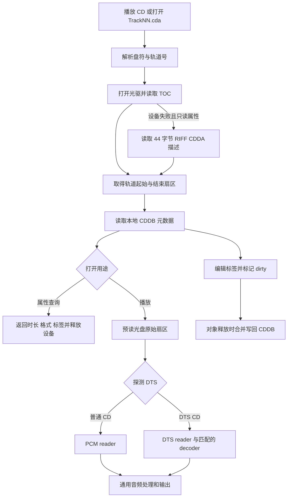

# 原版 CDA 实现分析与重建版差异

日期：2026-09-27。

## 1. 结论与证据范围

原版 CDA 包含 **光驱数字读取、轨道 reader、DTS-CD 探测、元数据和 CDDB 缓存**。
普通音频 CD 读取为 PCM，进入通用处理和输出链；识别出 DTS 的光盘数据则报告 DTS 格式，
交给通用解码器选择流程。`.cda` 本身只描述轨道，不包含整首歌曲的数据。

重建版已有普通 CD-DA 的 TOC 枚举、原始扇区读取、基本定位和通用转换入口，
**尚未恢复原版完整 CDA 行为**。确定缺失的部分包括 DTS-CD、本地 CDDB 元数据读写、
只读属性时的 CDA 描述文件后备路径，以及原版的设备恢复和缓冲策略。

本次依据：

- `reverse/decompiled/TTPlayer.exe.pseudo.c`。
- `reverse/decompiled/ttpcomm.dll.pseudo.c`，尤其是序号 106。
- 原 EXE 的 x86 反汇编、PE 虚表和字符串，用于纠正伪代码缺失的短函数、寄存器参数及返回值。
- 当前重建版源码，而非仅根据旧文档判断完成度。

原 EXE SHA256：
`c7999ea5823469c1684148cac1bd196009824348ccac5cdd45978f8fb574e28c`。

原 `ttpcomm.dll` SHA256：
`e349ef73e8a1d35b2c5debd2ddaeb5cc2513a90647766b7339d2605b34483b33`。

摘录和校验信息保存在本地 `out/analysis/cda-20260927/`。本次是静态分析，未进行实体
Audio CD、DTS-CD、坏盘或光驱热插拔实测；未修改播放器行为、构建发行包或运行 Actions。

## 2. 总体结构和关键函数



| 地址 | 作用 |
| --- | --- |
| `0047D023` | 光盘曲目枚举及 `.cda`、VCD 文件后备枚举 |
| `0041B669` | 根据 `CD\|CD Audio` 类型或 CDA 扩展名判断 CD 项目 |
| `004C8EBE`、`004E75BD` | 创建内置 CD Audio reader 对象 |
| `004E778B` | 按路径打开轨道，建立边界、格式、缓存及元数据 |
| `004E743C` | 读取 44 字节 RIFF/CDDA 描述 |
| `004DEBC2`、`004DECA1`、`004DED2D` | 打开设备、READ TOC、建立轨道区间 |
| `004DEE53` | READ CD 原始扇区读取及重试 |
| `004EF711`、`004EF7C4`、`004EF94C` | 平台选择与 Windows NT SCSI 直通 |
| `004E7E0F`、`004E7F14` | 分块读取、毫秒定位 |
| `004E7F9B`、`004E8078`、`004E8114` | 标签枚举、查询、设置 |
| `004E7675` | 释放 reader，在 dirty 时保存 CDDB |
| `004DF142`、`004DF1EC` | 本地 CDDB XML 读取、保存 |
| `0043840A`、`004381B2`、`00438241` | 构建 FreeDB 查询、query/read 请求 |
| `ttpcomm!600014F0`，序号 `106` | 在原始数据中探测 DTS |

这些名称是按行为归纳的，不是原程序的调试符号。

## 3. 路径、光盘枚举和 CDA 描述文件

### 3.1 轨道路径

`004E778B` 将路径转换为小写，再匹配 `%c:\track%d.cda` 或 `%c:/track%d.cda`。
取得盘符和轨道号后，实际读取对应光驱中的轨道，正常播放不靠 `.cda` 文件的内容。
把 CDA 描述复制到硬盘，并不能获得可独立播放的歌曲。

入口只判断 `swscanf` 转换数是否为 2，没有验证整串完全匹配；不能把它描述成严格的
完整路径验证器。重建时应保留正常路径语义，并采用明确的合法性检查。

### 3.2 “播放 CD”导入顺序

`0047D023` 先尝试设备 TOC，依据内部轨道表生成项目并计算长度；如果没有曲目，
枚举根目录的 `*.cda`；仍没有曲目，再枚举 `MPEGAV\*.dat`。
最后一步是同一光盘入口对 VCD 的后备处理，不代表 CDA reader 自身解码 VCD。

### 3.3 44 字节描述的用途

`004E743C` 读取 44 字节并检查：

| 文件偏移 | 检查/使用内容 |
| --- | --- |
| `0x00` | `RIFF` |
| `0x08` | `CDDA` |
| `0x0C` | `fmt ` |
| `0x10` | 格式块长度 `24` |
| `0x14` | 版本 WORD 为 `1` |
| `0x1C` | 起始扇区，供属性打开后备路径使用 |
| `0x20` | 扇区数量，用于结束位置与时长 |

函数将 `0x14` 起的 24 字节复制给调用者。FreeDB 后备枚举还使用描述末尾的 MSF
时间字段。该函数不读取歌曲 PCM 数据，也不是 WAV 音频解析器。

只有 **设备打开失败且打开标志 bit 0 未设置** 时，`004E778B` 才使用描述文件后备。
实际播放所需的 bit 0 设置时，设备失败不能靠描述文件继续播放。

## 4. 光驱读取：原版不是直接调用 RAW_READ

### 4.1 NT 与 ASPI 分支

`004EF711` 检查 `GetVersionExW().dwPlatformId`：

- Windows NT 系列走内部 SCSI 直通实现，XP、Win7 属于此分支。
- 非 NT 系列动态加载 `wnaspi32.dll`，解析 `GetASPI32SupportInfo` 和
  `SendASPI32Command`，枚举适配器、目标及 LUN。

因此 ASPI 不是 XP／Win7 正常播放的必装依赖。为了兼容 XP，也不必恢复仅服务于
Win9x 的整套 ASPI 分支。

### 4.2 NT 打开与错误恢复

`004EF7C4` 打开 `\\.\X:`。NT 主版本大于 4 时先申请读写访问，失败后切换写访问位
再试；共享标志为 `FILE_SHARE_READ`。随后用 `0x4D014` 发 SCSI INQUIRY（命令 `0x12`），
用 `0x41018` 获取 SCSI 地址，并保存设备句柄和盘符。

`0x4D014` 是 `IOCTL_SCSI_PASS_THROUGH_DIRECT`。其 `Cdb` 是设备命令，`DataBuffer`
是传输缓冲区，`TimeOutValue` 单位为秒，见
[Microsoft SCSI_PASS_THROUGH_DIRECT 文档](https://learn.microsoft.com/en-us/windows-hardware/drivers/ddi/ntddscsi/ns-ntddscsi-_scsi_pass_through_direct)。

`004EF94C` 将内部请求转换成这个结构，超时设为 5。遇到 `0x456`（媒体已更换）或
`6`（无效句柄）时尝试重开，并最多在该层重发一次。
上层 `004DEC63` 设置事件通知；请求 pending 时等待最多 5000 ms，再检查状态。
**NT 的 DeviceIoControl 本身是同步调用**，不能把整套代码称为多线程异步抓轨。

### 4.3 TOC 与坐标单位

`004DECA1` 发送 READ TOC `0x43`，请求缓冲大小 `0x324`。
播放用地址模式 `0`，直接取得 LBA（逻辑扇区地址）；FreeDB 用模式 `2`，取得
MSF（分、秒、帧）。`004DEA76` 对 MSF 计算 `(分钟×60+秒)×75+帧`，对 LBA 读取大端 DWORD。

原版播放路径不是“读 MSF 后统一减 150”。重建版使用系统 READ_TOC 的 MSF 地址再减 150；
比较两者必须统一坐标，避免重复减两秒。

`004DED2D` 用相邻地址之差建立 `{起始扇区, 扇区数}`，末轨以 lead-out 地址收尾，
最多检查 100 个描述符。它要求差值非零、单段和累计长度小于 `0x61F58`
（401240 扇区，约 89 分 9.87 秒）。这是原版边界判断，不是所有 CD 的通用上限。

此 helper 未见按 TOC Control 数据轨标志逐项过滤；当前重建版明确过滤该标志。
混合模式盘的轨道映射不能仅凭普通 CD 的行为判断一致。

### 4.4 读取与重试

`004DEE53` 发送 READ CD `0xBE`，指定起始 LBA 和数量；普通 CDA 用模式 `1`，
用户数据标志 `0x10`。缓冲大小按 `扇区数×2352` 计算并受调用者容量限制。
清零目标缓冲后最多提交 30 次，错误码 15 提前退出；零扇区/零容量直接成功并返回零字节。

这只能证明有“数字读取重试”。没有证据证明该路径实现 C2 错误指针利用、重复采样一致性
校验、光驱读取偏移校正或安全抓轨校验，不能称为 EAC 式完整安全抓轨。

重建版 `CdaSource::Read` 的 `IOCTL_CDROM_RAW_READ` 是另一种系统接口。
`DiskOffset=LBA×2048` 是重建版为该接口构造的参数，**不是 `004DEE53` 的实现**。

## 5. reader、缓冲、EOF 和定位

### 5.1 内置接口

PE 中 `005252A8` 为 reader 虚表，`0052528C` 为元数据虚表。反汇编补出了伪代码
未单独列出的短函数：

| reader 偏移 | 实现 | 行为 |
| --- | --- | --- |
| `+0x10` | `004E7C8D` | 能力基础值 `0x0A`，可写缓存时加 `4` |
| `+0x14` | `004E7CC5` | 返回轨道时长 |
| `+0x18` | `004E7CE5` | 返回当前 WAVEFORMATEX |
| `+0x1C` | `004E7CFD` | 建议读取块大小 `0x1260`，即 4704 字节 |
| `+0x20` | `004E7D17` | PCM 返回 `CD\|CD Audio`，非 PCM 查询编码名称 |
| `+0x24` | `004E7D96` | 返回 `nAvgBytesPerSec×8` 的码率 |
| `+0x2C` | `004E7DBC` | 需要时重开光驱，此处不重读 TOC |
| `+0x34` | `004E7DF2` | 关闭光驱 |
| `+0x38` | `004E7E0F` | 读取数据 |
| `+0x3C` | `004E7F14` | 定位 |
| `+0x40` | `004E778B` | 按轨道路径打开 |

`004E7D17` 是取得编码名称，不是创建 decoder。非 PCM 解码器选择发生在通用
reader/decoder 构建流程，如 `004CD045`。

### 5.2 普通 CD 的格式与时长

```text
PCM / 44100 Hz / 2 声道 / 16 bit
blockAlign = 4；bytesPerSecond = 176400
2352 字节/扇区 × 75 扇区/秒 = 176400 字节/秒
每个扇区 = 588 个立体声采样帧
```

时长用 `MulDiv(扇区数×2352, 1000, 176400)`。数据由数字读取进入播放链；
这个 reader 没有调用 MCI 的 CD 播放命令让光驱自行模拟播放。

### 5.3 开播预读与交付

`004E778B` 分配 `0x1B900=112896` 字节，即 48 扇区缓存：

1. 先尝试 24 扇区，不越过轨道末尾。
2. 首批失败时把批量上限依次降低为 20、16、12、8、4，再重试。
3. 首批成功后以最多 4 扇区追加读取，尝试填到 48 扇区，约 640 ms。
4. 对预读内容做 DTS 探测。
5. 后续 `004E7E0F` 在缓存耗尽时按保存的批量上限补充，正常每次向下游交付
   2 扇区，即 4704 字节，约 26.67 ms。

**24 是底层批量，2 是通常交付粒度，48 是开播预读容量**，三者不可混同。
没有剩余扇区时返回 `S_FALSE`，读取失败返回 `E_FAIL`。
重建版当前仅保留“最多 24 扇区、失败缩小请求”的简化版本。

### 5.4 定位

`004E7F14`：

```text
目标 LBA = 起点 + MulDiv(请求毫秒, 75, 1000)
要求目标 LBA < 终点
成功后写回实际毫秒 = MulDiv(目标 LBA - 起点, 1000, 75)
清空缓存数量和消费位置
```

原版按 CD 扇区定位，采用 `MulDiv` 的舍入语义。当前重建版向下取整，并允许定位到
结束位置；两者在末尾和不足一扇区的时间点上不同。

## 6. DTS-CD：原版已存在的分支

不能用“普通 CD 初始格式是 PCM”推断所有 CDA 都一直按 PCM 播放。

1. `004E778B` 把预读数据交给 `ttpcomm` 序号 106。
2. `600014F0` 扫描数据，调用 `60001380` 解析 DTS 头。
3. 同步头检查包括 16 bit 大小端 `7F FE 80 01` / `FE 7F 01 80`，
   以及 14 bit 打包 `1F FF E8 00 ...` / `FF 1F 00 E8 ...`。
4. 探测器检查帧长度、采样数等条件，后续有效候选帧长度须与首个匹配。
5. 成功时生成 `wFormatTag=0x2001` 的 WAVEFORMATEX，`00411C3C` 用它替换初始 PCM 格式。

`0x2001` 的官方名称是 `WAVE_FORMAT_DTS2`，见
[Microsoft Audio Subtypes](https://learn.microsoft.com/en-us/windows/win32/directshow/audio-subtypes)。

reader 仍负责读原始字节，匹配的 decoder 处理 DTS；最终能否播放取决于解码器可用性。
该探测不能扩大解释为支持所有压缩 CD、AC-3 CD 或所有 DTS 扩展格式。

当前 `CdaSource` 没有探测和 decoder 桥接，始终返回 PCM。因此 DTS-CD 存在被当作
普通 PCM 输出为噪声的风险。这是代码推导，本次未用实体 DTS-CD 实测。

## 7. 歌曲信息、属性与 CDDB

### 7.1 本地缓存

`004DEB38` 用 `GetVolumeInformationW` 取得卷序列号；`004E778B` 构建：

```text
<TTPlayer.exe 所在目录>\CDDB\<十进制卷序列号>.cddb
```

该卷序列号与网络查询计算的 FreeDB DiscID 不是同一个概念。
`004DF142` 读缓存，`004DF087` 按轨道号查记录；无缓存仍可播放。
reader 自身不能从普通音频扇区直接取得歌手、专辑、歌名。

### 7.2 XML 格式

`004DF1EC` 写 UTF-8 XML、根 `CD`、`version="3"`；`004DF6FA` 写根属性
`SerialNumber` 和 `Album`；`004DF7BA` 写 `Track%02d` 子节点及标签属性。
下面仅为格式示例：

```xml
<?xml version="1.0" encoding="UTF-8" standalone="yes"?>
<CD version="3" SerialNumber="123456" Album="专辑名称">
  <Track01 Title="歌曲一" Artist="歌手" />
  <Track02 Title="歌曲二" Artist="歌手" />
</CD>
```

`004DF3A0` 接受小于 4 的版本，要求卷序列号非零，兼容 `<Track ID="1" ...>`
和 `<Track01 ...>`。轨道写入跳过 `Album` 与 `Tracknumber`：专辑在根节点，曲号由
节点表达；`004DF621` 为缺少自身 Album 的轨道提供根专辑值。

### 7.3 属性编辑生命周期

- 元数据接口支持枚举、按键查询、设置及删除字段。
- `004E8114` 验证字段名，空值删除，非空值写字典，并设置 dirty。
- `004E7675` 在对象释放时重读缓存、合并当前轨道，再写回文件。
- `004E7C8D` 根据缓存文件不存在或非只读，设置可写能力位 `4`。

所以 CDA 属性“保存”写的是本地 XML，而非刻录音频 CD。仅检查只读位也不代表目录 ACL
允许最终保存，或保存一定成功。

伪代码易误读之处：元数据接口 `this` 在 reader 基址 `+4`，setter 的 `this+0x78C`
对应主对象 `+0x790` dirty 字段，并不是覆盖主对象的轨道号。

### 7.4 FreeDB

- `0043840A` 取 TOC 的 MSF 地址，设备失败时从 CDA 描述取得时间。
- `004380DC`、`004380F3` 做时间数字和及 DiscID 组合计算；局部缓存键不使用此值。
- `004381B2` 请求 `?cmd=cddb+query+...`，`00438241` 请求 `?cmd=cddb+read+...`。
- `00438176` 追加握手、`ttplayer+5.7.9` 和 `proto=5`。
- `00438F7D` 解析 `DISCID`、`DTITLE`、`DGENRE`、`DYEAR`、`TTITLEn`。
- `004398AA` 将选定结果写入 `.cddb`，另有 CUE 文本回写分支。

原二进制默认地址为 `http://freedb.freedb.org/~cddb/cddb.cgi`。本次确认的是协议代码，
不是今天服务仍可用；后续恢复应单独验证可用兼容服务，本地 CDDB 应独立工作。

上述 CDA 路径未发现 CD-TEXT 专用读取请求。CDDB/FreeDB 返回歌名不等于实现了 CD-TEXT。

## 8. 不应照搬的原版边界问题

以下关键控制流已核对 x86 指令，并非只凭反编译变量猜测；真实设备触发条件仍待测试。

1. **短于 48 扇区的预读边界。** 追加预读只检查缓存是否达到 48；末尾请求可为零，
   而零请求返回成功，缓存数量不增长，存在循环不前进的路径。
2. **最后奇数扇区消费。** `004E7E0F` 用 `min(缓存总数, 2)` 交付，没有减去已消费数。
   总数大于一但仅剩一扇区时，可能多交付一扇区旧缓存内容。
3. **初次预读全失败仍可能打开成功。** 跳到 `004E7C47` 后返回 `S_OK`，错误延后到读取暴露。
4. **短读未贯穿 reader 游标。** 底层返回实际字节数，上层仍主要按请求扇区数推进。
5. **定位先改游标后检查。** 到达/超出终点时返回 `E_INVALIDARG`，游标却已经改变。
6. **设备状态检查不足。** NT 包装主要用 DeviceIoControl 布尔成功判定完成，未在该层
   充分区分 SCSI 状态和 sense。重试上限也不等于固定总超时。

恢复目标应是正常功能和可见行为，同时保证 EOF、短读、取消、错误状态及内存边界正确，
不应复制这些缺陷。

## 9. 当前重建版对照

核对源码：`audio_engine.cpp` 的 `CdaSource`、`MakeBaseSource`；
`player_window_file_intake.cpp` 的 `DiscMediaPaths`；`builtin_file_info.cpp`、
`file_info_worker.cpp`；`player_window_playlist_network.cpp`；
`playlist_transforms.cpp` 和 `replay_gain_scanner.cpp`。

| 功能 | 原版 | 重建版 | 结论 |
| --- | --- | --- | --- |
| 导入顺序 | TOC → CDA → VCD DAT | 相同入口顺序 | 主流程已有 |
| 读取传输 | SCSI READ CD，NT 直通/旧 ASPI | IOCTL_CDROM_RAW_READ | 传输层不同 |
| 普通 CD 格式 | 默认 PCM 44.1k/16 bit/双声道 | 固定该 PCM 格式 | 基础路径已有 |
| 数据轨过滤 | 此 TOC helper 无明确 Control 过滤 | 明确过滤 | 不建议移除现有过滤 |
| 时长 | 扇区边界 + MulDiv | TOC + 向下取整 | 舍入不同 |
| 失效恢复 | 特定错误重开，读命令最多 30 次 | 缩小请求，无同等重开 | 未对齐 |
| 缓冲 | 48 扇区预读，批量补充，通常交付 2 扇区 | 请求直接读最多 24 扇区 | 未对齐 |
| Seek | 舍入，回传实际位置，拒绝终点 | 向下取整，允许终点 | 未对齐 |
| DTS-CD | 探测并改报 DTS，选 decoder | 始终作 PCM | 缺失 |
| 属性后备 | 设备失败可解析 CDA 描述 | 无专用描述解析 | 缺失 |
| 本地歌曲信息 | CDDB XML 读写 | 无该存储和接口 | 缺失 |
| FreeDB | 查询、解析、选择、应用 | 菜单提示后端不可用 | 后端未实现 |
| 转换/抓轨 | reader 进入通用链路 | 转换可创建 CdaSource | 基础入口已有，未实测硬件 |
| 增益标签 | 通用元数据接口可存键值 | 自动分析排除 CDA；手动扫描未接 CdaSource | 未形成完整功能 |

限定：属性读取存在 DirectShow 和通用 source 后备，部分环境可能获得时长/格式，不能说
“所有 CDA 属性必定失败”。但原版 CDA 元数据接口、44 字节后备、CDDB 保存确定缺失。

重建版另有静态风险需要处理：

- TOC 返回长度、轨道数量、lead-out 索引缺少完整校验，导入与播放校验不一致。
- Raw read 仅将返回字节数对齐 PCM blockAlign，再按整扇区推进 LBA；若返回非完整扇区，
  输出长度与光盘游标可能不一致，应明确拒绝或处理短读。

`CanOverlapPlayback()` 为 false，当前不会让曲目重叠占用同一光驱；后续恢复缓冲和
解码分支时应继续考虑设备资源约束。

## 10. 建议恢复顺序与验证

1. **设备与轨道模型**：让导入、播放、属性、转换共用设备与 TOC 校验，补齐短读、
   取消、换盘恢复。保留现代系统接口可行；如加入 SCSI 直通后备，需单独验证权限、
   sense、缓冲对齐和设备支持，不必机械复制 Win9x ASPI。
2. **播放与 DTS-CD**：有界缓存、准确末尾和 Seek 实际位置，接探测和 decoder。
   已识别 DTS 但没有解码器时报告不支持，避免把压缩数据作为 PCM 输出。
3. **属性与本地 CDDB**：补只读属性、描述文件后备、XML 兼容读取与合并保存，
   接通文件属性保存、重新读取和播放列表刷新。
4. **在线查询及通用处理**：验证可用兼容服务后恢复选择与应用，再检查转换标签、
   ReplayGain 是否复用同一 CDA 元数据接口。

可本地模拟的项目：TOC/描述格式、零/短读、错误注入、奇数末尾、超短轨道、Seek、
CDDB 多轨合并与编码、DTS 同步头和不足数据、取消与换盘状态。

真实设备必测：普通音频 CD、末轨 lead-out、混合模式盘、DTS-CD、无盘/退盘/换盘、
USB 光驱和慢读失败，以及播放/转换后的长度和内容。XP、Win7、现代 Windows 均应验证。
虚拟机只挂普通数据 ISO 不能代替实体音频轨道测试。

后续测试代码按现有约定保留于本地 `rebuild/tests`，不上传、不接入 Actions。

**总体判断：基础 CD-DA 读取已存在，原版完整 CDA 功能尚未恢复。优先补设备/边界正确性
和 DTS-CD，再补属性、CDDB 与在线查询。**
