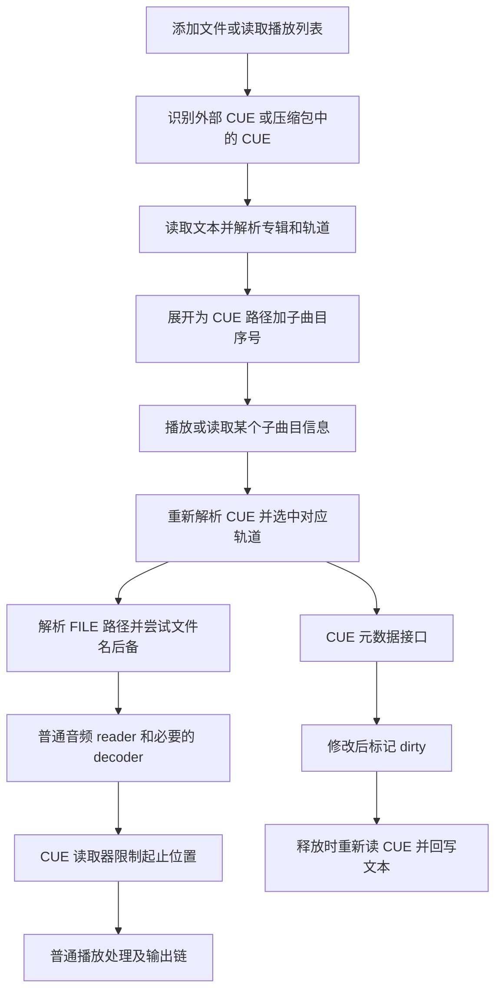

# 原版 CUE 实现分析及重建版差异

日期：2026-09-27。

状态说明：本文保留修复前的静态分析和差异清单。随后已按第 9 节实施修复，
并完成本机、XP、Win7 回归验证；当前实现及验证范围见
[CUE 修复与验证记录](CUE_RECOVERY_VALIDATION.md)。下文“当前重建版”描述的是修复前快照。

## 1. 结论与证据范围

原版的 CUE 是“文本解析器 + 逻辑曲目 + 分段音频读取器 + 元数据读写”的完整链路。
导入时不生成独立音频文件；播放某一项时，打开 CUE 引用的实际音频，再限制读取范围。

当前重建版已经实现常规 CUE 导入和分段播放，但不能称为与原版完整一致。主要缺口是：

- 子曲目使用的顺序编号与文本 `TRACK` 编号没有分开。
- 没有保留 `INDEX 00`、轨道 `REM` 元数据及可回写的原始行。
- 没有原版的底层音频文件名后备链。
- 文件属性读写没有接通 CUE 专用的元数据接口和回写生命周期。
- 时间边界、定位、异常轨道以及部分文本解析规则存在明确差异。

依据：`reverse/decompiled/TTPlayer.exe.pseudo.c`、原 EXE 的 x86 反汇编及 PE
中的字符串、虚表。原 EXE SHA256：
`c7999ea5823469c1684148cac1bd196009824348ccac5cdd45978f8fb574e28c`。

本文是本次静态分析结果，没有新增原版运行、音频逐样本或虚拟机测试。此前的播放测试
只能证明其已覆盖样本可用，不能替代本文发现的差异验证。原始摘录保留在本地
`out/analysis/cue-20260927/`；没有在本次修改产品代码或构建发行包。

## 2. 原版调用链



| 原版入口 | 职责 |
| --- | --- |
| `004739DB / 004742DD` | 文件分类及导入分发；`.cue` 是独立的类型 3 |
| `00473EC5` | 从文件或内存读取 CUE，展开逻辑曲目并拷贝元数据 |
| `00474051` | ZIP/RAR 枚举，取出 CUE 成员的字节并复用上述展开入口 |
| `00477EFB` | M3U 导入中识别 CUE 并展开，不作为普通音频行处理 |
| `004DD5FD / 004DD69E` | 文件读取入口／字节到文本及解析后处理 |
| `004DE026 / 004DE215` | 专辑层及轨道层解析 |
| `004B0B51 / 004E305F / 004E323B` | 创建 CUE reader、打开子曲目及实际音频 |
| `004E3C31 / 004E3CF3 / 004E3E64` | 子曲目长度、分段读取、相对定位 |
| 元数据虚表 `00524E48` | `004E3EDC / 004E3EF9 / 004E3FD0 / 004E4069` 提供数量、枚举、按键读、写 |
| `004E30D2 / 004DD8BF` | 修改后的释放提交与 CUE 文本序列化 |

`00411CAE` 通过逻辑文件名的 `.cue` 后缀决定是否进入 CUE reader。它不是对任意音频
文件内部的 CUESHEET 标签自动拆轨。压缩包内的独立 `.cue` 成员和 FLAC/APE 标签内
嵌入的 CUE 文本是两件事；本次 EXE 调用链没有证明后者具有同样的自动展开入口。

## 3. 解析器的数据结构与规则

### 3.1 解析结果保存了什么

从初始化、访问及复制代码恢复的结构含义如下。偏移描述的是原版对象，不是建议照搬的
C++ ABI：

| CUE 文档对象偏移 | 内容 |
| --- | --- |
| `+0x00` | 文件只读标记 |
| `+0x04` | CUE 文件名／逻辑路径 |
| `+0x08` | 专辑 TITLE |
| `+0x0C` | 全局 PERFORMER |
| `+0x10` | 保留的全局原始行 |
| `+0x14` 起 | 轨道数组，元素大小 `0x20` |

| 单轨道偏移 | 内容 |
| --- | --- |
| `+0x00` | INDEX 01 的 75 Hz 帧位置，缺失初值为 `-1` |
| `+0x04` | INDEX 00 的 75 Hz 帧位置，缺失初值为 `-1` |
| `+0x08` | FILE 字符串 |
| `+0x0C` | 需要保留的轨道原始行，包括 INDEX 行 |
| `+0x10` 起 | 元数据键值集合 |

`004DD48E` 的轨道提交条件是：FILE 非空，且 INDEX 00、01 至少一个不是 `-1`。
这只是“可以进入解析数组”，不保证之后一定能成功播放。例如仅有 INDEX 00 的对象
虽然可能被提交，播放边界计算仍读取 INDEX 01，不能据此声称支持这种文件的正常播放。

### 3.2 指令处理

| 指令 | 原版处理 |
| --- | --- |
| 全局 `TITLE` | 专辑名称；解析后填入每个轨道的 Album |
| 全局 `PERFORMER` | 缺少单轨 Artist 时的默认艺术家 |
| `FILE` | 保存引用文件名，支持多 FILE；检查 `.cue` 引用，避免把 CUE 再作为底层音频嵌套 |
| `TRACK n AUDIO` | 只接受 AUDIO 分支；文本数字必须能读到非零值 |
| 单轨 `TITLE` | 保存为 Title 元数据 |
| 单轨 `PERFORMER` | 保存为 Artist 元数据 |
| `INDEX 00` | 保存位置，也保留该行文本 |
| `INDEX 01` | 保存位置，也保留该行文本；用于实际播放起点 |
| `INDEX 02` 及其它编号 | 未参与上述两个位置字段的计算；走保留原始行路径 |
| 单轨 `REM key value` | 非空 key/value 放入通用元数据集合；不是只认少数固定 REM 名称 |
| 全局 REM、其它未专门识别的行 | 保留文本；不能因此认定都被映射成可查询标签 |
| `PREGAP / POSTGAP / FLAGS / ISRC / CATALOG` 等 | 此解析器没有对应的专用音频处理分支；保留行不等于实现插入静音、去加重等语义 |

命令比较使用 `_wcsnicmp`。带引号参数由 `004DD502` 取到闭引号；不带引号时扫描
空格分隔符。这是一套具体的旧解析规则，不能直接等同于重建版的通用 `Trim` 和
“整行剩余文字作为值”。时间数字由 `004DE905` 逐位读入，`004DD563` 计算：

```text
cue_frames = (minutes × 60 + seconds) × 75 + frames
```

原函数没有重建版 `seconds < 60`、`frames < 75` 的同等严格校验。这属于错误输入
容忍度的差异，不能将原函数的宽松处理理解为所有非法时间都可用。

### 3.3 子曲目是顺序编号

这是本次最重要的更正之一：原版的公开子曲目参数是**解析数组中的第几项，从 1 开始**，
不是始终照抄文本 `TRACK` 后面的数字。

- `004DE215` 最初读取文本轨号并写入 Tracknumber。
- `004DD69E` 的解析后处理又将 Tracknumber 覆盖为 `数组下标 + 1`。
  `004DD848–004DD851` 的字符串常量 `0051D030` 经二进制确认为 `Tracknumber`。
- `00473EC5` 展开条目时也采用 `下标 + 1`。
- `004E3487–004E3497` 将传入子曲目减一，并按解析数组长度检查及索引。

例如文本只有 `TRACK 03 AUDIO`、`TRACK 05 AUDIO` 两项，原版展开后的逻辑子曲目
是 1、2。当前 `CueTrack::number` 保存 3、5，`FindTrack()` 按这个数字查找，
正常连续编号时看不出差异，遇到跳号、重复编号或原版保存的播放列表时就会出现问题。

## 4. 文本编码：原版还有一个需要避免照搬的缺陷

`004DD69E` 先比较 UTF-8 BOM `EF BB BF`，否则调用 `0043D4AF / 004013CE` 判断
字节是否可按 UTF-8 解码，失败后用 `MultiByteToWideChar(CP_ACP, ...)`。

但二进制 `004DD704–004DD70E` 显示：**BOM 分支与无 BOM 的 UTF-8 检测成功分支
共用 `指针 + 3、长度 - 3`**。这意味着无 BOM 的 UTF-8（包括 ASCII）也可能丢掉
开头三个字节。以 FILE 或 PERFORMER 开头时会影响首条指令；以可忽略的 REM 开头
时则可能不明显。这是静态代码确认的异常路径，具体样本表现仍需原版运行测试。

在此入口未发现 UTF-16 LE/BE BOM 解码分支。原有 `AUDIO_RECOVERY.md` 中关于
UTF-16 和无 BOM UTF-8 的概括描述，实际对应重建版扩展，不能用来证明原版行为。

当前重建版正确地区分是否真的存在 UTF-8 BOM，并额外支持 UTF-16 LE/BE。
建议保留这些改进，不复制原版跳过前三字节的缺陷。

## 5. 实际音频文件的寻找

### 5.1 正常路径

`004E323B` 先解析整份 CUE，取得目标轨道的 FILE，再执行：

1. `004E31EE` 检查盘符路径、UNC 路径及包含 `://` 的地址。
2. 普通相对 FILE 拼在 CUE 所在目录之后。
3. 压缩包 CUE 使用 `archive|cue-directory\FILE` 的逻辑路径；CUE 字节先由压缩包
   读入内存，再复用同一解析器。
4. 进入普通音频打开函数 `004CBC1F`。

ZIP/RAR 成员后续由 `0047E177` 按成员名查找。这里没有证据支持将包内 `.`、`..`
自动折叠成另一个实际成员；当前重建版已经按此前分析保留其文本拼接规则。

### 5.2 引用文件打不开时的后备链

原版还有重建版当前缺少的逻辑。`004E36F2` 后取**CUE 自身路径去掉扩展名**作为
备用基名，依次尝试：

```text
FILE 指令解析得到的路径
→ CUE 同名文件 + FILE 引用的扩展名
→ CUE 同名文件.ape
→ CUE 同名文件.tak
```

例如 `D:\Music\album.cue` 写着 `FILE "old-name.wav" WAVE`，第一项打不开时会
尝试 `D:\Music\album.wav`、`album.ape`、`album.tak`。

注意：不是把 `old-name.wav` 一律改成 `old-name.ape`；也没有在这段代码中发现
遍历所有解码器扩展名或额外尝试同名 FLAC 的规则。原始 FILE 如果直接指向 FLAC，
仍可交给普通 reader 处理。FILE 行写 WAVE 也不代表底层只能播放 WAV。

当前 `CueSegmentSource::Open()` 和信息读取进程直接打开解析出的 `audio_path`，
没有这套 CUE 同名文件后备。底层通用内容探测不能替代“原引用文件根本不存在”时的后备。

## 6. 分段播放、长度与定位

### 6.1 CUE reader 是包裹底层 reader 的对象

`004B0B51` 为 CUE 创建大小 `0x68` 的对象，其主 reader 虚表是 `00524E68`，
元数据接口虚表是 `00524E48`。后者位于主对象 `+4`，分析其字段必须考虑这个偏移。

对象保存当前轨道、CUE 路径、子曲目下标、只读与 dirty 标记、起止毫秒、当前位置、
累计字节数、音频格式、底层 reader、可选 decoder 和中间缓冲。

底层直接提供可用 PCM 时可以直通读取；否则创建 decoder，使用中间缓冲把 reader
数据转换后再输出。能力、码率等若干接口继续转发到底层 reader；长度、读取和定位
则由 CUE 包装层改写。它不要求一个独立的 `ttp_cue.dll` 来完成分轨。

### 6.2 轨道边界

`004E2F69` 读取轨道结构的第一个字段，即 INDEX 01，用 `MulDiv(frames,1000,75)`
转换到毫秒：

```text
start = 本轨 INDEX 01 转换成毫秒
若存在下一项且 FILE 字符串不区分大小写相同：
    end = 下一项 INDEX 01 转换成毫秒
否则，或得到的 end <= start：
    end = 底层音频总长度
若 end < start：失败
对外长度 = end - start
```

原版比较的是相邻轨道的 FILE 字符串，不是扫描后面任意同名轨道。
相等／倒序边界的总长度后备也是真实代码行为，不能把它概括为“一律拒绝无效范围”。

对于下面的结构：

```cue
FILE "album.wav" WAVE
  TRACK 01 AUDIO
    INDEX 01 00:00:00
  TRACK 02 AUDIO
    INDEX 00 03:58:00
    INDEX 01 04:00:00
```

按原版分段边界，第一轨延续到 04:00，第二轨从 04:00 开始；03:58–04:00 的内容
仍在第一轨的播放范围内。保存 INDEX 00 不等于让前一轨在 INDEX 00 处结束。

### 6.3 Read 和 Seek

- `004E3CF3` 在当前位置达到结束毫秒时返回 `S_FALSE`。读到跨界缓冲时裁短长度，
  再按 PCM `nBlockAlign` 向下对齐，避免返回半个采样帧。
- 累计字节数结合 `nAvgBytesPerSec` 用于推算当前位置。
- `004E3E64` 将子曲目内的目标毫秒加上本轨起点，再调用底层 reader 的 Seek。
  底层返回实际位置后，再减去本轨起点返回给上层，并重置 decoder。
- 原函数要求目标小于子曲目长度；“恰好 Seek 到结尾”不会作为普通有效定位接受。

**原版并非全程保留 75 Hz 精确有理数到 PCM 字节边界。** `MulDiv` 的毫秒转换会
舍入，再叠加底层 reader 的定位粒度。例如 2 个 CUE 帧对应约 26.667 ms，在原转换
处变成 27 ms。因此不能把重建版的精确 75 Hz 分段宣传为原版逐样本等价。

当前重建版用帧数计算字节长度，并先定位到整秒、再解码丢弃余下帧对应的数据；Seek
又把目标毫秒量化到 75 Hz 帧。它的轨道边界计算避免了原版的毫秒舍入，但实际定位仍受
底层 Seek 行为影响。这不等于已经证明任意解码器、采样率、相邻轨道都完全无缝。

## 7. 元数据、文件属性与回写

### 7.1 读取的是逻辑轨道的元数据

解析后处理明确做了：

- 缺少单轨 Artist 时补全局 PERFORMER。
- 设置 Album 为全局 TITLE。
- Tracknumber 重写为顺序编号。
- 保留单轨 Title、Artist 和可解析的 REM 键值。

元数据接口的 Count/GetAt/GetValue 操作 CUE 自己的键值集合。它不是直接把实际音频
文件的全部标签借给每个子曲目。当前重建版则先取得底层音频元数据，再覆盖非空的
CUE 标题、艺术家和专辑；当 CUE 缺字段时，两者可能显示不同内容。

`004E2FF3` 只暴露其识别的 IUnknown、reader 和 metadata 接口，没有任意转发其它
QI 到底层 reader 的逻辑。不能从底层文件有封面推断原版 CUE reader 自动提供同样的
封面读写接口。是否由其它 UI 路径提供封面需要另行追踪。

### 7.2 写标签不是改底层音频文件

`004E4069` 是 metadata 虚表槽 6：

- 检查 CUE 只读标记，禁止写入时返回 `0x80070005`。
- `Tracknumber`、`Lyrics` 及不符合键名规则的字段不按普通可写标签处理。
- 其它字段可新增、更新，空值可删除，并设置 dirty 标记。

重要：伪代码中的 `this + 0x2C` 在此处基于 metadata 接口，等于主对象 `+0x30`
的只读状态；**不能误读成“仅第 1 轨可写”**。主对象的子曲目下标位于 `+0x2C`。

最后释放对象时，`004E30D2` 检查 dirty：重新读取 CUE，把当前轨道的修改合回数组，
更新专辑名称，再调用 `004DD8BF` 重写 CUE。重新读入有助于保留其它轨道已经写入的
修改，但不是并发事务、原子替换或失败回滚的证明。

### 7.3 序列化规则及局限

`004DD8BF` 会重新组织文本，而非原样字节替换：

1. 写全局 PERFORMER、TITLE 和保留的全局行。
2. FILE 变化时写 `FILE "..." WAVE`。
3. 使用顺序 `TRACK %02d AUDIO`。
4. Artist 写成 PERFORMER，Title 写成 TITLE，其它允许的字段写成 REM。
5. 不按普通单轨字段写 Tracknumber、Album、Lyrics；空值或超过 255 个字符的
   元数据值会被跳过。
6. 最后写回保留的轨道原始行，因此 INDEX 等信息没有因标签编辑而全部丢失。

字符串经 `0040175C(..., CP_ACP)` 输出，换行采用 CRLF；不是保持输入 UTF-8/UTF-16
编码的现代无损编辑器。直接 `CREATE_ALWAYS` 重写也没有临时文件原子提交保证。
后续重建这条能力应采用保留编码及安全替换，而不是照搬这些局限。

此外，`0043840A` 的专辑查询准备以及 `004398AA` 的 CUE 结果保存分支也会复用
解析器／写入器。这说明原版把 CUE 用于专辑级信息处理；不代表旧在线服务今天仍可用。

## 8. 与当前重建版的对照

| 项目 | 当前情况 | 判断 |
| --- | --- | --- |
| 外部 CUE 展开及逻辑路径 | 已有，条目保留 CUE 路径和 subtrack | 基本链路恢复 |
| ZIP/RAR 内独立 CUE | 有内存解析及逻辑成员路径 | 基本链路恢复 |
| 多 FILE、常规 TITLE/PERFORMER/INDEX 01 | 已有 | 常规样本可用 |
| 子曲目编号 | 使用文本 TRACK 数字查找 | 与原版数组顺序编号不一致 |
| 没有 INDEX 的轨道 | 仍可能被加入，并默认 start=0 | 与原版提交条件不一致 |
| INDEX 00、其它原始行 | 未保留 | 无法完成相同的解析／编辑往返 |
| 单轨 REM | 未解析到 CUE 元数据集合 | Genre、Date、ReplayGain 等可能缺失或借用整张音频的值 |
| FILE 不存在／打不开 | 没有 CUE 同名后备链 | 原版部分可播放样本会失败 |
| 相邻文件判断及异常边界 | 当前路径比较、非递减判断与原版字符串比较／总长后备不同 | 需边界样本验证 |
| 边界精度及 Seek | 帧到 PCM，毫秒 Seek 量化至 75 Hz；允许钳制到结尾 | 有意改进与行为差异应分开说明 |
| 元数据默认值 | 底层音频标签优先读入，再覆盖 CUE 非空字段 | 不是原版独立 CUE 标签集合 |
| 属性窗口重新读取 | `ReadFileInfoRecord` 保存 subtrack，但调用的通用读取接口未传入 subtrack | 未接通原版 CUE 属性路径 |
| CUE 标签保存 | 没有对应 writer／dirty 提交 | 未恢复 |
| UTF-8/UTF-16 | 重建版支持更完整，未复制原版无 BOM 缺陷 | 建议保留改进 |
| 物理拆轨 | 播放本身不产生分轨文件；转换可使用分段源 | 不应把 CUE 导入描述为物理切割 |

主要重建代码：

- [cue_sheet.cpp](../src/audio/cue_sheet.cpp)：解析、路径与轨道查找。
- [cue_sheet.h](../include/ttplayer/audio/cue_sheet.h)：当前精简数据模型。
- [audio_engine.cpp](../src/audio/audio_engine.cpp)：`CueSegmentSource`。
- [player_window_file_intake.cpp](../src/ui/player_window_file_intake.cpp)：导入展开。
- [file_info_worker.cpp](../src/app/file_info_worker.cpp)：播放列表信息读取专用 CUE 分支。
- [player_window_playlist_properties.cpp](../src/ui/player_window_playlist_properties.cpp)：属性读取、编辑及保存。
- [playlist.cpp](../src/playlist/playlist.cpp)：TTBL subtrack 和 XML `subtk` 持久化。

播放列表信息读取进程已经传入 subtrack，不代表文件属性对话框也已传入；这两条接口
必须分别检查。当前 CUE 信息读取会补底层格式和长度，但不会补出解析器已经丢弃的 REM。

## 9. 建议后续实施顺序

1. **先统一逻辑曲目模型和编号。** 分离顺序序号、源 TRACK 数字、INDEX 00/01、
   FILE 分组、原始行和元数据。评估既有重建版保存的非连续 subtrack 如何迁移。
2. **恢复 FILE 后备，统一播放与信息读取。** 两处使用同一个解析／解析路径结果，
   验证普通目录、包内目录、Unicode、缺文件和同名多个候选。
3. **补齐 REM 与属性窗口的子曲目信息。** 对齐 CUE 元数据优先级，避免错误地沿用
   整张音频的 Tracknumber、ReplayGain 或曲名。
4. **实现 CUE 编辑回写。** 以 CUE 文档为保存单位合并多轨修改，保留未知行和编码，
   检查只读／外部变更，采用临时文件验证后替换。Lyrics、Tracknumber 等限制单独处理。
5. **最后核对边界及连续播放。** 比较原版毫秒边界与现有精确帧实现；保留明确的精度
   改进，但验证 44.1/48/96 kHz、最后一轨、多 FILE、INDEX 00、倒序、等长、超长、
   接近结尾 Seek、不同 decoder 的实际定位返回值和相邻轨道交接。

建议保留现有 UTF-16 支持、正确的无 BOM UTF-8 解码及更安全的算术检查。
“恢复原版功能”不必复制首行截断、ANSI 丢字和直接覆盖写入等旧缺陷。
