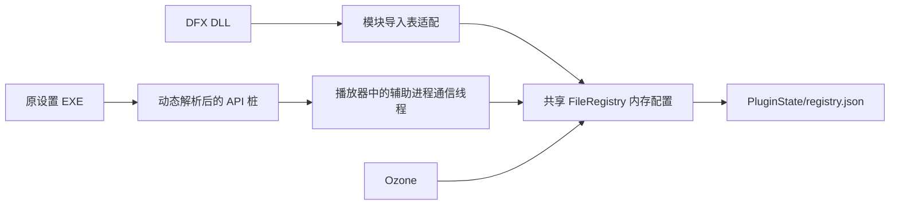

> 2026-09-28 注册表更新：DFX 数据已合并到共享路径树，移除了插件分区和分支可见性过滤；缺失键和值只读回退系统，包括 Windows 版本信息的显式 64 位视图。文件目录及助手适配保持原有用途。详见 [当前共享注册表说明](SHARED_PLUGIN_REGISTRY_IMPORT.md)。

# DFX 文件配置实现与验证

后续窗口交互修复见 [DFX 吸附后无法继续拖动修复](DFX_WINDOW_SNAP_DRAG_FIX.md)，包含根因、原版依据及 XP／Win7 真实插件回归结果。

实施日期：2026-09-28。对应 [原建议实施顺序](PLUGIN_FILE_REGISTRY_IMPLEMENTATION.md#7-dfx-建议实施结果2026-09-28)。

## 1. 结果与使用方式

Ozone 与已核验的 DFX 共用 EXE 旁的 `PluginState/registry.json`。DFX DLL 和原设置辅助进程通过播放器访问同一个内存配置，由播放器统一保存；用户不需要安装注册表服务或导入系统注册表。

退出播放器后，把已有的 DFX x86／x64 REG 文件拖到 `TTPlayerRebuild.exe` 文件图标上，完成导入，再启用 DFX。导入规则见 [共享存储说明](SHARED_PLUGIN_REGISTRY_IMPORT.md)。登记内容继续交给原插件校验，没有改写登记算法或插件文件。

DFX 的预设、窗口通信标志等附加文件放在 `PluginState/Dsp_Dfx/{CommonData,UserData,Documents}`；这些原本就是普通文件，不转换成注册表 JSON。`DFX/Skins`、`DFX/Presets`、`DFX/Apps` 等资源仍随 DLL 存放。

## 2. 原二进制的关键差异

仅启用以下经过核验的 x86 文件：

| 文件 | SHA-256 |
| --- | --- |
| `Dsp_Dfx.dll` | `987e7d531b92df9a582c1ab803f92856e948cc87f0a6b1ed900d3a7898a0eb03` |
| `DFX/Apps/dfxwsettings.exe` | `0952aff8450deaa20b379c0caba804c55d0e30aebaaed1a98aa7b42559a60877` |

### DLL

- Config `10001070` 读取 HKLM 安装目录，再启动 `Apps/dfxwsettings.exe`；播放器改为从实际 DLL 目录定位该文件。
- Init `10001660` 初始化窗口和音频处理对象；Modify `10001810` 处理音频；Quit `100011B0` 退出。
- DLL 使用 `HKCU/Software/DFX/9/11`。它会频繁轮询参数，配置读写必须在内存完成，不能每次调用都读写 JSON。
- 资源目录来自 HKLM 的 `11/host_plugin_folder`、`11/top_folder`、`11/top_host_folder`、`Shared/top_shared_folder`。加载时只在文件配置中按当前目录更新这四项。

### 设置辅助程序

该 EXE 只有 48,128 字节，入口 `00401DC1` 使用结构化异常进行脱壳。磁盘上的导入表只有四个 KERNEL32 API，且 OriginalFirstThunk 与 FirstThunk 指向同一个表；进入初始调试断点时，名称已被 Windows 替换成函数地址。因此必须依据核验后的磁盘布局定位 GetProcAddress 槽（RVA `1B514`），不能把加载后的地址误当成名称 RVA。

实际业务代码分析：

| 地址 | 行为 |
| --- | --- |
| `004011D0` | 读取 `DFX/8/11/LASTUSED_DFXG/windVisible`，初始化复选框 ID 200 |
| `004012B0` | 读取复选框；保存；向 DFX 窗口发送恢复或关闭消息 |
| `00401320` | 写入窗口可见设置，并写普通文件 `DFX/11/quick_uninstall/Default.txt` |
| `00401430` | 按类名 `DFX_WINDOW_2006`、标题 `DFX 8 Winamp` 查找窗口 |

随包的 DLL 实际创建 `DFX_WINDOW_11`、标题 `DFX 9 Winamp`。因此单纯转发注册表 API 仍无法让设置正确作用于当前实例。本次仅对该已核验辅助程序，把旧的 `8/11` 分支映射到 `9/11`，并在宿主进程范围内定位实际窗口。没有改写 DLL 或 EXE 的磁盘文件。

运行轨迹中，辅助程序使用 RegCreateKeyExA、RegSetValueExA、RegOpenKeyExA、RegQueryValueExA、RegCloseKey；没有发现创建其它子进程的业务路径。DLL 使用已核验的 A/W 注册表接口。轨迹仅记录模块/API 名、键名及返回状态，不记录登记字段内容。

## 3. 进程间配置通道

辅助程序以 `DEBUG_ONLY_THIS_PROCESS` 启动。在它进入业务初始化前替换动态解析入口；远程 x86 API 桩通过调试事件传递参数，播放器校验长度、复制输入输出，并调用同一套配置实现。非配置调用继续走原系统 API，脱壳所需的首次异常按原结构化异常路径处理。

这一实现不需要分发新的代理 DLL。进程/线程事件句柄按 Windows 的所有权规则处理：事件自带句柄由系统管理，通信线程只关闭自己复制的线程句柄和自己打开的文件句柄，避免退出时重复关闭已复用的句柄。[Windows 调试事件句柄规则](https://learn.microsoft.com/en-us/windows/win32/api/debugapi/nf-debugapi-waitfordebugevent)

同一辅助程序已打开时不重复启动。辅助程序异常退出会生成诊断，可以再次打开；插件卸载时终止其尚未关闭的辅助进程。未知 Reg API、注册表序号导入、未支持的子进程启动或通信失败会停止该辅助进程，不回退为原生注册表写入。

## 4. 配置语义与稳定性

- Ozone、DFX 使用独立逻辑树，共享一个存储实例、文件锁、保存定时器和 JSON 写入者，避免两个实例互相覆盖。
- DFX 区分 HKCU、HKLM，统一 WOW6432Node 的 32 位视图；64 位视图请求明确拒绝。
- 支持默认值、A/W 字符串转换、数据类型与原始字节、长度查询、短缓冲区、枚举、删除、键信息查询及删除后的句柄状态。
- 子键类名、安全描述符和写入时间不模拟完整 Windows 元数据；当前核验的插件不依赖它们。自定义类名/安全描述符、事务、通知、远程注册表不在适配范围。
- 相同数据的重复设置不触发保存；后台约 200 ms 合并保存，使用临时文件、备份和替换。写入失败保持待保存状态并报告诊断。
- 原实现累计保留所有关闭句柄，DFX 高频轮询会很快耗尽 65,536 次的累计上限。现在仅保留最近 4,096 个关闭记录，及时回收其它记录；关闭后不得继续使用旧句柄。
- 存储最大 4 MiB，单值最大 1 MiB；修正 JSON 读取器原先固定 2 MiB、导致成功保存后无法重开的限制。
- 辅助程序为 ANSI 程序；数据目录无法用当前代码页表达时尝试短路径，仍不可用则明确报告目录访问失败。

这属于已核验插件的兼容适配，不是通用安全沙箱。未核验的插件版本、外部业务 DLL、NT 原生注册表接口和任意派生进程不在支持范围。

## 5. 验证

测试源码、夹具和运行日志仅保留在本地 `rebuild/tests`；不上传测试源码，不随发行包分发，Actions 保持 `BUILD_TESTING=OFF`。

真实测试在专用子进程中把 HKCU/HKLM 映射到临时测试分支，保留插件所需的只读系统加密和版本信息。系统目录查询经生产适配进入夹具目录。验证结束检查原生测试分支未出现 DFX/Ozone 配置，再清理临时分支。

| 验证项 | 本机 | XP | Win7 |
| --- | --- | --- | --- |
| DFX 原 Init / 44.1、48 kHz PCM / Quit | 通过 | 通过 | 通过 |
| Ozone 与 DFX 同时初始化、共用存储 | 通过 | 通过 | 通过 |
| 原设置窗口取消勾选、重新勾选，影响同一实例 | 通过 | 通过 | 通过 |
| 辅助程序异常退出、重开、卸载时关闭 | 通过 | 通过 | 通过 |
| 保存重开、资源目录随夹具位置重算 | 通过 | 通过 | 通过 |
| 原生 DFX/Ozone 分支保持未创建 | 通过 | 通过 | 通过 |
| 文件后端压力、并发、枚举删除及大文件重开 | 通过 | 通过 | 通过 |
| 播放器实际 DSP 调度线程与窗口托管路径 | 通过 | 通过 | 通过 |

音频测试输入 4,096 个样本，DFX 在 44.1 kHz 下改变了 4,095 个；同时验证了 48 kHz 调用和退出。后端另有十万次开关、双配置并发、删除/枚举、损坏文件、文件锁、写入失败保护和超过 2 MiB 文件重开的回归测试。

## 6. 代码位置

- `src/audio/plugin_registry.cpp/.h`：共享存储、注册表接口、DFX 路径与窗口兼容。
- `src/audio/dfx_registry_helper.cpp/.h`：原辅助程序的进程通信与生命周期。
- `src/audio/winamp_dsp.cpp`：加载、设置入口、诊断、DFX 窗口识别。
- `src/app/main.cpp`：更新 DFX REG 导入完成提示。
- `src/update/json.h`：为配置存储显式指定读取大小上限，更新器原上限不变。

统一 Release 已通过 XP/Win7 静态导入检查：x86，子系统 5.01，20 个 DLL、709 个导入。发行包仅含主程序、更新器、已验证 HTTPS 组件和 SHA256SUMS，不包含原插件、登记数据或测试代码。
