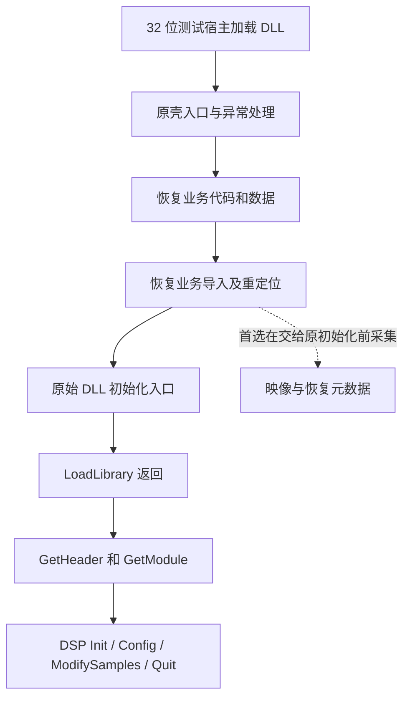

# DSP 插件恢复为常规 DLL 的方法与验收方案

日期：2026-09-28。分析对象为 `D:\Projects\Backup\TTPlayer\Plugins` 中的 17 个现有 DLL。

**后续实施状态：全部 12 个压缩 DLL（6 个 UPX 系、6 个 PECompact 2）已恢复到 `Plugins-out`，并完成 XP／Win7 共 148 个加载与音频回调用例。详见 [实际恢复结果与验证范围](DSP_DLL_RESTORATION_RESULTS.md)、[PECompact 恢复方法](DSP_PECOMPACT_RESTORATION.md)和[虚拟机报告](DSP_DLL_RESTORATION_VM_TESTS.md)。以下保留恢复前的方法分析，其中“尚未执行”描述的是分析阶段。**

本文承接 [DSP DLL 打包形式静态分析](DSP_DLL_PACKAGING_ANALYSIS.md)。这里的“恢复为常规 DLL”，指移除运行时解压依赖，形成能被 Windows 正常加载、保留原有 DSP 功能的 PE32 DLL。

**当前完成的是可行性和实施方法分析，没有解压或替换任何插件，也没有恢复先前暂停的通用注册表接入修改。** 本次重新校验了 17 个文件的 SHA-256，并读取了既有 Enhancer、Vinyl 内存快照；未重新执行插件。分析脚本与证据保存在本地 `tests` 下，不加入 Actions 或发行包。

## 1. 结论

可以按下列路线推进，不能把 12 个有壳插件统一交给一种“内存导出工具”就视为完成。

| 类别 | 文件 | 首选方法 | 当前判断 |
| --- | --- | --- | --- |
| 已是常规 DLL | `Dsp_Dfx.dll`、`dsp_Dolby.dll`、`dsp_izOzone.dll`、`dsp_skywalker.dll`、`DSP_VAPXP.dll` | 保留原文件 | 未发现需要去除的压缩壳 |
| 标准 UPX | `dsp_compwide.dll`、`dsp_DEE.DLL`、`dsp_iZVinyl.dll`、`dsp_jammix.dll`、`dsp_neq.dll` | 官方 UPX 离线解压，再验证 | 路径最明确；尚未实际解压验证 |
| PECompact 2 | `dsp_DeFX.dll`、`dsp_enh.dll`、`dsp_OctiMax.dll`、`dsp_so3d.dll`、`dsp_sps.dll`、`dsp_superequ.dll` | 跟踪原解压器，取得初始化前映像，重建 PE | 原理可行；逐文件工作量取决于导入、重定位和初始化恢复情况 |
| UPX 类变体 | `DSP_ViPER’s Audio.dll` | 先检验 UPX 元数据完整性；不满足则走动态恢复 | 压缩特征明确，具体变体与可直接解压性仍待验证 |

注意：`dsp_DeFX.dll` 与 `Dsp_Dfx.dll` 是两个不同文件，前者为 PECompact 2，后者是常规 DLL。

需要区分三种成果：

1. **获得可反汇编的解压代码**：Enhancer、Vinyl 的既有快照已经包含这类材料。
2. **获得可独立加载、功能等价的无壳 DLL**：本方案的目标，需要重建和测试。
3. **恢复厂商加壳前逐字节一致的文件，或原始源码**：目前不能承诺。压缩前后的节布局、被删除的调试资料等未必可以原样找回；解压也不会恢复 C/C++ 变量名、注释和工程文件。

## 2. 本次补充确认的直接证据

### 2.1 内存里已经能看到业务代码，但 PE 头仍描述壳

读取已有快照时，按“模块基址加 RVA”取代码；不能把内存快照当磁盘 PE，再按旧的节文件偏移取代码。

| 检查项 | Enhancer | Vinyl |
| --- | --- | --- |
| 原文件 | `dsp_enh.dll`，45,568 字节 | `dsp_iZVinyl.dll`，1,110,528 字节 |
| 既有内存快照长度 | 1,908,736 字节 | 2,224,128 字节 |
| `winampDSPGetHeader2` RVA | `0x5df0` | `0x2ae0` |
| 快照中的函数 | `mov eax, 0x10011340; ret` | `mov eax, 0x1009fe60; ret` |
| 快照 PE 头入口 RVA | 仍为 `0x7a36` | 仍为 `0x21cc30` |
| 快照导入目录 RVA | 仍为壳目录 `0x1cf60c` | 仍为壳目录 `0x21eb80` |

因此，“函数已经能反汇编”不代表“文件头已经恢复为原始布局”。目前也尚未定位并验证这两个插件的原始 DLL 入口。

Enhancer 快照中的导入描述符仍然 `OriginalFirstThunk == FirstThunk`，表内已经写入当前进程的系统函数地址。Vinyl 壳导入的 `OriginalFirstThunk` 为零。这些数据不能直接作为可移植的磁盘导入名称表。

### 2.2 壳重定位表不足以服务解压后的代码

检查全部 17 个文件后发现：

- 5 个标准 UPX 与 ViPER 的磁盘 PE 重定位目录各只有 **1 个 HIGHLOW 修正项**，另有填充项。
- 6 个 PECompact 2 文件各只有 **3 个 HIGHLOW 修正项**，另有填充项。
- 5 个常规 DLL 则分别有 1,558～9,997 个 HIGHLOW 项。

这不是据条目数量判断好坏，而是说明恢复文件不能照抄壳的重定位目录。

Enhancer 的具体反例：

```text
解压后 GetHeader，RVA 0x5df0：
    B8 40 13 01 10    mov eax, 0x10011340
    C3                ret

该绝对地址操作数位于 RVA 0x5df1。

原文件的 HIGHLOW 项只有：
    0x7a37、0x1d038c、0x1d0399

它们没有覆盖 0x5df1。
```

若基址从 `0x10000000` 改为 `0x12000000`，此返回值应变为 `0x12011340`。直接保存解压代码、继续使用壳的三项重定位，无法完成这一修正。

另外，**14 个插件声明首选基址为 `0x10000000`**；Jammix 和 NEQ 为 `0x00400000`，Ozone 为 `0x59410000`。同一进程中地址冲突很容易发生，恢复后的 DLL 必须支持实际换址加载。简单地固定到某个“看起来空闲”的基址不能替代完整修复。

### 2.3 现有 Enhancer 快照的取得时机

`tests/enhancer_registry_probe.cpp` 的顺序是：

```text
LoadLibraryW
    ↓ Windows / DLL 的加载初始化已经发生
按 SizeOfImage 逐页复制并保存 loaded.bin
    ↓
GetHeader / GetModule
    ↓
诊断 IAT 替换、DSP Init、DSP Quit
```

这个快照没有混入后面的诊断 IAT 替换，但已经经过 DLL 加载初始化。复制失败的页面会保留为零，原探针也没有输出逐页有效性清单。它适合定位业务代码与 IAT，不足以直接作为完整恢复文件的输入证明。

Windows 的 DLL 入口负责加载/卸载、线程相关通知；它与播放器之后调用的 DSP 初始化函数属于不同阶段。[Microsoft：DllMain](https://learn.microsoft.com/en-us/windows/win32/dlls/dllmain)

## 3. 标准 UPX：优先离线解压

### 3.1 为什么采用官方解压器

这 5 个文件同时具备 `UPX0/UPX1`、`UPX!` 和入口解压代码特征，具备使用 UPX 解压器的明确依据。

官方支持 `-t` 检验压缩数据、`-d` 解压和 `-o` 指定输出。`-t` 不覆盖整份文件的全部有效性，更不代表插件功能测试通过；官方还专门区分了可执行恢复与逐字节一致恢复。[UPX 官方手册](https://github.com/upx/upx/blob/devel/doc/upx.pod)

离线解压通常优于事后转储：它有机会利用完整压缩元数据恢复导入、重定位、初始化数据，不会混入某次运行的堆地址或句柄。

### 3.2 建议执行流程

以下是后续实施步骤，本次没有执行这些命令。

1. 固定工具版本并记录其哈希，逐文件记录原始 SHA-256。
2. 在本地 `tests/artifacts/dsp_restore/` 建立独立输入、输出目录，保留原文件。
3. 对副本运行 `upx -t`；成功后执行 `upx -d -o`，输出到不同路径。
4. 检查解压器返回值及输出 PE；核对导出、导入、资源、重定位和真实入口。
5. 通过第 7 节的加载、音频及界面测试后，才把该副本标为验证通过。

命令形式示意，假设工具和父目录均已准备：

```powershell
& $upxTool -t '.\input\dsp_compwide.dll'
& $upxTool -d -o '.\unpacked\dsp_compwide.dll' '.\input\dsp_compwide.dll'
```

本轮检查时，当前 PATH 没有可直接调用的 `upx`；因此没有“工具已接受全部样本”的测试结论。如果工具不支持某个旧文件，先检查实际版本和元数据，再决定采用兼容的官方版本或动态恢复，不能把一次识别失败视为无法恢复。

### 3.3 各文件的重点

| 文件 | 额外验证重点 |
| --- | --- |
| `dsp_compwide.dll` | 体积最小，适合作为首个完整流程样本 |
| `dsp_DEE.DLL` | 参数窗口、配置读写与音频回调一致性 |
| `dsp_iZVinyl.dll` | 资源界面、参数初始化、采样率切换；既有崩溃不能预设由 UPX 引起 |
| `dsp_jammix.dll` | 首选基址 `0x00400000` 的冲突测试；节与资源较大，解压器细节不能套用 compwide |
| `dsp_neq.dll` | 同为 `0x00400000`，必须验证换址；参数界面与均衡处理 |

## 4. PECompact 2：原解压器取证，再重建文件

### 4.1 为什么不能照搬 UPX 命令

PECompact 官方明确说明没有 UPX 式的解压开关，并提供可定制的 CODEC、加载器与 API 相关插件。虽然本地 6 个样本共享 PECompact 2 特征，不能由此假定压缩参数、导入恢复布局完全一致。[PECompact 官方说明](https://bitsum.com/portfolio/pecompact/)

有两条技术路线：

- **动态恢复，优先采用**：在受控的 32 位加载进程中运行原解压器，在交给原 DLL 初始化入口之前采集映像和恢复元数据。
- **实现离线解包器**：分析每个样本的压缩格式、代码预处理、导入和重定位编码，重写这些逆变换。可复现性较好，但前期工作更多，不能只找到 LZ 解压函数就认为已经完整支持。

对目前 6 个文件，建议先动态恢复一个样本，掌握实际格式，再判断是否值得提取公共离线处理逻辑。

### 4.2 推荐取证时机与加载链



这是待逐文件验证的概念流程，不能假定每个样本的 TLS 回调、导入恢复与入口调用都严格按图中的单一顺序执行。

具体操作要点：

1. 使用 x86 测试宿主，按 DLL 加载方式观察，不能把 DLL 当 EXE 直接启动。
2. 记录壳对映像的写入、导入解析和地址修正；追踪到原始初始化路径。
3. 在原始初始化尚未修改全局状态时采集；如原 TLS 回调先执行，也要找到它执行前的初始数据。
4. 除字节外，保存实际基址、页面保护与可读范围、依赖模块、导入解析记录、原入口及重定位证据。
5. 调试断点应使用硬件断点或在写出副本时按记录恢复断点字节；不能把 `INT3` 补丁一并存入结果。

这批 PECompact 入口会安装 SEH，再主动触发一次异常转入其处理器。调试器中的第一次异常提示不应直接视为插件崩溃，也不能统一跳过全部异常；需要让其原始处理链继续执行。

### 4.3 必须恢复的内容

#### A. 文件布局

内存按 RVA 布局，磁盘节按文件偏移布局，两者通常不同。恢复时重算节文件位置和长度、PE 头尺寸及映像尺寸；保留业务 RVA 可减少代码指针改写。导入、导出和重定位目录必须指向恢复后的有效数据。[Microsoft：PE 格式](https://learn.microsoft.com/en-us/windows/win32/debug/pe-format)

对本批样本，第一阶段不追求还原厂商原来的节名称、节排序与文件长度。先保留业务代码地址关系、形成正确文件；不能仅把 `.text` 改名、增大 RawSize，或把所有页面设为可写可执行来替代结构恢复。

#### B. 原 DLL 入口

应找回原先由壳转入的初始化入口，可能包含 CRT 启动逻辑；不是把 `AddressOfEntryPoint` 指向 `winampDSPGetHeader2` 或 DSP `Init`。

恢复后要观察加载、卸载以及线程通知是否仍正确传递；配置窗口能打开但卸载崩溃，也属于未完成恢复。

#### C. 完整业务导入

Enhancer 已确认的一小部分业务导入为：

| 业务 IAT RVA | 函数 |
| --- | --- |
| `0xf000` | `RegCreateKeyExA` |
| `0xf004` | `RegSetValueA` |
| `0xf008` | `RegSetValueExA` |
| `0xf00c` | `RegQueryValueA` |
| `0xf010` | `RegEnumValueA` |

这五项是恢复的线索，不是完整导入清单。必须识别全部系统库和运行库函数，包括按序号导入。

建议尽量保留原业务 IAT 槽位，在新增区域写入独立的导入名称表和描述符，由 Windows 加载时填入实际地址。若搬迁 IAT，必须逐一处理业务代码与数据对旧槽位的引用。为了后续通用接入方便，恢复结果应保留独立、可解析的名称表，避免继续使用会被运行时覆盖的共享表。

不能把当前快照中的 `0x76......` 函数地址直接写入发行文件，也不能仅按地址所在模块生成依赖：现代系统可能把旧 API 转发到其他 DLL，而该目标 DLL 在 XP 上不存在。应尽量恢复原来请求的库名与函数名，结合解压器解析记录确认；有多个导出对应同一地址时需要人工消歧。

Scylla 可辅助 x86 导入搜索、转储及导入表修复；其官方资料也列出了地址别名等自动识别限制。它适合作为工具，不能代替下面的重定位和初始状态恢复。[Scylla 官方仓库](https://github.com/NtQuery/Scylla)

动态 `GetProcAddress` 和延迟加载还要单独检查：保持原来的条件加载行为，不要把现代系统特有的可选函数强行变成 XP 必须提供的静态导入。

#### D. 完整业务重定位

优先读取、还原原壳实际使用的业务重定位信息。第 2.2 节已经证明，磁盘目录中的 1～3 项壳记录不能直接复用。

如果不能直接恢复原表，可在多个不同基址、相同初始化前时点采集映像，筛选随基址差值变化的候选位置，再结合指令、静态数据指针和壳的修正行为确认。至少用第三个基址复核，排除碰巧满足差值的运行时数据。

不能把所有数值落在模块地址范围内的 DWORD 都认作指针：常量、压缩数据、运行时生成值会产生误报。也不能把 IAT 中的系统函数地址、堆指针或句柄当作本模块重定位。

从非首选地址采集时，先将被修正的业务数据按证据还原到选定文件基址，再生成重定位目录；避免 Windows 下次加载时对已经偏移的值再次加偏移。

#### E. 初始数据与运行时状态

本项目现有快照在 `LoadLibrary` 之后取得，不能直接持久化其中的堆指针、模块句柄、锁、TLS 索引或初始化标志。若更晚到 DSP Init 之后采集，还可能混入窗口、音频缓存和注册表句柄。

优先取得初始化前模板；如果只能事后转储，需要通过初始化前后写入跟踪逐个恢复初值。不能把整个 `.data` 清零，因为默认参数、常量指针等本来就有非零初值。

同样，`VirtualSize` 大于 `RawSize` 可能包含正常的零初始化空间，无需把整块运行时内存全部写入 DLL。现有快照长度与 `SizeOfImage` 相同，不代表恢复文件必须达到这个长度。

#### F. TLS、资源与剩余壳依赖

逐文件核对是否存在原静态 TLS、回调、运行库异常处理与加载配置；壳 PE 头中某目录为零，并不能证明原始业务完全没有对应机制。需要时恢复原来的模板和指针关系。

完整保留对话框、图标、位图、字符串、语言资源及插件使用的尾部数据。能够获取插件头不代表皮肤界面、预设与帮助等路径可用。

清除壳依赖前还要检查业务代码是否继续调用壳提供的 API 跳板或资源辅助函数。如果仍有引用，应恢复其原始调用语义；删掉解压入口但保留业务对已删除代码的调用，仍不能算常规 DLL 恢复完成。

### 4.4 六个 PECompact 样本的处理顺序

| 顺序 | 文件 | 理由与注意点 |
| --- | --- | --- |
| 1 | `dsp_enh.dll` | 已有快照、插件回调地址和部分业务 IAT 证据，适合建立人工恢复流程；仍缺原始入口、完整业务导入/重定位和初始数据证明 |
| 2 | `dsp_DeFX.dll` | 文件较小，适合验证流程能否迁移到第二个样本；不能套用 Enhancer 的固定 RVA |
| 3 | `dsp_sps.dll` | 壳入口在资源节；删除/重排资源时必须区分真实资源和壳代码 |
| 4 | `dsp_superequ.dll` | 核对参数窗口、配置持久化及完整导入 |
| 5 | `dsp_OctiMax.dll` | 映像较大，重点检查对象初始化、配置和音频状态 |
| 6 | `dsp_so3d.dll` | 本组压缩文件最大，资源与运行路径需单独确认 |

后四项为基于当前体量与证据的实施安排，不是已测量出的难度排名。

## 5. ViPER：不能只补一个 UPX 标识

`DSP_ViPER’s Audio.dll` 有原始数据长度为零的 `SEGX`、承载压缩数据的 `SEGY`，入口前 24 条指令在地址归一化后与标准 UPX 样本一致，但缺少 `UPX!`。这支持“UPX 类加载器”的判断，尚不足以确认只是改了节名。

建议路线：

1. 在副本上尝试官方工具识别，保留完整诊断输出。
2. 检查压缩头、算法标记、尺寸、校验和及恢复元数据是否存在且相互一致。
3. 只有证实改名或改标识是唯一障碍，才对副本做最小元数据修复，再尝试标准解压。
4. 如果元数据丢失或加载器有实质修改，就按第 4 节动态恢复；不能猜一组 `UPX!` 字节强塞回文件。
5. 校验除 `winampDSPGetHeader2` 外的 `ResetDSP` 导出，验证重置音效状态的行为。

原静态解析还有资源范围警告，要用实际资源树与运行结果核对，不能仅凭警告判定原文件损坏。目前未执行上述试验，不能提前承诺官方 UPX 可以直接处理。

## 6. 与通用 registry.json 接入的关系

### 6.1 恢复无壳 DLL 能解决什么

如果业务导入名称表完整，后续可以用统一名称识别找到 `Reg*` 函数，减少对 Enhancer 等特定壳布局和固定槽位的依赖。它也便于反汇编、依赖审计和崩溃定位。

### 6.2 不能自动解决什么

- 插件原来访问 HKLM 的权限问题，不会因移除压缩壳自动消失。
- 原来由宿主决定的系统注册表、文件注册表语义不会自动改变。
- 经 `GetProcAddress` 取得的函数或其他依赖 DLL 发起的注册表调用，不会因为主 DLL 导入表恢复，就自动全部纳入兼容层。
- 在 DllMain 中发生的读写，仍早于目前 `LoadLibrary` 返回后的接入时点；有此行为的插件还需单独处理。
- 已有音频崩溃、资源问题不能在没有证据时归因于压缩壳。

**因此，“所有 DSP 共用 registry.json”不应以“先把所有 DLL 脱壳成功”作为唯一前置条件。** 两项工作有关联，但可分别验收；当前依用户要求仍暂停通用接入实施。

### 6.3 当前代码存在哈希识别影响

`src/audio/plugin_registry.cpp` 的 `PluginRegistry::Supports()` 目前仍按文件名和固定 SHA-256 识别 Enhancer、DFX、Ozone。恢复后的 Enhancer 即使音频行为一致，也会得到不同哈希，从而无法通过现有识别分支。

后续接入应把通用 API 适配与特定二进制补丁分开。固定 RVA 的补丁必须保留版本/哈希与实际函数指针校验，不能为了让恢复版通过就直接取消保护。

## 7. 什么情况下才能宣布“恢复成功”

### 7.1 静态验收

- 文件是有效的 x86 PE32 DLL，业务代码在磁盘上可直接分析，加载入口不再依赖解压流程。
- 原导出名称、序号及额外导出完整；不是仅保留一个插件入口的空壳。
- 业务导入完整、可解析且没有混入某次运行的地址。
- 重定位覆盖实际业务绝对地址；导出函数、插件头及回调指针均能换址。
- 资源与初始数据有完整性证据；未把断点、诊断钩子和运行时句柄保存进文件。

### 7.2 动态验收

| 测试 | 验证内容 |
| --- | --- |
| 全新进程加载 | 不依赖调试器、解压工具或之前已加载的原插件 |
| 首选地址与多个强制换址 | 记录实际加载地址，不能只确认预留内存调用成功 |
| 多个 DSP 同时加载 | 暴露共享首选基址、全局资源和卸载顺序问题 |
| 插件头与所有模块枚举 | 版本、描述、模块数量和回调指针；不能只测试 module(0) |
| Init / Config / ModifySamples / Quit | 覆盖初始化、界面、实际音频处理、退出 |
| 重复启停与卸载 | 检查窗口、计时器、工作线程是否在卸载后访问 DLL |
| 配置读写与重启 | 相同初始配置下比较原版与恢复版行为 |
| UI 与资源 | 对话框、皮肤、预设、字体、图标和控件事件 |

使用相同 PCM 输入、参数、采样率和调用序列与有壳原文件对照。优先验证确定性输出；对于带噪声、随机或时间依赖的音效，不能把逐字节不一致直接判定为恢复失败，应控制随机源或比较相应信号特征。44.1/48 kHz、不同块长和插件声明支持的声道配置都应覆盖。

平台至少覆盖目标 XP、Win7 和现代 Windows；在原版 `TTPlayer.exe` 与重建版中分别测试。测试结论逐平台记录，不以 Win11 上一次 `LoadLibrary` 成功推断 XP、Win7 也成功。本轮未新增这些运行测试。

执行环境使用独立插件副本、测试配置和可还原状态，输出文件全部留在本地 `tests/artifacts/dsp_restore/`；保持测试不上传、不进 Actions、不混入发行包。

## 8. 推荐实施顺序与交付物

1. **标准 UPX 最小样本 `dsp_compwide.dll`**：先验证工具、目录、记录格式及加载/换址验收流程。
2. **其余 4 个标准 UPX**：逐个离线解压并测试，不批量覆盖原目录。
3. **Enhancer**：建立 PECompact 初始化前采集、完整导入与重定位恢复流程。
4. **其余 5 个 PECompact 2**：按样本复用已验证方法，固定 RVA 不跨插件复用。
5. **ViPER**：在标准样本流程稳定后处理变体与资源警告。
6. **另行衔接通用注册表接入**：同时保留原文件与恢复版的对照测试，不能用移除哈希校验替代适配。

每个样本建议交付：

- 输入和输出 SHA-256、恢复工具/脚本版本。
- 原入口、完整导入、重定位来源、初始数据取得时机说明。
- 可复现的本地恢复步骤、恢复后的独立 DLL 副本。
- 原版与恢复版的平台、宿主、音频及界面测试结果。
- 尚未验证的功能与平台清单。

预期主要收益是可分析性和接入可维护性。恢复后的磁盘 DLL 可能明显增大，不能由此推断内存占用同比增加；同样不能预先承诺启动更快或音质改善。

## 9. 本地证据位置

- 分类和原始文件 SHA-256：`tests/artifacts/dsp_static/packaging/inspection.json`
- 本次 PE 目录、基址、重定位统计和快照比对：`tests/artifacts/dsp_static/packaging/restoration-evidence.json`
- 本次只读分析脚本：`tests/analyze_dsp_restoration.py`
- Enhancer 既有快照及运行记录：`tests/artifacts/dsp_static/enhancer/loaded.bin`、`modern.log`
- Vinyl 既有快照：`tests/artifacts/dsp_static/vinyl/loaded-image.bin`
- Enhancer 快照采集时机：`tests/enhancer_registry_probe.cpp`

这些是本地分析资料，既有快照不等同于本次已经产出的恢复版 DLL。
