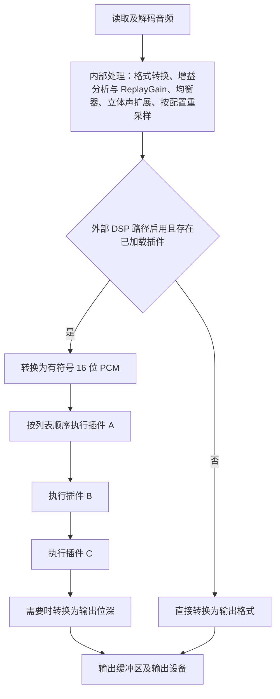

# 原版多个音效插件的音频处理流程

分析日期：2026-09-28。

> 2026-09-30 更新：原版从启动扫描到退出的完整分析、批量操作锁边界及 Quit 异常分支见 [原版音效插件完整运作分析](ORIGINAL_DSP_OPERATION_ANALYSIS.md)。本文第 9 节保留当时的重建版快照；当前 PCM 已在音频工作线程处理，故障实例保留并旁路，运行时启停使用异步请求，现状以新文档第 16 节为准。

## 1. 结论与证据范围

原版通过一条**按插件列表顺序执行的串联处理链**运行多个 Winamp DSP 插件。同一块音频先经过 A，再经过 B，最后经过 C；B 接收 A 已经修改过的 PCM，C 接收 B 修改后的 PCM。宿主没有为每个插件另开一条音频流再混音，也没有把这些插件的处理回调并行执行。

本次核对了：

- 原版 [`TTPlayer.exe.pseudo.c`](../../reverse/decompiled/TTPlayer.exe.pseudo.c) 的加载、音频处理、列表排序和释放路径。
- 原版 `D:\Projects\Backup\TTPlayer\TTPlayer.exe` 的 x86 指令及 SEH 异常处理表，补充反编译器遗漏的异常分支。
- 当前重建版 [`winamp_dsp.cpp`](../src/audio/winamp_dsp.cpp)、[`dsp_dispatcher.h`](../src/audio/dsp_dispatcher.h)、[`audio_engine.cpp`](../src/audio/audio_engine.cpp)。

原版 EXE 的 SHA-256：

```text
c7999ea5823469c1684148cac1bd196009824348ccac5cdd45978f8fb574e28c
```

下文地址均为该 EXE 的首选虚拟地址。反编译函数的名称、参数类型和结构字段名未必准确；涉及参数传递、缓冲区长度和异常处理的结论同时核对了机器指令。本次是静态分析，未执行新的本机或虚拟机音频测试，也未修改播放器代码。

## 2. 整体音频路径



图中的内部处理节点概括了不同格式、重采样配置下的分支，不表示所有文件必然执行每个阶段。可以明确确认的先后关系是：

1. `004B1375` 组织读取及内部处理。
2. `004B1950` 先调用增益分析器，再应用 ReplayGain 倍率。
3. `004B1B81` 先执行内置均衡器，再执行立体声扩展。
4. 内部处理结果返回 `004AC166` 后，才进入外部 Winamp DSP 链。
5. `004AC304` 将准备好的音频交给输出设备。

内置均衡器、立体声扩展与这里的多个外部 DSP 插件是不同处理层。ReplayGain 也不能直接等同于主窗口音量滑块。

### 2.1 外部插件的统一输入格式

`004AC166` 在调用 `0042898D` 前，把音频转换到 16 位；调用后，输出设备要求其他位深时再转换。

原版汇编在 `004AC1FF` 明确压入 `0x10` 作为位深，同时传入当前音频格式的声道数、采样率以及 PCM 地址、字节长度：

```text
004AC1FF  push 0x10             ; 16 bit
004AC201  push ecx              ; channels
004AC202  push [eax+4]          ; sample rate
004AC205  push ...              ; PCM bytes
004AC208  push ...              ; PCM address
004AC20B  call 0042898D         ; whole DSP chain
```

由此可知：

- 24 位音源或 32 位输出不意味着外部 DSP 收到 24/32 位音频。
- 整条链共用 16 位 PCM 格式，宿主没有在 A、B、C 之间反复转换浮点格式。
- 插件自己的内部运算精度取决于插件，宿主无法据此保证全链保持源文件精度。
- 最后转回较大位深不能恢复进入 16 位处理链时已经丢失的精度。
- 采样率及声道数按当前格式传入，这个包装函数没有统一降为 44.1 kHz 或立体声的步骤。
- 未加载外部 DSP 时，原版不需要经过这条专门的 16 位插件路径。

## 3. 多插件如何串联

### 3.1 列表顺序就是处理顺序

核心入口 `0042898D`（伪代码约 41458 行）遍历全局管理器 `DAT_00546C64` 的条目。每个条目保存插件路径及其已加载实例指针。

其逻辑可整理为：

```cpp
Lock(pluginManager);
for (auto& entry : pluginList) {
    if (entry.loadedInstance != nullptr) {
        ProcessOne(entry.loadedInstance,
                   pcm, originalBytes, rate, channels, bits);
    }
}
Unlock(pluginManager);
```

上面是便于阅读的语义还原，不是原始 C++ 源码。

假设列表为：

```text
1. A  已启用
2. B  未启用
3. C  已启用
4. D  已启用
```

实际顺序是 `A → C → D`。决定顺序的是当前列表位置，而不是用户先勾选了哪个插件。

### 3.2 共用同一块 PCM

循环向每个实例传递相同的 PCM 起始地址、原始字节长度、采样率、声道数和位深。插件直接修改这个缓冲区。

因此，三个插件的结果可以表示为：

```text
最终音频 = C(B(A(输入音频)))
```

比如 A 增强低频，B 做动态压缩，B 就会针对增强后的低频进行压缩；交换 A、B 后，压缩器收到的信号不同，结果可能明显变化。原版宿主没有在插件之间自动做响度均衡、干湿混合或恢复原始信号。插件内部自己的混音、限幅或自动增益属于该插件的算法。

### 3.3 帧数的单位

`004280CD` 用下面的方式计算回调参数：

```text
每帧字节数 = (位深 / 8) × 声道数
帧数       = PCM 字节数 / 每帧字节数
```

例如一块 4096 字节的 16 位双声道音频：

- 每帧 4 字节，包含同一时刻的左右声道。
- 共 1024 帧、2048 个 `short` 样本。
- 回调的帧数参数是 1024。
- 样本排列为 `L0, R0, L1, R1, ...`。

把帧数误解成左右声道样本总数，会使插件处理长度翻倍。这是恢复宿主 ABI 时必须保持一致的部分。

## 4. 大块音频只对半拆分一次

`004280CD`（约 40825 行）的阈值是 `0x4000`，即 16384 帧：

- 少于 16384 帧：调用一次 `ModifySamples`。
- 大于等于 16384 帧：先处理 `floor(N / 2)` 帧，再处理剩余帧。
- 没有循环切成固定 16383 帧大小的小块。

| 输入帧数 | 同一个插件的调用次数及帧数 |
|---:|---|
| 1024 | 一次：1024 |
| 16383 | 一次：16383 |
| 16384 | 两次：8192、8192 |
| 20001 | 两次：10000、10001 |
| 32770 | 两次：16385、16385 |

最后一行说明，对半后的每块仍可能超过阈值，原版不会继续拆分。

多个插件下，外层循环是插件，内层才是分块：

```text
A 前半块 → A 后半块 → B 前半块 → B 后半块 → C 前半块 → C 后半块
```

这决定了实际回调的先后顺序。对只依赖自身连续音频历史的插件，两种遍历方式可能得到相同输出；对共享全局状态或在回调中查询其他状态的插件，不能随意假设改变遍历顺序仍等价。

## 5. 原版忽略插件返回的新帧数

模块回调的 ABI 为：

```cpp
int ModifySamples(Module* module, short* samples,
                  int frames, int bits, int channels, int rate);
```

但是 `004280CD` 不采用这个 `int` 返回值。第一段回调返回后，`0042814F` 直接把 EAX 改为原先的半块帧数；第二段返回后直接进入清理路径。后续插件依然按进入处理链时的原长度接收音频。

因此：

| 插件返回值 | 原版宿主行为 |
|---|---|
| 等于输入帧数 | 继续按原长度处理和输出 |
| 小于输入帧数 | 不缩短缓冲区，也不缩短后续插件的输入 |
| 0 | 不据此丢弃音频，后续插件仍会运行 |
| 大于输入帧数 | 不扩大后续插件和输出设备的有效音频长度 |

回调是否修改了 PCM 与它返回什么长度，是两件不同的事。只写了前一部分、然后返回较短长度的插件，可能让后半部分保留原数据；宿主不会自动清空后半部分。

这表明原版宿主适合保持帧数不变的音效处理，不能认为它完整实现了所有依赖可变输出长度的变速/变调插件协议。

另一个细节：原版第一半块直接写在原缓冲区里，若插件向后扩写，可能提前覆盖第二半块的输入。这里确认的是别名及覆盖风险，本次没有据此断言原版实际分配容量一定不足。

`00427EDC` 确实过滤了包含 `pacemaker` 的插件描述；“这与可变长度处理限制有关”只能视为解释性推测，不能当作已恢复的作者设计说明。

## 6. 插件加载、调整顺序与配置

### 6.1 每个 DLL 选一个模块

`0042822F` 加载 DLL、查找 `winampDSPGetHeader2`，并要求头部版本至少为 `0x20`。`00427EDC` 按索引 0～9 查询 `getModule`，找到第一个非空模块即停止。

因此，多插件通常指多个已启用 DLL 的模块串联；原版没有把某个 DLL 导出的全部模块都加入链。

原版填入模块的 `hwndParent` 和 `hDllInstance`，调用 `Init`，随后保存 DLL、头部和模块指针。它使用插件返回的模块对象，没有复制成一个截断的小结构。

`Init` 的整数返回值同样被忽略。加载失败、无有效模块、初始化异常与 `Init` 正常返回非零，不能在还原时混为同一情况。

### 6.2 勾选与取消勾选

选项页 `0049911C` 根据勾选变化调用 `00428471`：

- 启用：创建包装对象，加载 DLL，取得模块并初始化，再接入管理器。
- 禁用：在管理器锁内摘下实例指针，随后销毁包装对象。
- 销毁时，`00428061` 清空宿主保存的指针，再调用 `Quit`，最后 `FreeLibrary`。

这一过程不要求对其他仍启用的插件重新初始化。

### 6.3 调整顺序不会重建全部实例

选项页排序通知 `00499181` 调用 `0042892A`，后者持有管理器锁，执行 `00428A7F`。移动的数据包括路径和原有实例指针。

因此交换 A、B 顺序时，插件的均衡器参数、延迟线和滤波历史等私有状态会随原实例保留；宿主没有先对整条链执行 `Quit`，再全部 `Init`。

管理器锁覆盖整次串联调用，排序更新不会插入当前块的 A、B 两次回调之间。新顺序应用于后续的整链处理。

### 6.4 配置窗口操作同一个实例

`004990E8/00499107 → 00428972 → 004280BE` 直接调用已加载模块的 `Config`。这里没有再创建一个专门用于配置的临时实例。

需要注意，所见 `004280BE` 没有在 `Config` 外持有该实例的处理锁。音频处理有锁，不等于原版替插件完成了配置界面与音频线程之间的全部参数同步。

### 6.5 跨块状态与重置

插件实例在启用期间持续存在，连续 PCM 块反复调用同一个模块。这使混响、延迟、压缩器等能保留跨块状态。

观察到的定位重置路径 `004B16FE` 包含内部处理器重置；外部模块 ABI 没有宿主调用的独立 `Reset` 槽位。不能擅自把每次定位、每块处理都实现成外部 DLL 的 `Quit/Init`。本结论不代替对所有切歌、交叉淡化分支的独立审计。

## 7. 线程及锁：音频工作线程同步串联

已确认的调用关系为：

```text
004AC4D6：创建音频工作线程 004AC5C5，并进入读线程协调流程
  └─ 004AC5C5：等待事件 → 004AC304 → 通知完成
       └─ 004AC304：准备/写入音频
            └─ 004AC166：准备一块 PCM
                 └─ 0042898D：按列表遍历所有插件
                      └─ 004280CD：调用单个插件的 ModifySamples
```

锁分为两层：

1. 管理器 `+0x10` 的临界区覆盖本次所有插件的遍历与处理。
2. 单插件包装对象起始位置的临界区保护该实例的音频回调及相关指针操作。

所以原版播放器本身有多个线程，但这条链里的 A、B、C 是同步依次执行。插件内部是否另建计算线程，要单独检查对应 DLL，不能由宿主的串联结构推断。

这一结构的实际影响：

- 同一块音频的处理时间累加，近似为格式转换耗时加各插件耗时之和。
- 某个插件长时间不返回，会阻塞后续插件，并可能使等待管理器锁的界面操作停顿。
- 音频缓冲能吸收短暂波动，但不能弥补持续处理速度慢于播放速度。
- 举例说，48 kHz 下的 1024 帧约为 21.33 ms 音频；这是时间换算示例，不代表原版固定使用 1024 帧缓冲。

把 A、B、C 同时交给不同线程处理同一输入，再混合结果，会改变原版串联语义。即使采用有序流水线，也必须另外处理插件状态、延迟、重入及配置同步，不能仅靠增加线程数量保证等价。

## 8. 从原始汇编补出的异常处理

### 8.1 `+0x24` 实际是处理故障标志

反编译器把插件包装对象错误地延伸解释成了两个 `CRITICAL_SECTION`，因此出现 `param_1[1].OwningThread` 这样的字段名。结合指令可以恢复主要布局：

| x86 偏移 | 含义 |
|---|---|
| `+0x00` | 24 字节临界区 |
| `+0x18` | DLL 句柄 |
| `+0x1C` | DSP 头部指针 |
| `+0x20` | 插件模块指针 |
| `+0x24` | 处理故障后跳过的标志 |

原版指令及异常表为：

```text
004280DE  cmp [ebx+24h], 0
004280E1  jne 00428191              ; 已失败则跳过处理

00428175  xor eax,eax
00428177  inc eax
00428178  ret                       ; 异常过滤结果为 1

00428179  mov esp,[ebp-18h]          ; 异常处理分支
0042817C  mov ebx,[ebp+8]
0042817F  mov [ebx+24h],1            ; 标记失败
0042818B  call LeaveCriticalSection

005264F8  FFFFFFFF 00428175 00428179 ; SEH 作用域表
```

该异常分支没有完整显示在生成的 `004280CD` 伪代码中，单看伪代码会漏掉这项原版行为。

### 8.2 某个插件出错后发生什么

若 B 的处理回调产生可由此 SEH 分支捕获的异常：

1. B 的本次处理提前结束；如果前半块就异常，不再调用 B 的后半块。
2. B 的失败标志置 1。
3. 释放 B 的处理锁，返回外层循环。
4. C 等后续插件继续处理当前缓冲区。
5. 下一块开始时，B 直接被跳过。

异常分支没有立即调用 `Quit` 或卸载 DLL，也没有取消列表勾选。启用查询 `0042841A` 和数量统计 `0042831E` 都只检查实例指针是否非空，所以“看起来仍启用，但实际已被跳过”是原版这套逻辑允许出现的状态。

由于原版原地写 PCM，B 出错之前已经写入的部分不会自动回滚；后续插件可能收到部分处理过的音频。取消勾选后重新启用会创建、初始化实例并清除故障标志。

由数量统计逻辑还能推得：即使所有已加载插件都被标记为故障，宿主仍可能进入 16 位 DSP 转换分支，只是在各实例处全部跳过处理。

这里的 SEH 机制不提供独立进程隔离，也没有插件处理超时。它不能保证挽救任意内存破坏、死循环、死锁或插件主动终止进程。

## 9. 与当前重建版的对照

这次没有发现重建版把多个插件错误实现为并行混音。核心音频规则已经对应，但异常处理及线程组织不能称为与原版完全相同。

| 项目 | 原版 | 当前重建版 |
|---|---|---|
| 多插件语义 | 按列表顺序串联 | 一致 |
| 外部 DSP 位深 | 16 位 PCM | 一致，见 `audio_engine.cpp` 的 DSP 边界 |
| 大块处理 | 达到 16384 帧时只对半一次 | 一致，`winamp_dsp.cpp::Impl::Process` |
| 回调返回帧数 | 忽略 | 一致 |
| 调整顺序 | 保留已有模块实例 | 一致，`Impl::Update` 移动现有实例 |
| 插件取得的内存 | 原始 PCM 中对应块的地址 | 每次回调先复制到临时缓冲区，成功后复制原长度回来 |
| 扩写隔离 | 前半块可能覆盖后半块输入 | 为当前块预留两倍容量，分半暂存 |
| PCM 回调所在位置 | 音频工作线程的同步调用链 | 排队到带消息循环的 DSP 线程，调用方等待完成 |
| 处理异常 | 保留实例，设置故障标志，以后跳过 | 从运行链移除，等外层插件回调退出后再执行退出和卸载 |
| 出错时的 PCM | 已有原地修改保留 | 当前失败回调的暂存修改不复制回去；之前成功的半块仍保留 |

重建版暂存和延后卸载是额外保护。对正常、保持帧数的插件，串联顺序及数据传递规则一致；这不足以证明所有插件内部状态、异常场景和输出音频已经逐样本相同。

如果后续要验证完全一致，应使用可记录回调的本地探针分别覆盖：顺序变化、16383/16384/奇数大块、非输入长度返回值、第二半块故障、配置窗口打开期间的处理和插件禁用。真实插件组合还需要对输出 PCM 及连续播放状态单独比较。本次没有把这些待验证项目写成已通过的测试。

## 10. 关键入口索引

| 地址 | 伪代码行号 | 用途 |
|---|---:|---|
| `0042822F` | 40903 | 加载 DLL、取得 DSP 头部 |
| `00427EDC` | 40671 | 选择一个模块、填入宿主信息并初始化 |
| `00428471` | 41119 | 启用或禁用单个插件 |
| `0042841A` | 41088 | 按实例是否存在判断启用状态 |
| `0042831E` | 41011 | 统计已加载实例 |
| `0042892A / 00428A7F` | 41415 / 41531 | 带锁调整插件顺序、保留实例 |
| `00428972 / 004280BE` | 41438 / 40807 | 对已加载模块调用配置函数 |
| `004AC166` | 163294 | 16 位格式转换和整链入口 |
| `0042898D` | 41458 | 按顺序执行所有插件 |
| `004280CD` | 40825 | 单插件分块处理；需结合汇编还原异常路径 |
| `004B1950 / 004B1B81` | 168966 / 169072 | 内部增益分析、ReplayGain、均衡器与立体声扩展 |
| `004AC304 / 004AC5C5` | 163397 / 163529 | 音频准备、输出及工作线程 |
| `00428061 / 00428B16` | 40781 / 41571 | 单个插件释放及整表释放 |

本次汇编与文件身份记录仅保存在本地 `tests/artifacts/dsp_multi_plugin_flow/`，不属于发行包或 Action 测试内容。
