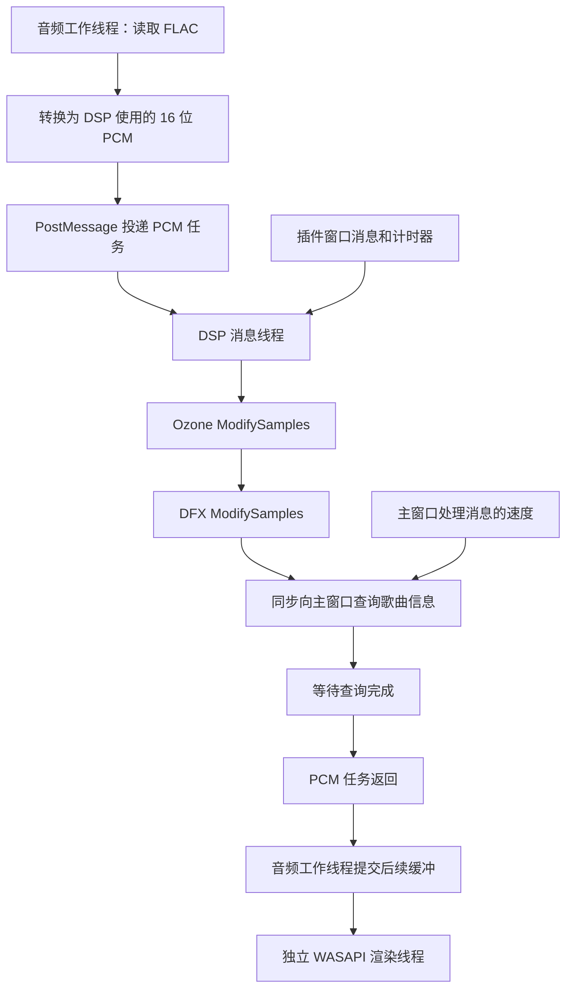

# Ozone＋DFX／WASAPI 多插件卡顿分析

分析日期：2026-09-29。

后续实现及验证见 [多插件卡顿修复](DSP_MULTI_PLUGIN_STUTTER_FIX.md)。本文保留修复前的实现、测量和诊断边界。

## 1. 结论与边界

使用用户指定的 FLAC、真实 Ozone 和 DFX DLL、当前 Release 核心库，已经通过对照实验确认：**DFX 在音频回调中同步查询主窗口，可以把主界面停顿传递到整条 DSP 音频链，最终耗尽 WASAPI 的已处理音频。** 当前将插件界面消息和音频回调放在同一条 DSP 消息线程上的实现，也增加了等待并偏离原版线程分工。

这不是已经证实的“两个插件算法运算量超过 CPU 能力”。在本次短样本中，两插件处理速度足够快；阻塞发生时，DFX 单次宿主查询却可以占用约 3 秒。

需要区分三个结论：

- **已经复现并定位**：受控主界面停顿导致的 DFX 同步等待、音频供给中断；预先加载 Ozone＋DFX 后，在窗口线程上同步启动播放可以触发 4 秒超时。
- **未在自然运行中复现**：主界面持续处理消息时，20 秒 WASAPI 共享模式测试没有持续进度落后。尚未证明用户实际操作中是哪条主窗口消息或插件界面事件触发了停顿。
- **没有证明**：本次 WASAPI 路径存在旧 PCM 重复提交或歌曲进度倒退。另有独立的 DirectSound 旧缓冲重播缺陷，不能拿它解释用户明确指定的 WASAPI 现象。

本轮是分析和本地诊断，**未修改正式播放器源码、原始插件 DLL、发行 EXE 或 ZIP**。所有诊断代码和输出均在 `tests/`，没有加入 Actions。

## 2. 输入和测试方式

歌曲：

```text
C:\Users\Sonic853\Music\test\蔡明希（不才）,三体宇宙 - 夜航星 (Night Voyager).flac
```

文件 69,127,108 字节，48,000 Hz、24 位、双声道；原 AddIn 解码器每次实际返回 1,024 帧，对应约 21.333 ms 音频。

| 输入 | SHA-256 |
| --- | --- |
| FLAC | `be585c8668940a5ecf253320eea1b51623913a54fab88c560ebc37ef6b3b1140` |
| `Plugins/dsp_izOzone.dll` | `e3bb0eef979ea8016fb1278b373c7c70ae4507719524bfefe802b5bc3c800e59` |
| `Plugins/Dsp_Dfx.dll` | `987e7d531b92df9a582c1ab803f92856e948cc87f0a6b1ed900d3a7898a0eb03` |
| 链接的 `build/Release/ttplayer_core.lib` | `8fb9d21d9ce178d68e4b6d0a8ea83d3db889272625d2a51750bc2925464a83fd` |
| 本轮未替换的 Release EXE | `15eca39b385d9f017a230780fbba8715285c2621f0c2c81e7c1494d0ad8a64ad` |

顺序为 Ozone → DFX。WASAPI 实时测试使用 `wasapi:shared:default`、1,000 ms 输出缓冲，关闭淡入淡出和自动扫描增益，播放器音量为零。复制插件目录及文件型注册表到测试目录，读取原曲；没有改写原曲或用户日常插件配置。

本次实际输出设备测试记录的是处理回调与播放位置，**没有做声音回录**，因此不能仅凭进度统计断言听感或逐样本连续性。共享模式是本次验证范围；用户尚未细分共享／独占，本轮未验证独占模式。

## 3. 原版与重建版的线程差异

原版完整处理顺序见 [原版多音效插件音频处理流程](DSP_MULTI_PLUGIN_AUDIO_FLOW.md)。本轮相关的原版地址均以 `TTPlayer.exe` 优选映像地址表示。

| 项目 | 原版伪代码／二进制 | 当前重建版 |
| --- | --- | --- |
| 多插件音频链 | `0042898D` 按插件列表顺序同步串联，同一 PCM 依次通过各插件 | 串联顺序已保留 |
| PCM 回调线程 | `004AC166 → 0042898D → 004280CD` 位于音频工作路径 | 音频工作线程发任务到 DSP 消息线程，然后同步等待 |
| Init／Config 与 PCM | 初始化、配置走界面控制路径；PCM 在音频工作路径 | Init、Config、界面消息、PCM 共用 `DspDispatcher` 线程 |
| 大块拆分 | `004280CD` 对至少 16,384 帧拆成两半，同一插件两半处理完再到下一插件 | 已保留，当前 FLAC 的 1,024 帧不会触发该拆分 |
| 慢生产者防护 | `004AC605` 的协调路径在等待期间独立检查缓冲余量 | WASAPI 已有独立渲染线程；DSP 同步等待仍会阻断上游供给 |

当前主要调用关系：



相关源码：

- [`dsp_dispatcher.h`](../src/audio/dsp_dispatcher.h)：消息循环、`InvokeQueued` 和同步等待。
- [`winamp_dsp.cpp`](../src/audio/winamp_dsp.cpp)：`WinampDspChain::Process` 将整条 PCM 链放入消息线程；`Impl::Process` 依次调用插件。
- [`audio_engine.cpp`](../src/audio/audio_engine.cpp)：解码、处理、预填充和输出；`Play` 的同步启动等待。
- [`wasapi_sink.cpp`](../src/audio/wasapi_sink.cpp)：独立渲染线程及有限 PCM 队列。

增加插件后，算法耗时相加，额外的界面等待也会相加；任何一个插件阻塞，后续插件和该块 PCM 的提交都要等待。对同一块 PCM 并行运行 Ozone、DFX 会破坏原版串联语义，不适合作为修复。

## 4. DFX 每块音频都查询主窗口

核对真实 `Dsp_Dfx.dll` 的指令：

1. `10001810` 是 `ModifySamples` 入口。
2. 正常处理路径在 `10001954` 调用 `100016E0`。
3. `100016E0` 调用 `10001310` 查询当前曲目。
4. `10001354` 通过导入表调用：

```cpp
SendMessageTimeoutW(
    module->hwndParent,
    WM_USER,
    0,
    3031,                 // 0xBD7，当前文件信息查询
    SMTO_ABORTIFHUNG,      // 2
    10,
    &result);
```

只有成功取得文件字符串、并发现内容变化，后续才会调用 `10001390`，发送另一个 `WM_USER / 0x123` 查询。不能把第二个查询算成每块必定执行。

本曲每块 1,024 帧，正常速度下约每秒 46.875 次首项查询。它位于 `ModifySamples` 内，不是仅在打开设置窗口时执行。

当前 `src/` 和 `include/` 中未找到该 `WM_USER / 3031` 查询的明确处理分支。返回“不支持”也必须先由主窗口处理消息，因而未实现查询内容并不等于没有同步等待成本。

### 4.1 实测的 10 ms 参数不构成可靠上限

只在测试进程内观察 DFX 的 `SendMessageTimeoutW` 导入调用，保持原调用参数和返回值。一次完整记录为：

```text
msg=1024 lp=3031 flags=2 requested_timeout_ms=10
elapsed_ms=3000.302 sender=70136 receiver=64656 result=1
```

即调用实际等待约 3 秒，最后返回成功；不能按 DLL 中写着 `10` 就认为其最多只占用 10 ms。

微软文档说明：接收窗口与调用线程属于同一消息队列时，`SendMessageTimeout` 可以忽略超时参数；跨线程窗口的父子或拥有关系也可能关联输入队列。[SendMessageTimeoutW 文档](https://learn.microsoft.com/en-us/windows/win32/api/winuser/nf-winuser-sendmessagetimeoutw)、[微软对跨线程窗口关系的说明](https://devblogs.microsoft.com/oldnewthing/20130412-00/?p=4683)。

**边界：本轮没有证明本进程具体通过哪条关系产生了这种超时行为。** 枚举到的 Ozone、DFX 顶层窗口并没有直接以测试主窗口为 owner，不能据此杜撰一条已确认的跨线程拥有关系。已确认的是实际调用耗时、所在回调、以及移除该等待后卡顿消失的对照结果。

## 5. 对照实验

### 5.1 同一 FLAC 的离线 PCM 对照

前 512 块，共 524,288 帧，即 10.922667 秒音频：

| 指标 | 当前消息线程调度 | 诊断程序直接由音频工作线程调用 |
| --- | ---: | ---: |
| 全部处理耗时 | 2,204.961 ms | 1,012.624 ms |
| Ozone 回调累计 | 95.938 ms | 98.996 ms |
| DFX 回调累计 | 993.808 ms | 853.570 ms |
| 两插件回调以外的累计耗时 | 1,115.214 ms | 60.058 ms |
| 单块处理 P99 | 7.497 ms | 4.297 ms |
| 单块最长处理 | 10.155 ms | 5.854 ms |
| 返回帧数异常 | 0 | 0 |

“回调以外”还包括解码、I/O、复制与调度，不能全部标成消息排队时间。DFX 的回调耗时包含它内部的宿主查询，也不能全部视为 DSP 数学运算。

两种调用方式生成的 2,097,152 字节 PCM **逐字节相同**，SHA-256 均为：

```text
e33925e9f01917999cf5c6fca4ef0555504f889a4cac354e412a3971ea0f3a70
```

在这个范围内没有发现插件链重复处理、输出长度错配，或完全相同的相邻 PCM 块。短片段一致不代表已验证整曲、所有预设、用户全部操作。

### 5.2 真实 WASAPI 共享输出，主窗口持续处理消息

20 秒测试正常结束，退出码 0：

- 20,000 ms 墙钟时间，音频位置 19,990 ms。
- 最大观察进度落后 73 ms；最长位置更新间隔 79 ms。
- 两插件各处理 974 块；Ozone 最长回调 0.537 ms，DFX 最长 6.853 ms。

这次没有持续断粮。测试期间不显示完整播放器界面、不操作插件配置窗口；不能据此否认用户在实际 UI 负载下的现象。

### 5.3 受控主窗口停顿，准确定位等待来源

播放约 5 秒时，仅让拥有测试主窗口的线程停止处理消息 3 秒，音频线程和 WASAPI 渲染线程继续运行。

| 情况 | 10 秒时源位置 | DFX 首项宿主查询最长耗时 | 结果 |
| --- | ---: | ---: | --- |
| 保持真实查询 | 7,700 ms | 3,000.302 ms | 稳定出现约 2.3 秒进度损失 |
| 仅在诊断进程中让查询立即返回“不提供文件指针” | 9,990 ms | 接近零 | 相同主窗口停顿下没有该进度损失 |

两次均完整退出，退出码 0；后一项也能在主窗口线程上同步启动，启动耗时约 140 ms。

第二项是定位用的实验变量，没有修改磁盘上的 DLL，也不是正式修复方案。正式实现不能随意丢弃本应支持的歌曲查询，否则可能破坏按歌曲保存预设等功能。

测试主窗口 3 秒没有轮询进度，所以“最长位置更新间隔”会达到约 3 秒，即使声音生产正常也是如此；**本节判断依据是阻塞调用耗时、最终源位置以及仅改变查询行为的对照，不是轮询间隔本身**。

### 5.4 启动阶段的同步等待

模拟正式 UI 路径，在拥有主窗口的线程上直接调用 `AudioEngine::Play`：

| 条件 | 结果 |
| --- | --- |
| 不启用 DSP | 约 15 ms 启动成功 |
| 仅 Ozone | 约 109 ms 启动成功 |
| Ozone＋DFX，保留真实宿主查询 | 4,000 ms 后报解码打开超时 |
| Ozone＋DFX，让主窗口在等待期间继续处理消息 | 约 218 ms 启动成功 |
| Ozone＋DFX，仅诊断性立即返回宿主查询 | 约 140 ms 启动成功 |

正式 `PlayerWindow::PlayCurrent` 直接调用 `audio_->Play`；`Play` 使用条件变量等待工作线程完成打开，预填充期间会执行 DSP。主窗口等待完成、DSP 等待主窗口查询，形成启动等待环。

“解码器 4 秒未打开”在这种情况下是外层等待报错，不能直接归咎于 FLAC 解码失败。测试使用同一个文件，无插件和 Ozone 单插件均正常。

首次未经消息泵处理的清理测试也被本地看门狗终止。之后显式处理消息完成停止和销毁；一次保留同步 `Stop` 的测试也能正常退出。**清理阻塞没有完成独立归因，不将其写成已确认的 `Stop` 必现缺陷。**

## 6. 为什么独立 WASAPI 渲染线程仍不足以解决

此前已修复 WASAPI 依赖解码线程泵送的问题，当前渲染线程会独立处理已经提交的 PCM。该修复仍然有效。

但渲染线程只能消费现有队列。上游等待 DFX 约 3 秒，约 1 秒配置缓冲不可能凭空补出后续音频。`WasapiStream::Pump` 在队列没有数据时不产生新的源帧；后续供给恢复再继续。这能解释停顿和源位置落后。

当前源码没有在这里把旧队列重新压入播放，也没有在断粮分支自动 seek 回去，因此本轮证据更直接支持“供给停顿”，尚不足以解释用户描述中可能存在的真正重复片段。

原版 `004AC605` 的协调逻辑更完整：

1. 等待生产者期间，约每 20 ms 查询输出缓冲余量。
2. 低水位按 `max(缓冲总字节数 / 100, 每秒字节数 / 10)` 计算。
3. 有效数据低于阈值时调用输出 vtable `+0x18` 停止，并经 `004AC581(1,2)` 进入缓冲状态。
4. 有效数据超过约 80% 总容量或收到 EOF 后，调用 `+0x14` 恢复。

这里描述的是原版输出状态机；原版没有对应的 WASAPI 实现。可以恢复其等待和缓冲语义，不能宣称“照抄原版 WASAPI”。低水位保护能让断粮恢复更可控，无法消除上游同步等待本身。

## 7. 单独发现的 DirectSound 问题

在用户说明使用 WASAPI 之前，还检查了 DirectSound。独立诊断以原始源帧编号作为 PCM，直接检查实际播放游标处的 DirectSound 缓冲内容，音量为零。

1,000 ms 环形缓冲中，让两个测试插件分别仅一次延迟 700 ms：

- 实际设备播放约 4,970 ms，引擎位置仅约 3,970 ms。
- 缓冲中读到源帧编号从 59,520 回到 12,000，确认一次旧缓冲重复。
- 只让一个插件延迟 700 ms 时，没有该帧编号回退。

原因是 `DSBPLAY_LOOPING` 持续运行，而同一工作线程正在同步等 DSP，不能及时补环；`GetCurrentPosition` 的取模差值还会漏算完整一圈。`stream_write_byte - played_bytes` 的无符号差值也存在下溢风险，后者本轮仅静态确认风险条件，未单独动态触发。

这是需要修复的另一个输出后端缺陷，但**不属于本次 Ozone＋DFX／WASAPI 卡顿的已证实原因**。

## 8. 建议修复顺序

### 第一优先级：恢复音频回调与插件界面消息的分工

- 保持原版的串联顺序及固定帧数约定。
- 将 `ModifySamples` 从插件界面消息队列中移出，交给音频工作路径；Init／Config／Quit 和插件窗口继续在明确的界面所属线程执行。
- 增加生命周期同步：修改列表、排序、停用、退出必须等待在途 PCM 回调安全结束；不可卸载还在运行的 DLL。
- 避免 Config 的模态消息循环重入 PCM 回调和复用同一个 scratch 缓冲。

离线直接调用对照支持这个方向，但不能凭短片段相同就直接上线线程改造。需覆盖插件预设切换、对话框打开期间播放、停用和退出。

### 第二优先级：处理宿主查询与启动等待

- 将插件需要的歌曲信息维护成稳定快照，明确支持的查询编号、字符串编码与返回指针有效期。
- 必要时用与播放器主界面解耦的宿主窗口处理只读查询；不能通过一个最终仍同步转发到繁忙主窗口的代理把问题搬到别处。
- 调整 `Play` 等待方式，使插件查询需要的消息能被处理。不得简单运行任意嵌套 UI 命令循环，以免在打开过程中重入换曲、退出或重配插件。
- 核对原版不支持的查询该如何返回；不把新增的完整 Winamp IPC 支持误称为原版已存在功能。

### 第三优先级：补足输出缓冲的等待／恢复状态

- WASAPI 统计有效队列深度、持续断粮时间及恢复次数，将日志留在诊断路径。
- 根据已处理音频余量进入等待和重新预填充，避免连续零星补数导致反复停顿。
- DirectSound 修复旧环重播、跨圈计数和无符号下溢；该项单独测试。

### 验收范围

- 指定 FLAC 整曲，Ozone→DFX 和 DFX→Ozone；共享、独占分别验证。
- 插件预加载后开始播放，以及播放中启用第二个插件。
- 打开／关闭／拖动 Ozone 和 DFX 窗口、改预设、操作播放器选项。
- 主窗口短暂阻塞、切歌、暂停恢复、停止、禁用插件、程序退出。
- PCM 连续性或受控回录对齐、实际断粮计数与源时间线；不只看 UI 进度，也不只检查进程是否崩溃。

扩大缓冲、提升线程优先级只能掩盖部分等待，不是这条同步阻塞链的完整修复。当前也没有证据表明共用 `registry.json`、EXE 更名或 FLAC 本身导致了这次问题。

## 9. 本地复核文件

代码位于 `tests/`：

- `dsp_multi_plugin_diagnosis.cpp`、`build_multi_dsp_diagnosis.py`、`run_multi_dsp_diagnosis.py`：真实插件与离线 PCM 对照。
- `dsp_wasapi_multi_probe.cpp`、`dsp_host_query_trace.h`：真实 WASAPI、查询计时及受控主窗口停顿；`run_dsp_wasapi_diagnosis.py` 提供后续独立目录的复核入口。
- `dsp_directsound_underrun_probe.cpp`：DirectSound 独立缺陷复现。

输出统一位于 `tests/artifacts/dsp_multi_plugin_diagnosis/`：

- `tested-inputs.json`：原曲、插件、核心库与发行 EXE 的哈希。
- `ozone-dfx-{host,direct}-1024-512-flac/`：离线日志、块计时、PCM 和哈希。
- `wasapi-ozone-dfx-flac/result-pumped-cleanup.log`：自然消息处理下 20 秒测试。
- 同目录 `result-blocked-open*.log`：同步启动对照。
- 同目录 `result-ui-stall-instrumented.log` 与 `result-ui-stall-skip-query.log`：保留／隔离宿主查询的对照。
- `dfx_modify.asm.txt`、`dfx_processing_details.asm.txt`、`dfx_host_queries.asm.txt`：DFX 相关反汇编。

部分时间线 CSV 会被同目录后续实验覆盖；每次独立保存的 `result-*.log` 才对应上述表格所列运行，不应混用最终 CSV 来重算较早运行。
