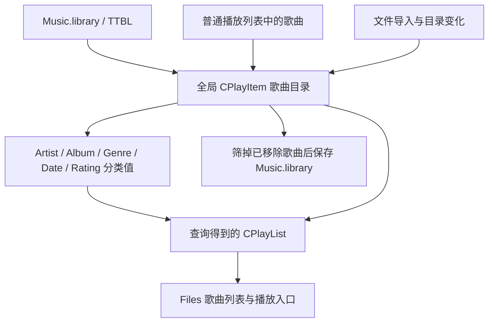

# 媒体库实现审计：原版伪代码与重建版对照

审计日期：2026-09-16。代码基线：`81c9dff1a80b9bc75f5253576b2dc326836b3615`。

> 本文保留修复前的审计结论和原始复现数据。后续修复、分类语义的汇编确认及回归验证见 [MEDIA_LIBRARY_FIXES.md](MEDIA_LIBRARY_FIXES.md)；下文“当前／重建版”均指上述审计基线。

## 1. 结论

**媒体库已有实质性的核心实现，但尚不能认定“已完全做好”，也不能认定与原版行为完全一致。**

已经具备独立存储、歌曲去重、分类树、查询结果、独立播放快照、目录监视，以及评分、属性、复制、排序和删除等命令。当前主要欠缺是数据一致性、媒体库独有歌曲的启动恢复、元数据完整性，以及目录监视的故障恢复。

本次对当前源代码编译了隔离探针，复现了扫描覆盖评分、启动恢复丢失、删除记录重新发现失败、WAV 信息读取不完整、盘符根目录包含关系错误。另外，原版对话框资源与调用参数共同确认：重建版误把“同时监控子文件夹”解释为“启用此目录”。另有通过控制流即可确认的问题，以及需要原版运行验证的语义差异，下面分别说明。

本次只新增审计文档；没有修改播放器实现。工作区原有的 `README_chs.md` 修改保持原状。

## 2. 原版媒体库如何工作

依据：[TTPlayer.exe.pseudo.c](../../reverse/decompiled/TTPlayer.exe.pseudo.c)。以下地址为原始程序函数地址。反编译代码存在 `unaff_EBP`、隐式参数和寄存器恢复失真，不能把生成的 C 函数签名直接当成原始声明。

### 2.1 全局歌曲目录、查询列表与普通播放列表

原版的媒体库并非一个独立 SQL 数据库。其核心是全局 `CPlayItem` 目录，`Music.library` 通过 TTBL 播放列表读写器持久化。

| 原版函数 | 可确认的职责 |
| --- | --- |
| `004AF271 / 004AF1C5` | 初始化歌曲目录的散列表容量；选择至少 257 的合适桶数 |
| `004AF7F4` | 通过 `CPlayList_LoadTtbl` 读入媒体库文件 |
| `004AF6DF / 004AF75B` | 遍历目录，将仍有效的歌曲组成“全部歌曲”查询列表 |
| `004AF295` | 枚举某元数据字段的非空不同值，支持附加筛选条件，并排序 |
| `004AF46A` | 按元数据字段和值查询；支持第二字段条件，用于“歌手 → 专辑”等层级 |
| `004AF602` | 按精确评分值查询 |
| `004AF838` | 汇总有效歌曲，调用 `CPlayList_SaveTtbl` 保存 |

关键对象关系：



`004AF75B / 004AF46A / 004AF602` 将歌曲放入查询列表时，会增加原 `CPlayItem` 的引用计数。也就是说，查询列表拥有自己的排列和成员集合，但成员仍引用共享歌曲对象。

歌曲的 `+0x90` 字段承担移除标记的作用：查询和保存都会跳过该字段非零的歌曲。这与删除物理文件不同。不能把“从媒体库移除”和“删除磁盘文件”视为同一个操作。

`Library/MaxItemCount` 是下一次初始化的容量提示，**不是媒体库允许收录的最大歌曲数**。重建版在这一点上已正确恢复。

### 2.2 分类树与查询

`00489ED4` 处理树节点展开，`0048A38E` 处理选择：

- 根节点对应全部有效歌曲。
- 一级字段为 `Artist`、`Album`、`Genre`、`Date`、`Rating`。
- 非评分字段展开为非空字段值；歌手下面可以继续按专辑展开。
- 评分展开为 5 星到 1 星。
- 字段值查询使用不区分大小写的相等比较；歌手下的专辑需要同时满足两个条件。
- 查询结果成为 Files 列表当前使用的 `CPlayList`，随后更新行数、当前播放行标记和界面。

**一级分类节点本身的点击语义仍需重点复核。** 原版 `0048A38E` 的分类分支中，Rating 创建空列表，其余字段将空字符串条件交给 `004AF46A`；后者执行字段相等比较。这指向“空字段歌曲／空评分父列表”的行为，而非重建版当前实现的“所有有该字段／所有有评分歌曲”。详见第 5 节；本次没有运行原版完成这个分支的动态验收。

### 2.3 信息读取

`004ADA76` 负责打开声音读取器、枚举元数据，并把字段写回歌曲对象；`004AD95B` 从读取器获取时长、音频格式、采样率、声道和码率等信息。`00481759` 还体现了对可见歌曲延迟读取信息的路径。

歌曲时长状态有明确含义：`-2` 表示尚未读取，`-1` 表示读取失败，非负数表示已知时长。媒体库中的路径、标签、时长及格式不是同一项完成条件；能够列出文件路径不代表信息读取已经完整恢复。

### 2.4 目录监视

`0045EAF1` 根据设置重建目录监视；`0041AC7B` 打开目录句柄并保存每个目录的递归选项，`0041AD0D` 将该值交给 `ReadDirectoryChangesW` 的第四参数，过滤掩码为 `0x13`。`0041AF86` 等待通知，`0041AE8D` 将路径和动作发给窗口，窗口消息 `0x7F5` 进入 `004833B6`。

目录列表中的复选框表示是否同时监视子文件夹；未勾选的目录仍要监视其直接子项。原版对话框 255 直接说明了这一点，详见第 4.8 节。

通知消费端区分新增、修改、删除以及重命名的旧名／新名，分别更新歌曲信息、加入文件或递归处理目录，再更新当前列表。重建版基本恢复了这条链，但异常路径与移除标记恢复仍有问题。

原版最多 63 个目录的限制来自等待句柄数量，需要为停止事件保留一个位置；重建版保留该限制有依据。

### 2.5 持久化、模式和启动恢复

- 初始化／启动链 `004C038B -> 004AF7F4` 读取 EXE 同目录的 `Music.library`。
- `0047F766` 切换媒体库模式；当 Library 尚未有效时会装载、整理普通播放列表的歌曲信息，再建立媒体库视图。
- `004810D2` 根据 `PlayingCatalog` 逐层查找并恢复分类选择。
- `004C038B` 对媒体库模式具有单独的记忆歌曲处理分支：查找全局歌曲目录后进入 `0047FFB6`，并非只搜索编号播放列表。
- 退出链 `004616BD -> 004AF838` 保存有效歌曲；关闭媒体库功能时删除库文件。

`004AF838` 保存时临时开启详细信息保存选项。`CPlayList_SaveTtbl` 的 `0x10` 段可以携带格式及音频信息；`0x20` 是元数据项，`0x40` 是评分。重建版目前只保留了其中一部分，见第 4.7 节。

## 3. 重建版已经完成的部分

主要实现：[player_window_library.cpp](../src/ui/player_window_library.cpp)、[directory_change_monitor.cpp](../src/ui/directory_change_monitor.cpp)、[playlist.cpp](../src/playlist/playlist.cpp)。

| 项目 | 当前实现与判断 |
| --- | --- |
| 独立存储 | 使用 EXE 同目录 `Music.library`，TTBL 读取、退出保存、禁用删除均已有代码 |
| 收录和去重 | 按规范化路径和子轨身份合并持久化、普通列表、手动加入及扫描来源 |
| 分类与值查询 | 五类分类、歌手下专辑、评分叶节点、自然排序已实现；一级分类语义待核验 |
| 查询与播放分离 | 查询结果和 `media_library_playback_` 播放快照分开，切换树节点不直接替换正在播放的队列 |
| 目录功能 | 配置目录、递归扫描、原生目录通知和通知代次校验均已实现；边界与恢复有缺陷 |
| 评分和属性 | 可修改当前结果、持久化副本、关联的普通列表以及播放副本；并发扫描仍可覆盖修改 |
| 复制与列表流转 | 剪贴板、拖放数据、复制／移动到普通列表和 Send To 路由已有实现 |
| 清理与排序 | 选中移除、清空当前结果、重复／无效项处理、排序与随机排列已有实现 |
| 文件操作 | 浏览文件、属性、重命名、物理删除等通过媒体库身份或共享命令路径处理 |
| 线程生命周期 | 扫描持有插件生命周期；结果检查实例和代次；销毁撤销接收者并限制等待时间 |

以上“已有实现”来自控制流审查，**不表示每项都做过完整端到端验收**。例如，存在 Send To 或在线命令入口，并不证明所有第三方目标、网络服务和历史服务器仍能工作。

## 4. 已确认的问题

### 4.1 后台扫描结果覆盖扫描期间的评分修改〔高优先级，已复现〕

位置：`player_window_library.cpp:1040` 的 `SetVisiblePlaylistRating`、`:1506` 的请求快照、`:1848` 的 `ApplyMediaLibraryIndex`。

复现顺序：歌曲初始 1 星 → 后台生成扫描结果 → UI 将其改为 5 星 → UI 收到扫描结果。

实际输出：

```text
rating before completed scan delivery=5
rating after completed scan delivery=1
```

原因：扫描请求持有歌曲副本；评分修改没有推进修改版本，也没有登记需要合并的修改。结果提交只比较扫描实例和代次，然后整批替换 `items`，再重建持久化副本。原版共享对象的关系没有在这些副本之间完整恢复。

影响不止界面：旧评分会进入后续保存结果。标签编辑也缺少同类版本合并保护，但本次只对评分进行了受控交错复现。

建议：为歌曲维护独立的修改版本，提交扫描结果时合并较新的用户字段；扫描代次不能替代歌曲修改版本。

### 4.2 媒体库独有歌曲无法按记忆记录恢复〔高优先级，已复现〕

位置：[player_window.cpp](../src/ui/player_window.cpp):6147，`RestoreStartupPlayback`。

当前恢复函数只遍历 `playlists_` 的普通播放列表；找不到便调用 `ClearPersistedPlaybackIdentity`。它既不搜索媒体库，也不等待媒体库异步读取完成。

探针让歌曲存在于媒体库，而普通播放列表没有该歌曲，设置其为记忆播放文件后调用恢复，得到：

```text
library-only startup identity retained=0
```

这意味着启动恢复／续播对只通过媒体库收录的歌曲没有完成。原版 `004C038B` 中存在媒体库模式的独立恢复分支。

建议：将媒体库来源的恢复延期到库加载完成，按歌曲身份找回播放项并建立正确的播放队列，之后再应用自动播放和位置恢复设置。

### 4.3 删除记录经过刷新后，同路径新增仍被隐藏〔高优先级，已复现〕

位置：`player_window_library.cpp:1097`、`:1666`、`:1848`。

受控事件顺序：移除 A → 一次刷新使 A 不再存在于 `items` → 收到同路径 A 的新增通知 → 扫描重新产生 A。

实际输出：

```text
readded item count=1 visible=0 still excluded=1
```

原因：新增通知清理 `excluded` 时，只遍历当前 `items` 来找旧身份。旧项已经从数组消失时，移除标记没有被清掉。新扫描虽能收录同一身份，查询仍会过滤它。

本探针调用实际移除、构建、通知消费和结果提交函数；使用真实监视器建立有效通知代次，并受控投递新增事件，没有依赖磁盘删除／重建的随机时序。

建议：移除标记保留可按源路径查询的身份信息；新增／新名通知直接处理对应路径及子轨的恢复，避免依赖当前可见或已存活的条目。

### 4.4 内建格式的媒体库信息读取不完整〔中高优先级，已复现〕

位置：`player_window_library.cpp:762`、`:814`、`:876`。

有匹配 AddIn 时使用声音读取器；没有匹配 AddIn 时只调用 Shell 属性存储。后者读取部分标签和评分，没有填充时长、格式、码率或采样率，也没有接入重建版自己的内建音频读取路径。

对探针生成的有效 1 秒、44.1 kHz、16 位单声道 PCM WAV，未提供外部 AddIn，实际得到：

```text
WAV without external AddIn: duration=-2 format= bitrate=0
```

这证明的是媒体库扫描阶段信息读取不完整，不代表该 WAV 无法播放。普通列表的延迟读取队列按普通列表槽位工作，不能据此认为媒体库独有项一定会被补齐。

兼容性方面，Shell 属性接口在重建版使用可选 API 包装，接口不存在会返回失败；没有对应 AddIn 时，这条元数据路径没有进一步后备读取。XP 分发包能启动，并不等于其媒体库标签、时长和分类信息已经完整兼容。本次没有在 XP／Win7 实机运行此功能。

另一个静态可见问题是 Shell 的非零 `PKEY_Rating` 会直接改写 `track.rating`，与代码注释所说的“保留独立 TTPlayer 评分”存在冲突；此条件尚未制作带 Shell 评分的文件验证。

建议：为媒体库统一接入内建／AddIn 信息读取能力，并明确库内评分与文件标签评分的优先级。

### 4.5 一个监视目录重新监听失败，会结束所有目录监视〔高优先级，控制流确认〕

位置：`directory_change_monitor.cpp:151` 附近的 `if (!Arm(watches[index]))`。

代码注释说保留其他句柄，但实际在发送一次目录 `FILE_ACTION_MODIFIED` 后执行 `return`，退出整个监视循环。其他仍有效的目录也随线程结束停止监视。

接收端对不存在的目录直接返回；对仍存在的目录 MODIFIED 事件不会安排递归补扫。因此注释所承诺的后续全量协调也没有形成完整路径。

这是确定的失败分支问题；本次没有进行拔盘／网络断连故障注入。原版 `0041AF86` 在重新发起监视后继续等待，其伪代码未见相同的“失败即结束全部目录”分支，但也不能据此保证原版所有故障恢复都正确。

建议：按目录移除或重试失败句柄，保留其他目录；显式传递需要补扫的状态，并让 UI 能重新建立失效监视。

### 4.6 盘符根目录的包含关系判断错误〔中优先级，已复现〕

位置：`player_window_library.cpp:285`，`IsSameOrBelowPath`。

`C:\` 这样的盘符根路径保留尾随分隔符，但函数还要求候选路径的下一字符也是分隔符，导致 `C:\song.wav` 被判断为不在 `C:\` 内。

```text
drive root contains child=0
```

这会影响以盘符根为范围的批量失效和恢复判定。它不等于“监视盘符根目录时所有普通文件通知都失败”，因为普通通知通常携带具体文件路径。

建议：对根路径和已以分隔符结束的前缀单独处理，并同时覆盖 UNC 根、相邻同名前缀及大小写情况。

### 4.7 TTBL 详细音频信息没有完整往返保存〔中优先级，控制流确认〕

位置：`playlist.cpp:992`、`:1059`。

加载 `0x10` 段时，当前代码读过格式字符串并跳过后续 12 字节，没有写入 `Track`；保存时也不生成该段。因此，原版 Music.library 中已有的详细音频信息会被丢弃，重建版内存中的格式、码率等信息也不会通过此段保留下来。

原版 `004AF838` 会开启详细保存，而 `00476550` 实际包含 `0x10` 段写出分支。这是持久化保真度的差异；并非整个 TTBL 不兼容，路径、标题、时长、常规元数据和评分已有相应读写。

建议：先逐字段确认原始 12 字节布局，再补齐读写与往返验证，避免只改声明或凭字段名推断二进制结构。

### 4.8 把“包括子文件夹”误解为“启用该目录”〔高优先级，原版资源与参数链确认〕

原版对话框资源：[5__255__2052.bin](../../reverse/ttpres/root/verified/5__255__2052.bin)，解码文字包含：

> 自动将变化反应到媒体库中。(选定表示同时监控其子文件夹)

原版参数链也与文字一致：

1. `00494750 -> 0049FFCF` 读取目录行的复选状态，保存到目录条目的第二字段。
2. `0045EAF1` 对目录逐一调用 `0041AD91(path, flag)`，没有按该标志跳过目录。
3. `0041AD91 -> 0041AC7B` 把标志保存到监视对象的 `+0x18`。
4. `0041AD0D` 将该字段作为 `ReadDirectoryChangesW` 的第四参数，即是否监视子目录。

重建版则在 [settings.h](../include/ttplayer/settings/settings.h):243 将其命名为 `enabled`，`StartMediaLibraryMonitoring` 在 `:1625` 附近跳过 `!directory.enabled` 的目录；`directory_change_monitor.cpp:65` 又把递归参数固定为 `TRUE`。

| 目录复选框 | 原版 | 重建版 |
| --- | --- | --- |
| 不勾选 | 监视该目录的直接子项 | 完全跳过该目录 |
| 勾选 | 同时监视子目录 | 递归监视 |

所以当前缺少的是**非递归监视模式**，并且会错误解释原版已有配置。应把模型改为表示 `recursive/include_subdirectories`，保留每个配置目录，把递归选项逐级传到监视器；目录扫描也需要按其实际语义确定深度。

原版资源还写明监视变化可以更新“媒体库或默认的播放列表”；`0045EAF1` 的启动条件不要求 Library Enabled，`004833B6` 也有普通列表处理路径。重建版 `StartMediaLibraryMonitoring` 则要求 `settings_.library.enabled`，因此关闭媒体库时的默认列表监视行为也尚未恢复。此项为资源／控制流对照结论，没有做原版 GUI 动态验证。

## 5. 尚需核验的行为差异与验收缺口

### 5.1 一级分类节点语义

重建版 `player_window_library.cpp:1993` 明确写为“聚合已填字段的子项”。探针验证它会在 Artist 分类中显示有歌手的歌曲，在 Rating 分类中显示已评分的歌曲。

| 场景 | 原版伪代码指向的行为 | 重建版当前行为 |
| --- | --- | --- |
| 点击 Artist／Album／Genre／Date 分类本身 | 将空值交给字段相等查询，即筛出缺少该字段的歌曲 | 筛出该字段非空的歌曲 |
| 点击 Rating 分类本身 | 新建空查询列表 | 显示全部已评分歌曲 |
| 点击具体字段值或星级 | 字段／评分精确匹配 | 已实现相应精确匹配 |

前两项是高可信静态差异，但 `0048A38E` 的部分参数由反编译器隐式恢复。本次没有运行原版核对实际行数，故不将其与第 4 节已复现缺陷混为一谈。应使用“有标签、无标签、有评分、无评分”四组样本对原版和重建版点击同一节点验收。

### 5.2 初扫、离线变化和完整重扫

启动 `player_window.cpp:2553` 调用 `StartMediaLibraryRefresh()`，随后 `StartMediaLibraryMonitoring()` 使用默认 `scan_new_directories=false`。刷新请求只取 `pending_directories`，不会自动把全部配置目录加入扫描。

只有应用媒体库配置调用 `StartMediaLibraryMonitoring(true)` 时，新加入监视集合的目录才会安排初扫。普通刷新命令 `0x7FEE` 同样没有枚举全部配置目录。

因此，“实现了目录初扫”需要限定入口。关闭期间新增的文件、监视未成功启动的目录、遗漏通知后的完整补扫，尚没有统一的目录协调流程。原版 `0045EAF1` 所展示的也是监视设置链，不能仅凭它断言原版每次启动必定全盘重扫。

现有本地监视探针在程序启动后才创建测试文件；这能检查新增通知，不能证明启动前已有文件会被初扫。

### 5.3 读者阻塞与大库性能

扫描在同一进程的分离线程中调用 AddIn／Shell，生命周期管理能避免退出时卸载仍使用中的模块，但没有逐文件超时或进程级故障隔离。一个读取器一直不返回时，`indexing/workers` 会一直阻止下一次刷新。

构建结果也是整批完成后发布；已有种子在后续刷新中可再次读取元数据。尚不能根据“后台线程不阻塞 UI”就认定大目录、慢网络盘和问题插件下的扫描体验已经完成。应分别测试可取消性、结果逐步出现和重复刷新成本。

### 5.4 保存与退出边界

退出只保存当时已提交的有效条目。扫描期间新加入的待处理数据、旧扫描覆盖后的修改以及扫描未完成就退出的行为，需要专项验证。`SaveTtbl` 使用直接截断写入，异常退出／写满磁盘时的恢复也没有在本次验收。

原版库保存底层也能见到直接创建目标文件的写法；不能仅凭重建版未做原子替换就将其表述为确定的原版回归。这是数据可靠性仍需完善的部分。

## 6. 本次验证的范围

本地探针位于 `out/media-library-audit/audit.cpp`，编译产物为 `build/Release/media_library_audit.exe`，输出为 `out/media-library-audit/probe-results.txt`。这些位于忽略的构建／输出目录中，不是已加入 CI 的测试。

探针直接编译当前 `player_window_library.cpp`，链接当前本地 `ttplayer_core.lib`；通过已有测试访问入口调用实际函数。评分用受控的“生成结果 → 用户修改 → 提交结果”顺序重现异步交错，未依赖概率性压力测试。

完整输出：

```text
rating before completed scan delivery=5
rating after completed scan delivery=1
library-only startup identity retained=0
Artist category count=1 first artist=Artist A
Rating category count=1
WAV without external AddIn: duration=-2 format= bitrate=0
drive root contains child=0
readded item count=1 visible=0 still excluded=1
```

没有执行原版 GUI 分类对照、XP／Win7 实机、大规模曲库、网络盘掉线、通知丢失或写盘失败测试；本次也没有声称整个测试套件通过。

此外，本地 `tests/`、`tools/` 没有列入当前仓库跟踪文件，现有发行工作流使用 `BUILD_TESTING=OFF`。历史文档中的本地探针成功，不能直接等同于当前 Actions 对媒体库行为提供了持续回归保障。

## 7. 建议修复与验收顺序

1. **先保护数据与恢复能力**：扫描结果合并用户修改；恢复同路径重新出现的记录；补齐媒体库独有歌曲启动恢复。
2. **恢复正确的监视语义并修复故障传播**：未勾选表示非递归监视；单目录失败不得终止其他目录，补上按目录重试和明确的全量协调入口，并恢复关闭媒体库时的默认列表监视行为。
3. **统一信息读取与持久化**：内建格式也获得声音信息；验证旧系统的无 Shell 后备路径；恢复 TTBL 详细字段。
4. **核准原版分类语义**：原版与重建版使用同一组样本比较每个父／叶节点及歌手下专辑。
5. **建立可随仓库运行的行为回归**：覆盖评分并发提交、删除后再发现、库内续播、初扫与离线变化、问题读取器，以及保存／重启。

达到这些条件后，才适合把媒体库从“核心功能已有实现”提升为“主要行为恢复完整并经过验收”。目前不应给出完成百分比：没有稳定的原版行为清单和覆盖分母，百分比会掩盖这些实际影响数据的缺陷。
