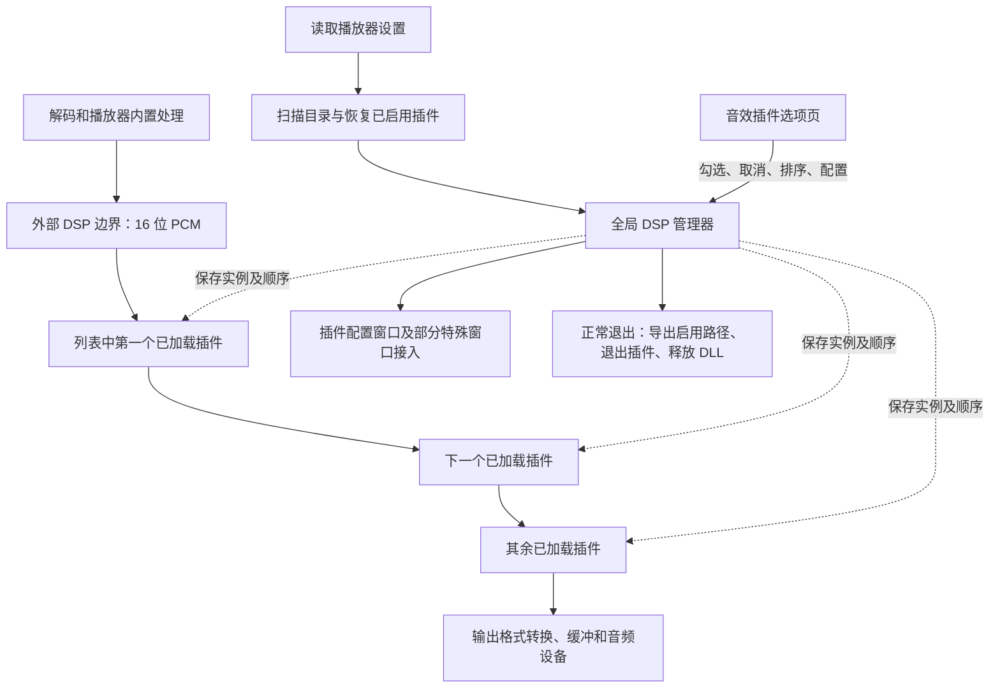

# 原版音效插件完整运作分析

分析日期：2026-09-30。对象：项目根目录的原版 `TTPlayer.exe`，以及它的 Ghidra 伪代码。

## 1. 结论与范围

原版的音效插件系统可以概括为：**一个进程内的全局 Winamp DSP 管理器，按列表顺序保存多个插件实例；界面线程负责启用、配置和禁用，音频工作线程将解码后的音频依次送入这些实例。**

插件的生命周期跟随“是否启用”，不跟随每一首歌曲。配置界面操作正在处理音频的同一个实例。原版宿主负责接口调用、排序、部分窗口协调及有限的异常处理；音效算法、插件私有线程、预设和注册表读写由各插件实现。

本文覆盖宿主从启动到退出的完整主干，以及已经能确认的边界分支。**完整分析宿主流程不等于完整恢复每个第三方 DLL 的全部算法，也不等于证明所有插件和所有系统上的行为完全相同。**

### 1.1 证据

- [原版伪代码](../../reverse/decompiled/TTPlayer.exe.pseudo.c)：主要函数、调用关系、设置读写和界面消息。
- 原版 EXE 的 x86 指令、虚函数表、C++ EH 元数据及 SEH 作用域表：核对被伪代码遗漏的参数和异常分支。
- [本地 Winamp DSP 接口头文件](../../winamp/Src/Winamp/DSP.H)：只用于区分标准 ABI 与原版实际实现，不把较新 SDK 的所有能力套给原版。
- 当前重建源码：仅用于第 16 节的现状对照。

本次重新计算的原版 EXE SHA-256：

```text
c7999ea5823469c1684148cac1bd196009824348ccac5cdd45978f8fb574e28c
```

下文地址是该 EXE 的首选虚拟地址 VA，不是文件偏移。`FUN_*` 是反编译名称，结构名称是依据用途重建的名称。伪代码中的 `in_EAX`、`unaff_ESI`、`extraout_ECX` 不能当成没有初始化的源代码变量；它们经常代表反编译器未正确恢复的寄存器参数。

此次为静态分析，未启动插件、未播放音频、未修改系统注册表、未重新构建发行包。提取工具及 58 个相关函数的本地证据放在 `rebuild/tests/artifacts/original_dsp_full_analysis/`，测试工具不加入发行和 Actions。

## 2. 总体结构



需要区分三层：

| 层次 | 负责什么 | 是否属于本文的 Winamp DSP 链 |
|---|---|---|
| 输入／解码插件 | 识别 MP3、FLAC 等文件，输出 PCM | 否 |
| 播放器内部音频处理 | ReplayGain、均衡器、立体声扩展、重采样等 | 否，但位于相关音频路径上 |
| `dsp_*.dll` | 对 PCM 进行第三方音效处理 | 是 |

PCM 是已经解码的采样数据。宿主不会把 FLAC 压缩数据直接交给 Ozone，也不会因为启用了 DFX 就改用 DFX 解码歌曲。

## 3. 数据结构与 ABI

### 3.1 DLL 导出入口

`0042822F` 的实际流程：

```cpp
library = LoadLibraryW(path);
entry = GetProcAddress(library, "winampDSPGetHeader2");
header = entry();                 // 原版没有传入 HWND 参数
if (header && header->version > 0x1f)
    return success;
FreeLibrary(library);
```

原版使用 Winamp DSP 导出函数加载插件。这里没有调用 `DllRegisterServer`，也不以 COM 注册作为发现条件。依赖 DLL、资源和插件自己的注册信息是否齐全，是另外的问题。

### 3.2 头部

| x86 偏移 | 内容 | 原版用法 |
|---|---|---|
| `+0x00` | `version` | 要求大于 `0x1F` |
| `+0x04` | ANSI `description` | 显示描述；用于 Pacemaker 名称过滤 |
| `+0x08` | `getModule(index)` | 查询索引 0～9 中第一个非空模块 |
| `+0x0C` 及后续 | 较新接口的扩展字段，例如 `sf` | 未见此宿主使用 |

版本检查只有下限，不表示对所有更高版本均完整支持。本地 SDK 的 `0x22` 可以要求头部入口接收 HWND，而原版调用没有这个参数；因此“版本号通过”不能保证新接口兼容。

### 3.3 模块

```cpp
// 语义还原，32 位指针；回调采用 __cdecl。
struct DspModule {
    char* description;                         // +00
    HWND hwndParent;                           // +04
    HINSTANCE hDllInstance;                     // +08
    void (*Config)(DspModule*);                 // +0C
    int  (*Init)(DspModule*);                   // +10
    int  (*ModifySamples)(DspModule*, short*,
                          int frames, int bits,
                          int channels, int sampleRate); // +14
    void (*Quit)(DspModule*);                   // +18
    void* userData;                             // +1C，插件私有数据
};
```

宿主使用 DLL 返回的原始模块指针，仅填写父窗口和 DLL 句柄，不复制或重新分配模块。`userData` 位于回调表之后，不能插到结构开头。Ozone 实际使用 `+0x1C` 保存处理对象。

### 3.4 宿主包装对象和全局管理器

单插件包装对象分配 `0x28` 字节：

| 偏移 | 含义 |
|---|---|
| `+0x00`～`+0x17` | 实例临界区 |
| `+0x18` | `HMODULE` |
| `+0x1C` | DSP 头部指针 |
| `+0x20` | 模块指针 |
| `+0x24` | 音频处理失败后旁路标志 |

伪代码把对象误识别成延长的 `CRITICAL_SECTION` 数组，因此出现 `[1].OwningThread` 等名字。这里的 `+0x24` **不是实际线程句柄**。

全局管理器位于 `00546C64`，前部是列表容器，`+0x04` 是条目数，`+0x10` 起为管理器临界区。每条记录保存路径字符串与包装对象指针；未启用的记录仍可以保留路径，实例指针为空。

`005144D4` 在静态初始化阶段调用 `0042828B` 构造管理器，并登记退出析构 `0051589B → 004282AA`。它不是每首歌曲新建的对象。

## 4. 启动、默认目录、扫描与依赖搜索

### 4.1 默认目录不是永远固定在程序目录

`00401E96` 的插件设置默认值分支依次尝试：

1. 读取 `HKCU\Software\Winamp` 默认值，拼接 `\Plugins`。
2. 没得到目录时，检查 Program Files 下的 `Winamp\Plugins`。
3. 仍未得到目录时，使用播放器程序目录下的 `Plugins\`。

已有 XML 中的 `Plugin/@Folder` 可以覆盖默认值。因此移动播放器后仍访问旧目录，是绝对路径配置造成的可解释行为。

### 4.2 扫描规则

`0042875F → 00428626 → 004288DB → 004289FC`：

- 配置目录非空时，先扫描程序自带的 `Plugins\`。
- 自带目录与配置目录的字符串忽略大小写比较不同，再扫描配置目录。
- 匹配 `dsp_*.dll`，不递归扫描全部子目录。
- 将枚举到的文件路径加入管理器，按路径字符串忽略大小写去重。
- 目录枚举没有在这里做文件名排序。
- 扫描本身只添加候选记录，不对每个 DLL 调用 `Init`。

这里的去重是字符串比较，不是文件 ID 比较。短路径、不同路径别名等是否指向同一文件，不由这段逻辑完整判断。扫描入口也没有先清空管理器，因此更改扫描目录不等于立即卸载已经启用的旧目录插件。

### 4.3 描述探测会真正加载 DLL

选项页填列表时，`00428372` 分两种情况：

| 状态 | 获取描述的办法 |
|---|---|
| 已有活动实例 | 读取现有头部描述 |
| 尚未加载 | `004281C6` 临时 `LoadLibrary`、取头部和描述，再 `FreeLibrary` |

因此打开选项页本身就可能触发 DLL 的 `DllMain` 和依赖加载。没有勾选不等于插件文件完全没有执行过任何代码，但此时不代表已经进入 `Init/ModifySamples` 生命周期。

`00498C2C` 没有根据描述探测失败跳过插行，所以原版允许出现“有文件名、描述为空”的候选项。文件存在、接口探测成功、初始化完成、实际改变声音，是四个不同层次。

### 4.4 PATH 处理

`0042875F` 从配置插件目录构造“去掉尾部反斜杠的目录；其父目录”，交给 `004C8421` 追加到当前进程的 `PATH`。例如：

```text
D:\Player\Plugins\ → D:\Player\Plugins;D:\Player
```

它服务于旧插件的依赖查找：

- 是当前进程的环境变量修改，不是系统环境变量的永久设置。
- 没有在此调用 `SetCurrentDirectory`。
- 不会自动修改插件注册表内的资源路径。
- 已见实现直接追加，没有去重；反复刷新可能重复追加。

因此“DLL 能加载但预设、图片、设置程序找不到”仍然可能发生。

## 5. 启用列表恢复与持久化

### 5.1 设置格式

`004B605A` 的 XML 插件分支读写：

```xml
<Plugin
    Folder="D:\Player\Plugins\"
    Modules_Count="2"
    Modules_0="D:\Player\Plugins\dsp_izOzone.dll"
    Modules_1="D:\Player\Plugins\Dsp_Dfx.dll" />
```

上面是说明格式的示例，不是本机当前配置。二进制字符串 `00520EF4="Modules"`、`00521874="%s_%d"`、`0052187C="%s_Count"` 确认属性命名方式。

保存对象是启用插件的路径及相对顺序。插件内部的音效参数、注册信息和预设不在这几个属性中。

### 5.2 启动恢复的实际顺序

`004C038B`：

1. 配置目录非空时调用扫描。
2. 保存的模块列表非空时，调用 `004285A7(..., enable=1)`。
3. `004285A7` 先清空管理器，再按照保存列表逐条添加并启用。

这意味着存在已保存模块时，启动后管理器先按保存顺序重建；打开音效插件页触发扫描后，其他未启用候选才补回列表。**不能把启动恢复简单理解成“按枚举顺序勾选几个文件”。**

如果某条保存路径加载失败，其记录仍可存在，但实例指针为空。顺序恢复不代表所有条目加载成功。

### 5.3 何时导出当前启用状态

`0042855B` 清空目标字符串列表，再沿当前管理器顺序收集所有实例指针非空的路径。

已确认的调用点是正常退出 `004616BD`：先导出到设置中的模块列表，再进入设置保存，之后清理 DSP。

需要区分：

- 勾选、取消、排序会立即改变运行状态。
- 这不等于每次操作立即重写 XML。
- 通用“全部保存”分支 `0049FE39 → 0040374B` 没有在该调用链显式执行 `0042855B`；不能仅凭按钮名称断言它已经重新采集最新运行链。
- 二进制直接调用检索中，`0042855B` 的调用只见于退出路径。该检索不是对任意间接调用的数学证明。

因此评价原版持久化时，应将“正常退出后恢复”与“运行中保存、异常退出后恢复”分别验证。

## 6. 勾选启用：从界面到活动实例

选项页消息映射 `00490CB8` 将列表状态变化交给 `0049911C`。列表重建期间通过页面 `+0x54` 标志抑制递归操作，点击记录保存在 `+0x58`。

运行链为：

```text
列表状态变化
  → 0049911C
  → 00428471(enable=1)
  → 分配 0x28 字节包装对象、初始化锁
  → 00427EDC
      → LoadLibraryW / winampDSPGetHeader2
      → 检查版本及描述
      → getModule(0..9)，取第一个非空
      → 填写主窗口 HWND、DLL HINSTANCE
      → Init(module)
      → 保存模块指针并清除处理故障标志
      → 接入已知特殊窗口
  → 在管理器中发布包装对象
```

### 6.1 模块选择

原版不是只调用 `getModule(0)`，而是从 0 查到 9，遇到第一个非空模块停止。即使一个 DLL 提供多个模块，原版也不把它们全部加入处理链，选项页没有这里对应的模块选择器。

### 6.2 Pacemaker 过滤

头部描述被转换为小写并查找 `pacemaker`，匹配则拒绝启用。过滤对象是描述字符串，不只是文件名。

原版不支持根据 DSP 返回值调整输出帧数，与变速插件需求存在冲突；这可以解释过滤的技术背景，但不能据此声称已经获得原作者的设计理由。

### 6.3 `Init` 的返回值

汇编 `00427FE7` 调用 `module+0x10` 后，没有检查 EAX，直接进入状态保存。**原版忽略 `Init` 的整数返回值。**

标准接口约定 0 表示成功，但原版中：

- 正常返回非零，不会仅因此拒绝模块。
- 没有有效模块、加载失败和被局部异常处理捕获，是不同的失败路径。
- `Init` 返回了，不代表插件内部已建立有效处理对象；有些插件之后仍会自行旁路。

父窗口由 `00428471` 明确传入 `DAT_005474F8`，即播放器主窗口；它不是音效选项页 HWND，也不是专门创建的完整 Winamp 模拟窗口。

### 6.4 锁的边界

普通单项启用路径中，执行 `Init` 时没有持有管理器锁和实例 PCM 锁，初始化完成后才发布给音频链。

**批量恢复是例外：**`004285A7` 自己持有外层管理器临界区，再调用单项启用。临界区允许同线程递归进入，内层解锁不会释放外层那一层。因此不能把“单项 Init 在锁外”扩大成“原版所有 Init 都在管理器锁外”。

## 7. 选项页、配置和排序

### 7.1 控件和消息

| 项目 | ID／消息 | 原版行为 |
|---|---|---|
| 插件列表 | `0x428`／1064 | 勾选状态、描述、文件名 |
| 路径显示 | `0x404`／1028 | 显示当前配置目录 |
| 浏览目录 | `0x3FF`／1023 | 选目录、补尾部反斜杠、通知扫描、刷新列表 |
| 配置 | `0x3F7`／1015 | 只对已加载模块可用 |
| 上移 | `0x412`／1042 | 与上一项交换，第一项禁用按钮 |
| 下移 | `0x415`／1045 | 与下一项交换，最后一项禁用按钮 |
| `NM_CLICK` | `-2` | 记录用户点击行 |
| `LVN_ITEMCHANGED` | `-101` | 判断复选框变化，执行启用／禁用 |
| `LVN_ITEMACTIVATE` | `-114` | 调用选中模块配置；包括控件发出的激活操作 |
| 自定义换序通知 | `-197` | 同步管理器记录顺序 |

不能把行选中等同于重新加载插件。`00498D94` 按当前行和活动实例更新配置按钮及上下移按钮。

### 7.2 Config 使用正在工作的实例

```text
配置按钮／列表激活
  → 004990E8 / 00499107
  → 00428972
  → 004280BE
  → module->Config(module)
```

原版没有新建仅用于显示配置的第二个模块，也没有为 Config 再启动一个独立宿主进程。因此插件调节内存参数时，可以影响正在运行的处理对象。

Config 自己可以显示已有窗口、创建模态或非模态窗口，也可以启动辅助 EXE。宿主不要求所有插件都返回一个相同类型的窗口。

`004280BE` 没有围绕 Config 加实例处理锁，也没有专门的局部 SEH 包装。配置与 PCM 参数访问是否正确同步，仍依赖插件自身实现。Config 返回后宿主保留 DLL，不因“配置函数返回”就卸载。

### 7.3 排序交换的是真实处理顺序

`00499070/0049909E → 0041CC48 → 00499181 → 0042892A → 00428A7F` 同时更新显示顺序和管理器记录。

交换包含路径及原有实例指针，不执行整链 Quit/Init。滤波历史、插件窗口及内存参数随实例保留。管理器锁覆盖一次完整 PCM 串联处理，换序不会插入当前块的两个插件回调之间。

## 8. 音频进入插件前后如何处理

### 8.1 音频工作路径

```text
004AC4D6 创建工作线程 004AC5C5
  → 004AC5C5 等待生产事件
  → 004AC304 准备及写入音频
  → 004AC166 准备下一块
      → 004B1375 读取及内部处理
      → 转成外部 DSP 所需的 16 位 PCM
      → 0042898D 串联所有活动 DSP
      → 需要时转为输出设备的位深
  → 输出缓冲及设备接口
```

原版有协调线程和音频生产线程，但没有为每个 DSP 分配一个并行处理工作线程。插件自己创建的线程是另一层。

### 8.2 内置处理与外部 DSP 的先后

已核实的关系：

1. `004B1375` 组织输入及内部处理分支。
2. `004B1950` 先做相关增益分析，再按配置应用 ReplayGain 倍率。
3. `004B1B81` 先调用内置均衡器，再调用立体声扩展。
4. 相应重采样／格式处理完成，返回 `004AC166` 后才进入外部 DSP。
5. 外部 DSP 完成后转换到输出格式并写入设备。

不同音源与设置不一定执行所有步骤。主音量、淡入淡出和 ReplayGain 也不能混为一个处理：输出协调代码还有单独的音量／淡化控制，不是通过每次调整音量重新初始化 DSP。

### 8.3 外部 DSP 固定使用 16 位

`004AC1FF` 明确压入 `0x10`，并传入当前格式的声道数和采样率，随后 `004AC20B` 调用管理器。

- 24 位 FLAC 不意味着 Ozone 收到 24 位整数或浮点 PCM。
- A、B、C 共用这条 16 位处理链，不在各插件之间重新解码。
- 最后转到 24／32 位输出，不能恢复进入 16 位阶段时已丢失的精度。
- 宿主没有在这个边界统一强制为 44.1 kHz、双声道。
- 插件自己可能只支持特定声道／采样率，不支持时可能返回原音频。
- 没有已加载插件时，不进入这条专门的 DSP 16 位转换分支。

链入口还检查声音对象的 DSP 允许标志；`004AB58B` 构造时将相关 `+0xAC` 标志设为 1。它不是独立的插件逐项勾选状态。

## 9. 多插件处理的精确语义

### 9.1 按列表串行、原地处理

`0042898D` 的语义为：

```cpp
Lock(manager);
for (Entry& entry : entries_in_current_order) {
    if (entry.instance)
        ProcessOne(entry.instance, pcm, inputBytes, rate, channels, bits);
}
Unlock(manager);
```

假设 A、C 启用而 B 未启用，实际就是 `A → C`。顺序由列表位置决定，不由最近一次勾选的先后决定。

每个插件收到相同的缓冲区地址和原长度；后面的插件看到前面插件已经修改过的数据：

```text
最终音频 = C(B(A(输入音频)))
```

宿主没有在插件之间恢复干声、自动混音、自动做响度补偿或自动削弱重复增强。两套增强器叠加后的音量、压缩和失真变化不能仅凭听感判断为宿主重复播放。

### 9.2 帧数单位

```text
每帧字节数 = (bits >> 3) × channels
frames     = inputBytes / 每帧字节数
```

4096 字节的 16 位双声道数据是 1024 帧，包含 2048 个 `short`。不是 2048 帧。交错采样形式为 `L0,R0,L1,R1,...`。

### 9.3 大块只对半一次

`004280CD`：

| 输入帧数 | 对同一个插件的调用 |
|---:|---|
| 16383 | 一次，16383 帧 |
| 16384 | 两次，8192＋8192 帧 |
| 20001 | 两次，10000＋10001 帧 |
| 32770 | 两次，16385＋16385 帧 |

这里没有反复循环切成固定上限的小块，也没有宿主补齐“至少 128 帧”。本地 SDK 的建议不能替代原版代码的实际行为。

外层按插件遍历，因此大块的顺序是：

```text
A 前半 → A 后半 → B 前半 → B 后半 → C 前半 → C 后半
```

### 9.4 忽略 ModifySamples 返回帧数

原版不采用回调返回的整数长度。返回 0、少于输入、超过输入，都不会据此改变下一插件和输出设备的有效长度。

这限制了会改变时长的处理器。返回更短长度也不会自动清零缓冲区后半部分。插件若扩写第一半块，还可能提前修改第二半块的输入。

此处确认的是原地处理和别名覆盖关系；不能仅凭这一点断言原版实际分配容量必然不够。重建版为回调提供暂存及额外容量，是另外的防护选择。

### 9.5 多插件的耗时是相加

一块音频的处理时间约为解码／转换时间加上各 DSP 的耗时。48 kHz 下 1024 帧只代表约 21.3 ms 声音；如果处理这块数据长期超过对应音频时长，输出缓冲最终会耗尽。

缓冲可以吸收短暂抖动，不能让长期慢于实时的处理链无限连续播放。把 A、B 改为同时处理同一原始输入后混合，会改变原版串联语义。

## 10. 停止、暂停、定位、换歌与尾音

| 操作 | 已确认的外部 DSP 主干行为 |
|---|---|
| 播放 | 同一批活动实例反复接收 PCM |
| 暂停／停止 | 控制声音读写及输出状态；没有因此固定执行整链 Quit/Init |
| 换歌 | 全局管理器继续存在；歌曲声音对象变化不等于 DSP 管理器重建 |
| 定位 | `004B16FE` 重置有关内部处理器；标准外部 DSP 回调表中没有独立 Reset 槽位 |
| 调整插件顺序 | 保留实例及其私有处理历史 |
| 取消后重新勾选 | 原实例退出，创建新实例，清除宿主失败标志 |

采样率和声道参数每次回调都会传入。插件需要自行发现格式变化并调整内部状态。不能假定“换歌必然调用 Init，借此通知格式变化”。

末尾数据耗尽后，`004AC304` 有为输出侧填充静音的分支，但这段静音填充位于外部 DSP 调用之后。已分析主干中没有通用的“持续给外部 DSP 送零，直到插件声明混响尾音结束”的协议，也没有单独的 Flush／EndOfTrack 回调。

由此只能说明宿主没有这套通用尾音协议，不能推断某个插件一定听不到尾音；已经处理进输出队列的尾音仍可能被播放。

## 11. 线程、锁与潜在卡死

### 11.1 调用线程与锁表

| 操作 | 主要调用方 | 关键同步 |
|---|---|---|
| 扫描、描述探测 | 启动或选项页线程 | 列表变更受管理器锁保护；未加载描述探测先离开该锁 |
| 单项 Init | 选项页消息路径 | Init 在该单项调用自己的锁外；完成后发布 |
| Config | 选项页消息路径 | 没有专门 PCM 锁包围 Config |
| ModifySamples | 音频工作线程 | 整链管理器锁，再进入当前实例锁 |
| 单项禁用 | 选项页消息路径 | 等待当前整链处理，摘除实例，锁外 Quit |
| 批量恢复 | 启动路径 | 外层管理器锁覆盖逐项恢复，包括 Init |
| 全部清理 | 重置／退出路径 | 管理器锁覆盖逐个销毁，包括 Quit |

### 11.2 两把锁保护的对象不同

- 管理器锁保证一块音频处理时列表和实例指针不会被换序或删除。
- 实例锁保护模块指针和单项 PCM 调用。
- 普通单项卸载先等待音频调用结束并从链中摘除，避免 DLL 正在执行时被释放。
- Config 不在这两把锁的处理范围内，插件参数同步不能由此一并保证。

### 11.3 原版也不是绝对不会卡死

单项禁用执行 Quit 前仍然需要取得管理器锁。若插件的 ModifySamples 一直不返回，禁用会等待它。

还存在如下有依据的死锁风险：

```text
主界面线程：取消勾选 → 等待管理器锁
音频线程：持有管理器锁 → 插件同步发送消息给主界面 → 等待主界面响应
```

这是从锁和跨线程消息机制推导的风险，不是本次在原版复现的死锁。原版没有在这条等待路径中提供每插件超时、自动终止线程或独立进程恢复。

因此恢复原版时应保留实例、顺序和回调语义，不能把可能阻塞的同步等待也当成必须照搬的正确行为。

## 12. 禁用、全部重置和正常退出

### 12.1 单项禁用

`00428471(enable=0)`：

1. 取得管理器锁。
2. 取出目标实例，把记录中的实例指针置空。
3. 释放管理器锁。
4. `0042853A → 00427EAF → 00428061` 销毁目标包装对象。
5. 实例锁内清空模块、头部和 DLL 句柄，再释放实例锁。
6. 调用旧模块的 `Quit`。
7. 调用旧 DLL 的 `FreeLibrary`，删除实例锁及包装对象。

其他仍启用的插件不需要重新 Init。摘除后的新 PCM 块会跳过该记录。

### 12.2 全部清理的差别

`004282E4` 持有管理器锁，调用 `00428B16`，按列表从前往后销毁实例，最后清空容器。

所以 A、B、C 的正常整体退出顺序是 A→B→C，而不是倒序。此时外层管理器锁仍在，不能套用单项禁用“Quit 完全不持有管理器锁”的结论。

选项窗口“全部重置”分支 `0049FE39` 在用户确认后调用全部清理、清空保存的模块列表，再恢复默认设置及刷新界面。

### 12.3 正常关闭程序

`004616BD` 的相关顺序：

1. 处理仍打开的选项窗口及相关界面状态。
2. `0042855B` 导出当前启用路径。
3. 保存播放器设置。
4. 进入当前播放会话收尾，例如 `0045B78E`。
5. `004282E4` 清理全部 DSP。
6. 完成其余窗口清理，销毁主窗口。

静态管理器析构还提供最终清理入口。这里应区分“正常主窗口退出路径”和“异常终止进程”：后者不能保证设置保存、Quit 或窗口清理完成。

## 13. 异常处理：保护了什么，没有保护什么

### 13.1 Init

`00427EDC` 的 C++ EH 元数据指向局部 catch-all，处理入口 `00428052` 释放当前 DLL 并返回初始化失败路径。该保护不是对 LoadLibrary、描述、getModule、Config 等全部第三方入口统一加保护。

这也不等于能处理任意内存破坏；不同异常机制与插件自身异常处理需要分别判断。

### 13.2 ModifySamples：异常后旁路

伪代码缺失的关键分支已由汇编确认：

```text
00428175：SEH 过滤器返回 1
00428179：进入异常处理
0042817F：wrapper->failed = 1
0042818B：释放实例临界区
```

后果：

- 本插件本次处理提前返回；前半块异常时不再处理后半块。
- 后续插件继续处理当前块。
- 下一块起跳过故障插件。
- 不立即 Quit、不立即卸载 DLL。
- 已修改的 PCM 不回滚。
- `0042841A` 和 `0042831E` 只看实例指针，因此故障插件仍可能显示勾选、允许配置、被计入已加载数量。
- 所有插件都故障时，音频路径仍可能做 16 位 DSP 转换，然后逐项旁路。

这解释了为什么“列表仍勾选”不能证明插件仍在处理声音。重新取消并勾选才会创建新实例并清除失败标志。

### 13.3 Quit：异常被吞掉不等于资源一定释放

`00428061` 的 SEH 表在 `00526508`，过滤器 `004280AD`，处理分支 `004280B1`。

正常流程在 Quit 后执行 FreeLibrary；但如果 Quit 抛出被捕获的异常，会直接跳到清理尾部，**跳过后面的 FreeLibrary**。宿主指针此前已经清空，可能留下 DLL 引用及插件未清理资源。

因此不能写成“原版 Quit 无论怎样失败都保证正确卸载”。死循环、永久等待不产生这类异常，SEH 更不会替它们退出。

### 13.4 保护边界汇总

| 情况 | 原版已见处理 |
|---|---|
| 文件不存在、LoadLibrary 失败 | 返回失败 |
| 缺少导出函数 | 释放 DLL，失败 |
| header 为空／版本过低 | 释放 DLL，失败 |
| 描述命中 Pacemaker | 释放 DLL，失败 |
| 0～9 都没有模块 | 释放 DLL，失败 |
| Init 正常返回非零 | 不据此拒绝 |
| Init 局部异常 | catch 路径释放 DLL，失败 |
| PCM 回调可捕获异常 | 标记旁路，保留实例 |
| Config 卡住／崩溃 | 该薄包装未见专门隔离机制 |
| Quit 可捕获异常 | 返回，但后续 FreeLibrary 可能被跳过 |
| 插件任意线程死锁、主动退出进程、严重破坏内存 | 无通用可靠恢复保证 |

## 14. 插件窗口、吸附与宿主消息

### 14.1 只对两个旧窗口标识做专门接入

每次成功初始化后，`00427EDC` 调用：

```cpp
FindWindowW(L"DFX_WINDOW", nullptr);
FindWindowW(L"Dee2", L"Dee2");
```

找到后，`00427E08` 创建窗口包装器，`0043556C` 用 `SetWindowLongW(GWL_WNDPROC)` 安装转发窗口过程，`0040BF67(hwnd,1)` 加入全局窗口集合 `005492A8`。

不是枚举所有 DSP 创建的窗口，也没有在这两次 FindWindow 后验证目标进程 ID。本地 DFX 使用 `DFX_WINDOW_11`，与这个旧类名不同，因此不能把旧类名分支直接当成本地 DFX 11 窗口已受原版管理的证据。

### 14.2 包装器的确切作用

二进制虚表 `0051C64C` 为：

```text
00405623：消息处理返回未处理
0041EB05：删除包装器
0043C7FB：返回通用窗口过程 004722AA
00427E4B：最终窗口销毁时移除全局 HWND 记录
```

`004722AA → 0043C9E0` 将未处理消息转交插件原窗口过程；在 `WM_NCDESTROY` 时处理恢复和收尾。

**这个 DSP 专用薄包装本身没有实现一套新的 WM_NCHITTEST，也没有直接把所有鼠标移动替换成播放器皮肤拖动。** 窗口集合参与的是播放器现有的可见窗口吸附／连接关系计算：`0044F804`、`0047075B`、`004709A2` 等。

应分别评价：插件自己的可拖动区域、系统原生移动流程、播放器向它吸附、连接窗口随主窗口移动。这四件事不能仅凭“安装了子类过程”便宣布全部相同。

### 14.3 普通插件窗口的责任

插件可以在 Init 创建窗口，在 Config 显示窗口，或创建辅助进程。父窗口字段是供插件使用的参数，宿主没有在这里强制为所有顶层窗口设置 owner、任务栏分组或统一 DPI。

原版自身 GUI 消息循环可服务在该线程创建的插件窗口；插件另建线程、另起 EXE 的消息循环由它自己维护。

原版主窗口会在退出早期向集合中有关窗口发送内部消息 `0x7EA`，但薄包装主要转发原窗口过程。不能将这条消息直接等同于所有第三方窗口的标准 Quit 协议。

### 14.4 Winamp IPC 的边界

支持 Winamp DSP ABI，不等于实现完整 Winamp 宿主。DSP 加载路径没有创建名为 `Winamp v1.x` 的完整兼容窗口，也没有在这里建立 SDK 全部 IPC 服务。

本地 DFX 会从处理回调向 `hwndParent` 同步查询消息；例如 SDK 中 `WM_USER` 的 `lParam=3031` 是当前播放文件名查询。它会带来跨线程依赖，但不能仅因 DFX 发了查询，就认定原版对这个查询返回了完整正确数据。这个问题需要主窗口分发及插件返回值使用路径的专项验证。

## 15. 注册表、预设、辅助 EXE 与具体插件

### 15.1 原版宿主不统一保存插件内部参数

原版的 Plugin XML 保存选择与顺序；各插件可以使用：

- `HKCU`／`HKLM` 注册表。
- 自己的 INI 或预设文件。
- DLL 目录中的资源子目录。
- 根据宿主 EXE 名称构造的配置文件。
- 独立设置程序及其通信机制。

本次核对的 DSP 宿主路径没有通用 REG 导入、共享 `registry.json` 或插件注册表虚拟化层。这些是重建版后续添加的便携化功能。

### 15.2 已有插件分析可确定的区别

以下沿用已有 DLL 专项证据，地址属于对应插件，**不是 TTPlayer.exe 的地址**；本次没有重新声称对全部插件做了运行测试。

| 插件 | 可以确认的运作特点 | 对宿主实现的要求 |
|---|---|---|
| Ozone | Init `5941A390` 建对象存入 `module+1C`；Config `5941A5C0`、Modify `5941A6C0` 使用它；Quit `5941B6D0` 清理 | Config 与 PCM 必须使用已初始化的同一对象 |
| 本地 DFX | Config `10001070` 读取 `HKLM\SOFTWARE\DFX\11\top_folder`，再启动 `Apps\dfxwsettings.exe` | DLL 成功加载不足以证明辅助界面路径正确 |
| Dolby | Init 创建状态；Config 显示现有窗口；Modify 检查 16 位、双声道 | 不满足格式可能自己旁路 |
| Skywalker | Config 创建非模态对话框；Modify 发现格式变化后调整状态 | Config 返回后仍需保留 DLL 和窗口消息循环 |
| VAPXP | Config 依赖全局初始化对象；Modify 检查格式及开关 | 未初始化时单独调用 Config 不能替代活动实例 |
| OctiMax | 根据宿主 EXE 名构造 `octimax_<host>.ini` | 更名可能影响原配置继承，JSON 注册表适配不能自动覆盖 INI |
| SPS | 从模块 DLL 路径寻找预设目录及脚本 | 应保留配套文件，不能只复制顶层 DLL |

参考：[最初插件实现分析](WINAMP_DSP_PLUGIN_IMPLEMENTATION_ANALYSIS.md)、[REG 文件分析](PLUGIN_REGISTRY_FILES_ANALYSIS.md)、[EXE 名称影响](EXECUTABLE_IDENTITY_AUDIT.md)。这些历史报告中的“当时重建版差异”应按其日期理解。

### 15.3 “完全一致”的验证维度

至少应分别验证：发现／描述、初始化对象、同实例配置、PCM 数据、跨块历史、格式变化、参数保存与重启恢复、窗口消息、辅助 EXE、正常禁用、异常退出。

只通过 LoadLibrary，或只听到音效，都不能覆盖其余维度。压缩或恢复过的 DLL 还应单独验证入口、导入、重定位及运行时行为，不能从宿主主干分析代替这些结论。

## 16. 与 2026-09-30 当前重建版的对照

本节以当前 [winamp_dsp.cpp](../src/audio/winamp_dsp.cpp)、[dsp_dispatcher.h](../src/audio/dsp_dispatcher.h)、[plugin_registry.cpp](../src/audio/plugin_registry.cpp) 为准。

| 项目 | 原版 | 当前重建版 |
|---|---|---|
| 头部、模块 ABI | Winamp DSP，0～9 首个非空模块 | 对应，增加坏指针及回调表检查 |
| 同实例配置 | 是 | 是 |
| 多插件 PCM | 音频线程顺序串联 | 对应 |
| 位深／对半规则／返回长度 | 16 位、达到 16384 帧对半一次、忽略新长度 | 对应核心规则 |
| 排序／单项变更 | 保留其他活动实例 | 增量保留实例 |
| Init／Config／Quit 所在线程 | 主要为宿主 GUI 调用线程 | 专用且持续运行消息循环的 DSP GUI 线程 |
| 运行时启停 | 界面同步进入管理器 | `RequestUpdate` 异步请求，在可安全变更时发布 |
| 慢 Quit | 单项路径不持链锁执行，但界面调用仍等待 | 摘链后在 DSP GUI 线程清理，主界面不等待慢 Quit |
| PCM 缓冲 | 原地写入 | 每个半块两倍容量暂存，成功后复制原长度 |
| PCM 异常 | 保留实例、失败标志、UI 仍可能视作活动 | 保留映射并旁路，同时更新实际活动缓存 |
| 故障块修改 | 之前写入的修改保留 | 失败回调的暂存修改不复制回去 |
| 依赖搜索 | 原始 LoadLibraryW 加进程 PATH | 使用含 DLL 目录的加载策略及兼容处理 |
| 注册表 | 插件访问系统注册表 | 通用共享文件注册表接入，系统读取回退及文件写入 |
| DFX 窗口 | 旧类名专门接入 | 扩展当前类名、进程筛选、吸附和已知负坐标兼容 |
| WASAPI | 原版没有该输出后端 | 重建版扩展，需单独验证缓冲／切换行为 |

这些额外保护和扩展是有意的实现差别。因此合理的目标是“正常音效数据及用户可见行为对应，故障处理更可靠”，而不是逐指令复制所有旧限制。

其中线程与异常处理的历史表格已经过后续修复：请结合 [多插件修复](DSP_MULTI_PLUGIN_STUTTER_FIX.md)、[启用禁用修复](DSP_ENABLE_DISABLE_AND_DFX_MULTIMONITOR_FIX.md) 阅读，不再采用早期文档中“当前 PCM 仍投递 GUI 线程”的旧结论。

## 17. 对此前 Ozone／DFX 问题的解释

### 正在播放时禁用卡住

需要区分三段等待：当前 PCM 块退出、插件 Quit 的内部清理、DLL 卸载及资源释放。它们的原因不同。

原版单项摘链再 Quit 的顺序，是有意义的兼容基准；原版的同步界面等待及整体清理持锁则不是不会卡死的保证。重建版当前异步控制、音频线程 PCM 和锁外清理，是在保留有效语义的基础上降低等待相互牵制。

### 两个插件后出现卡顿／似乎重复

原版不是重复送同一首歌曲，也不是把两个插件结果混音。应分别核对：PCM 是否重复提交、回调耗时、同步窗口消息阻塞、输出缓冲耗尽与恢复。WASAPI 是重建版新增路径，不能从原版 DSP 管理器直接推出它的缓冲实现正确。

### DFX 在另一屏幕拖不动

DSP PCM 链和鼠标命中测试是两条路径。本地 DFX 的负坐标截断已在专项修复中定位；原版仅识别旧窗口类名，并不能证明它替当前 DFX 修复了所有多显示器问题。

### 插件窗口与主程序分组不同

给模块 `hwndParent` 不代表强制建立顶层窗口 owner 或 AppUserModelID。窗口归属、现代任务栏分组与 DSP 接口初始化应分别处理。

## 18. 可直接用于后续开发的原则

1. 正确填写 ABI，保留 DLL 返回的模块对象及其私有尾部字段。
2. 启用期间维持同一实例；Config、PCM 操作同一个状态。
3. 坚持列表顺序串联；排序不能重置其余插件。
4. 正常音频保持原版 16 位边界、帧数单位、一次对半和固定输出长度语义。
5. 将 GUI 生命周期和 PCM 调用线程分清；不在会形成跨线程等待环的路径同步等待。
6. 摘链、等待在途回调安全结束、Quit、卸载按明确顺序完成。
7. 承认插件私有线程和外部进程的边界，不能靠 SEH 宣布任意故障均可恢复。
8. 目录、依赖、资源、INI、注册表、辅助程序分别核对。
9. 将当前插件类名和版本与原版写死的兼容对象区分，窗口接入不能覆盖或破坏插件原本命中测试。
10. 原版固有的坏路径与重建版保护措施应写清，不能为了字面一致重新引入阻塞或危险卸载。

## 19. 关键函数索引

| VA | 伪代码起始行 | 职责 |
|---|---:|---|
| `00401E96` | 1225 | 默认设置，包括插件目录查找 |
| `00427DEB` | 40571 | 读取管理器条目数 |
| `00427E08 / 00427E79` | 40587 / 40617 | 特殊插件窗口包装与加入集合 |
| `00427E97 / 00427EAF` | 40635 / 40652 | 实例构造、析构 |
| `00427EDC` | 40669 | 初始化、模块选择与特殊窗口接入 |
| `00428061` | 40776 | 单实例退出与 DLL 释放 |
| `004280BE` | 40805 | 活动实例 Config |
| `004280CD` | 40820 | 单实例 PCM、一次对半及故障旁路 |
| `004281C6 / 0042822F` | 40875 / 40901 | 临时描述探测、基础 DLL 加载 |
| `0042828B / 004282AA` | 40934 / 40967 | 管理器构造、析构 |
| `004282E4 / 00428B16` | 40987 / 41569 | 整体清理 |
| `0042831E / 0042841A` | 41009 / 41086 | 已加载数量、活动状态查询 |
| `00428372` | 41039 | 条目路径和描述 |
| `00428471` | 41117 | 单项启用／禁用 |
| `0042855B / 004285A7` | 41188 / 41216 | 导出启用路径、批量恢复 |
| `00428626 / 0042875F` | 41253 / 41309 | 目录枚举、双目录扫描和 PATH 准备 |
| `004288DB / 004289FC` | 41384 / 41492 | 加入候选、路径去重 |
| `0042892A / 00428A7F` | 41413 / 41529 | 交换记录及实例 |
| `00428972 / 0042898D` | 41436 / 41456 | 配置分发、整链 PCM |
| `00490CB8` | 139043 | 音效页消息分发 |
| `00498C2C / 00498D94` | 145952 / 146028 | 列表刷新、按钮状态 |
| `00498E25 / 00498F7B` | 146071 / 146126 | 页面初始化、浏览目录 |
| `0049911C / 00499181` | 146239 / 146276 | 复选框变更、换序通知 |
| `0049FE39` | 151503 | 选项窗口保存、重置及关闭 |
| `004AC166 / 004AC304` | 163292 / 163395 | PCM 准备及输出 |
| `004AC4D6 / 004AC5C5 / 004AC605` | 163475 / 163527 / 163546 | 音频线程建立、生产及协调 |
| `004B1375 / 004B1950 / 004B1B81` | 168431 / 168962 / 169070 | 内部处理主干 |
| `004B605A` 中插件 XML 分支 | 177895 | Folder 和 Modules 属性读写 |
| `004C038B` | 179458 | 启动恢复 |
| `004C8421` | 188637 | 追加当前进程 PATH |
| `004616BD` | 95544 | 正常退出、导出及清理 |

函数索引的行号指向当前这份伪代码；异常处理和部分静态初始化只在汇编证据中完整可见。详细 PCM 专题可参阅 [多插件音频流程](DSP_MULTI_PLUGIN_AUDIO_FLOW.md)。
