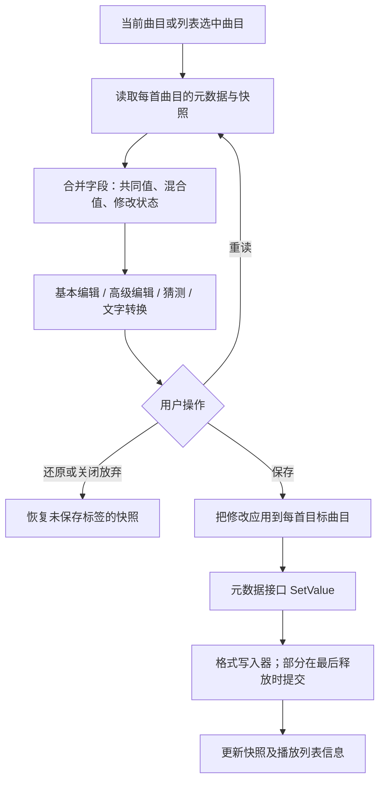

# 原版标签编辑：界面、批量状态、插件接口与实际写入

分析日期：2026-10-02。

本文“当前／缺失／建议”描述的是修复前的分析快照。后续已按建议实施，最新改动与实测结果见 [标签编辑修复记录](TAG_EDITING_RECOVERY.md)。下文保留原分析依据，并补充这次确认的 Lyrics3 写入分支。

## 1. 结论与证据范围

原版的标签编辑是一条完整的数据处理链：选择曲目 → 读取及保存快照 → 合并多曲目的字段状态 → 编辑 → 分发修改 → 调用元数据接口 → 格式写入器提交 → 更新列表信息。基本模式与高级模式操作同一组数据，封面另有接口和状态。

重建版已经恢复了大部分界面操作和逐文件草稿管理，但**不能据此认定标签读写与原版完全一致**。此次确认的主要差异是：

1. 部分原生 ID3 字段尚未映射，重建版把相应新字段写成 `TXXX`。
2. 原版的 `TPE2 ↔ Orchestra` 与重建版的 `TPE2 ↔ AlbumArtist` 需要兼容别名处理。
3. 原版读取优先级还包含 Lyrics3；重建版保留其所在字节，但没有解析这一层。
4. 自动补写 APEv2 的条件、ID3v2 填充大小条件，重建版都扩大成了“任意非空元数据”。
5. 正在播放的文件、对象释放时提交、部分字段失败等路径，不能只依据界面保存按钮的状态判断完成。

另一方面，重建版“保存失败停止属性窗口的上一首／下一首切换”、逐字段记录失败和临时文件替换等设计应保留，不宜照搬原版较弱的错误处理。

### 分析材料

- 原版伪代码：[TTPlayer.exe.pseudo.c](../../reverse/decompiled/TTPlayer.exe.pseudo.c)。下文地址为该样本的虚拟地址。
- 原版二进制：[TTPlayer.exe](../../TTPlayer.exe)。SHA-256：`c7999ea5823469c1684148cac1bd196009824348ccac5cdd45978f8fb574e28c`。
- 原版资源：[ttpres.dll](../../ttpres.dll)，对话框 224、225、372、374，工具栏／位图 149，以及错误提示字符串。
- 重建版界面、工作进程、MP3 内置读写器及已有恢复文档。

初次分析阶段进行了静态代码追踪、二进制数据表读取和关键指令核对，**没有运行音乐文件写入测试，也没有重新进行 XP／Win7 虚拟机测试**。旧文档中的历史测试结果不等于此次新发现的分支已经验证。第三方格式插件的内部序列化也不由主程序伪代码全部覆盖。

反编译器在属性页初始化等位置报告了不可达块，并丢失了部分调用参数。因此，MP3 选项表、歌词判断常量、导航保存返回值和填充条件均结合 EXE 核对，不能仅凭伪代码的局部变量名推断含义。

## 2. 入口与总体结构

| 阶段 | 原版入口 | 行为 |
| --- | --- | --- |
| 主窗口文件属性 | `00464A94`，命令 `0x7D67` | 根据当前曲目、焦点与列表上下文选择对象；必要时转交播放列表 |
| 播放列表文件属性 | `00483C59`，命令 `0x7EF6` | 歌曲列表收集选中项；播放列表栏按对应列表收集曲目 |
| 属性页消息 | `0042E640` | 基本字段、高级表格和编辑工具的分发 |
| 读取／重读 | `0043376F` | 单曲直接处理，多曲目进入进度处理 |
| 保存入口 | `00433927`、`00432DB2` | 将字段修改应用到目标曲目，再进入单曲或批量写入 |
| 插件元数据写入 | `004ADD9C` | 检查能力、取得元数据接口、逐字段设置、释放引用并刷新信息 |
| 关闭 | `00433AF0`、`00430C73` | 恢复尚未保存的标签快照并释放窗口所持对象 |



这张图表示正常流程，不表示原版每个写入阶段都有严格的失败回滚。

## 3. 基本字段、高级字段与混合值

### 3.1 基本页显示什么

EXE 表 `0053B530` 的控制 ID 与字段名如下：

| 控件 ID | 字段 | 用途 |
| --- | --- | --- |
| `0x7D1` | FileName | 文件名显示；不意味着编辑标签会重命名文件 |
| `0x3F1` | Title | 标题 |
| `0x3FD` | Artist | 艺术家 |
| `0x401` | Album | 专辑 |
| `0x405` | Tracknumber | 音轨 |
| `0x406` | Genre | 流派，可输入自定义内容 |
| `0x407` | Date | 年代／日期 |
| `0x408` | Comment | 备注 |
| `0x418` | replaygain_track_gain | 基本页增益显示，高级元数据中可出现该字段 |
| `0x8E8` | SongSource | 歌曲来源显示 |

`004315CF` 响应编辑通知，经 `0042F97D` 找到字段；`0042E28F` 更新合并状态，`004303F5` 标记修改。初始化时通过抑制标记避免程序填入文字被误认为用户编辑。

### 3.2 多曲目不是把所有文本框直接覆盖到每首歌

`0042E0B8` 收集每首曲目的字段，`0042E28F` 按不区分大小写的键名合并，`0042E1B4` 查询共同值和混合状态。`0042E173` 只分发被编辑或删除的字段。

例如选中两首歌：Title 分别为 A、B，Album 都为 C。用户仅将 Album 改为 D，保存后应是 A/D 和 B/D；不能把 Title 的混合显示文本写入文件，也不能因为共同 Title 为空而清掉原有标题。

`0042E38F` 的删除标记与未修改不同：它记录删除状态并清空值，后续写入才能真正删除字段，而非只移除表格的一行。

### 3.3 修改颜色和快照

- `004312D1`、`00431372`、`0043272D`：修改值显示蓝色，混合值显示红色，普通值采用正常颜色。注意 Win32 `COLORREF` 的 `0xFF0000` 是蓝色。
- `0042D47A`：复制标签集合，建立快照；`0042D4BF`：从快照恢复。
- 普通文本框先改合并编辑状态；部分转换命令先应用已有修改，再对各曲目的实际字段集合转换，最后重新合并显示。
- 因而原版并非完全独立的现代草稿模型，但也不是每次按键都直接改写磁盘。

### 3.4 清除、还原、重读不是同一个动作

| 操作 | 原版效果 |
| --- | --- |
| 清除，`00431AF3` | 清除七个基本编辑字段和 `replaygain_track_gain`；不遍历删除全部扩展字段，不同时删除 `replaygain_track_peak`，也不等同于清除封面 |
| 删除高级字段，`00431D0F` | 删除选中的键；之后调整表格选择 |
| 还原，`00431E48` → `00430A16` | 恢复未保存标签的快照；不是重新从磁盘读取；封面操作另行管理 |
| 重新读取，`0043376F` | 重新取文件信息，刷新快照与界面，丢弃相应标签草稿 |
| 关闭，`00433AF0` | 放弃未保存修改；已完成的文件写入不会被关闭操作撤销 |

这也解释了为什么“清除标签”不应直接复用“删除全部增益信息”：两者处理的字段集合不同。

## 4. 高级编辑、文件名猜测与文字转换

### 4.1 高级字段编辑

`00431B34` 打开字段编辑对话框 225，`00431E2B` 复用这一入口。`0042F0C7` 根据添加／编辑模式初始化字段名控件、建议项和历史；编辑现有字段时字段名不按新建方式任意更改。`0042F320` 接受结果并处理键名和历史去重。

高级字段不是仅有七项的固定结构：界面可以增加扩展键。但“允许输入一个键名”与“当前格式插件能够保存该键”是两件事，最终仍由元数据接口和格式写入器决定。

### 4.2 从文件名猜测标签

`004317F5` → 对话框 224 → `0042EE06`／`0042EBAB`：

1. 处理文件路径，去掉最后的文件扩展名。
2. 按模板需要匹配文件名或末尾若干目录层级。
3. 识别 `%(FieldName)`，使用模板中的普通字符作为分隔。
4. 截取并整理文本，写入相应字段修改。

例如 `歌手 - 歌名.mp3` 与 `%(Artist) - %(Title)` 对应；`歌手\专辑\歌名.mp3` 可以使用目录模板。此功能不分析声音、不调用在线识别，也不重命名文件。

表 `00540524` 有七个模板指针，其中可直接读出的六项是：

```text
%(Artist) - %(TrackNumber).%(Title)
%(TrackNumber).%(Artist) - %(Title)
%(Artist)\%(Title)
%(Album)\%(TrackNumber).%(Title)
%(Artist)\%(Album)\%(Title)
%(Genre)\%(Album)\%(Title)
```

**待运行确认的样本异常：**第一个指针 `00517308` 的文件字节以 UTF-16 NUL 开始，后面才是 `(Artist) - %(Title)` 的内容。静态读取该指针得到空串；不能据此断言运行时首项一定为空，也不应把空模板作为重建目标。当前重建版使用完整的 `%(Artist) - %(Title)`，后续应在原版无模板历史的配置下实测首项。

### 4.3 文字转换

- `0043198F`／`004C1BAA` 的首字母大写按 ASCII 字母处理，非字母会重新开始一个词，例如 `DON'T_stop` 会得到 `Don'T_Stop`，并非语言学分词。
- 简繁及代码页转换沿 `00431FDE`／`00430CF6` 处理各曲目的字段内容，不转换界面上的“混合值”占位文字。
- 代码页修复先按原代码页转回字节，再按所选代码页解码；改变代码页选择时存在先恢复原始快照再转换的逻辑，以免多次叠加乱码转换。
- 这一工具与下面的“ID3v2 编码类型”不同：前者修复已有字符串，后者控制保存标签时的字节编码。

## 5. 单曲、批量、播放中的文件与错误处理

### 5.1 线程安排

`0043376F` 的单曲读取在调用路径内直接进行，多曲目通过进度框处理。二进制内保留的函数名明确标出：

- `0043307B`：`CFileInfoDlg::_LoadSoundInfoProc`。
- `00433229`：`CFileInfoDlg::_SaveSoundInfoProc`，后续循环反编译到 `0043332B`。

批量操作是后台线程逐首处理、更新进度、检查终止，不是为每首歌同时启动写线程。终止也不是事务回滚：已经写入的曲目不会恢复为修改前文件。

### 5.2 只读文件的单曲／批量行为不同

单曲保存 `00432DB2` 检测失败后，若是本地只读文件，会使用资源 `0x814F` 询问是否去掉只读属性再重试；一般错误使用 `0x814E`“保存文件失败！”。

批量保存路径先调用 `004C80AC` 清除本地文件只读属性，再调用标签写入；这里没有复用逐文件的上述确认。该差异已结合批量循环指令核对。

因此不能写成“原版所有保存都统一询问只读属性”。重建版统一确认后再清除属性的行为更稳妥，应保留。

### 5.3 正在播放的文件有专门协调

`004AD25D` 在锁保护下优先取得曲目对象保留的 reader（对象 `+0x9C`），增加引用；必要时才重新打开。

单曲显式重读时，`0042D719` 检查是否保留 reader；命中后，`0043376F` 发送 `WM_COMMAND / 0xE102 / lParam=-1`。对应 `00464A5C` 路径临时处理淡出设置并进入停止／重置逻辑，再重新加载信息。

所以不能概括为“原版所有标签操作都停播”，也不能认定它总是在另一个独立 reader 上安全保存。

重建版的隔离工作进程无法共享主进程 reader。当前属性窗口代码没有同等的停止、释放、重新打开协调流程；实际是否发生共享冲突取决于文件、后端及插件，尚需播放中保存／重读的专项测试。

### 5.4 上一首／下一首：修正旧文档结论

`004339EF` 在存在未保存修改时先调用 `00432DB2(1)`，然后继续切换属性窗口中的曲目。二进制关键指令为：

```text
00433A0A  push 1
00433A0C  mov  ebx, esi
00433A0E  call 00432DB2
00433A13  cmp  word ptr [ebp+8], 836h
```

这里没有根据返回值判断是否停止导航。旧文档把“保存失败留在当前曲目”也归为原版一致行为，证据不足，应纠正为：**这是重建版保留的安全策略**。这不等于已经实测原版所有错误／异常情况下都一定切换。

### 5.5 保存返回值并不严格代表全部字段成功

`004ADD9C`：

1. 检查 reader 能力位 `4`。
2. 取得 metadata 接口。
3. 逆序遍历字段，通过虚表槽 6（偏移 `+0x18`）调用设置。
4. 处理空值删除，释放接口，再更新曲目信息。

错误聚合存在弱点：`E_NOTIMPL`、`E_FAIL` 有特殊失败分支；其它负值可能被归为 `S_FALSE(1)`，后续成功又可能把聚合结果置为 `S_OK(0)`。因此结果受字段顺序影响，不能认为原版已经严格追踪了每个失败字段。批量循环对写入返回值的使用也较弱。

重建版工作进程记录每个字段的结果，失败时保留未成功草稿并停止导航，比照搬这些原版细节更合适。

## 6. SetValue 与真正落盘可能发生在不同时间

原版 MP3 的 `004D9E23` 检查可写能力，修改内存键值并设置 dirty；析构路径 `004D9A59` 检测 dirty，再调用 `004D9B56` 写文件。CUE 也有类似的释放时提交路径。

因此：

- `SetValue` 返回成功，可能只表示内存修改被接受。
- 只有相关引用最后释放，才会进入某些插件的实际提交。
- 正在播放时，主播放器仍持有引用，提交时机可能继续后移。
- 析构提交错误不一定能够通过之前的 `SetValue` 返回值完整传到界面。

重建版 `file_info_worker.cpp` 已在输出工作结果前执行 `reader.reset()`，这一步必要。但释放后并没有统一对所有插件字段做完整回读校验，仍不能把每个 `SetValue == S_OK` 等同于“磁盘内容已核验”。后续应针对会延迟提交的插件加入关闭后重新打开验证，并区分接口接受、提交、回读失败。

## 7. MP3 多种标签如何共存

### 7.1 读取优先级按字段合并

二进制表 `0053B580` 与读取器 `004DC174` 对应：

| 界面文字 | 保存值 | 实际顺序 |
| --- | --- | --- |
| APEv2 > ID3v2 > ID3v1 | `0x04080102` | APEv2 → ID3v2 → ID3v1 → Lyrics3 |
| ID3v2 > APEv2 > ID3v1 | `0x08040102` | ID3v2 → APEv2 → ID3v1 → Lyrics3 |
| ID3v1 > ID3v2 > APEv2 | `0x01080402` | ID3v1 → ID3v2 → APEv2 → Lyrics3 |
| ID3v1 > APEv2 > ID3v2 | `0x01040802` | ID3v1 → APEv2 → ID3v2 → Lyrics3 |

编码分别为 `1=ID3v1`、`2=Lyrics3`、`4=APEv2`、`8=ID3v2`，从高字节向低字节解释。旧配置低 16 位为零时补 `0x0102`。

`004DA50D` 只用后来的标签填补缺少或为空的字段，**不是发现 APEv2 后整首歌就完全忽略 ID3v2**。例如 APEv2 只有 Title，ID3v2 仍可补 Artist。

`004DA9F2` 明确检查 `LYRICS200`、`LYRICSBEGIN`，说明 Lyrics3 是实际读取层。它与外置 LRC、ID3v2 的 USLT 不是同一个存储位置。重建版 `MergeMp3Tags` 当前忽略类型 2；保留相应文件字节不能代替解析和优先级合并。

### 7.2 写入类型和自动补写 APEv2

表 `0053B5A0` 有六项：

| 写入类型 | 值 |
| --- | --- |
| ID3v1 | `0x01` |
| ID3v2 | `0x08` |
| APEv2 | `0x04` |
| ID3v1 & ID3v2 | `0x09` |
| ID3v1 & APEv2 | `0x05` |
| ID3v2 & APEv2 | `0x0C` |

`004D9B56` 在没有选择 ID3v2 时，会检查：

- `004D9932`：`replaygain_` 前缀字段及其非空值。
- `004D9979`：`lyrics`／`lyric` 键及其非空值；比较参数已经由二进制字符串确认。

命中时追加 APEv2 位 `4`。这些帮助函数带有遇到匹配项即返回的实现细节，不能扩大解释为“任何一个自定义字段都自动补 APEv2”。

重建版 `WriteMp3` 当前用 `has_metadata`（任意非空字段）触发，因此即使只有普通 Title，选择“ID3v1”也会追加 APEv2。这个条件和相关代码注释都需要修正。封面不能由这一文字字段条件直接推导，应单独验证封面存储策略。

#### 后续补充：ID3v1 与 Lyrics3 的写出顺序

进一步核对 `004DC39E` 和 `004DBBEF`：写入掩码含 ID3v1 位 `1`，且存在非空 `Lyrics` 时，先将歌词从通用文字字段集合移出；之后将其写为 Lyrics3 的 `LYR` 字段，再写 ID3v1。不是始终同时保留 USLT／APEv2 Lyrics 和 Lyrics3 三份歌词。

二进制中 `004DC39E` 使用 `0051CE44` 的 `Lyrics` 字符串，移除字段的调用为 `004D99D6`。`004DBBEF` 生成 `LYRICSBEGIN`、`IND00003110`、`LYR` 加五位长度、歌词正文、六位块长度及 `LYRICS200`；正文限制为五位十进制长度。这是新修复需要补齐的实际写入路径。

### 7.3 原生 ID3 帧映射比七个基本字段更广

EXE 表 `0053CD70` 由原版读取和写入逻辑复用；`004DC59D` 根据字段名选择对应帧：

| 帧 | 原版字段 | 重建版当前情况 |
| --- | --- | --- |
| TIT2 | Title | 已有 |
| TIT3 | Subtitle | 缺少专用映射 |
| TCOP | Copyright | 缺少专用映射 |
| TCOM | Composer | 缺少专用映射 |
| TPE1 | Artist | 已有 |
| TPE2 | Orchestra | 当前映射为 AlbumArtist，缺少原版别名协调 |
| TPE3 | Conductor | 缺少专用映射 |
| TALB | Album | 已有 |
| TRCK | Tracknumber | 已有 |
| TDRC | Date | 已有；原版日期无连字符时还有 TYER 分支 |
| TPUB | Publisher | 缺少专用映射 |
| TCON | Genre | 已有 |
| TENC | Encoder | 缺少专用映射 |
| COMM | Comment | 已有专门正文处理 |
| USLT | Lyrics | 已有专门正文处理 |
| TXXX | 自定义键 | 已有，但不能替代所有专用帧 |
| WXXX | WWWUSER | 缺少对应 URL 帧处理 |

当前 `FrameSemantic` 不识别的上述专用帧通常仍作为原始帧保留，但不会转成可编辑字段；用户新建同名字段时，`BuildId3v2` 又会写成 TXXX。

例如原文件已有 `TCOM=旧作曲者`，在重建版中新加 `Composer=新作曲者`，可能形成旧 TCOM 与新 TXXX 并存。不同读取顺序可能显示不同值；**这是由当前读写代码推导的冲突风险，尚未执行该文件往返用例**。

`Orchestra` 与 `AlbumArtist` 应建立明确别名和冲突规则，保留已有 AlbumArtist／SMTC 能力，不能简单将后者删除或重命名。保存时还要避免同一含义同时残留在原生帧和 TXXX 中。

### 7.4 编码选项与填充

原版属性页二进制 `004311CE`—`0043124F`：ISO-8859-1、UTF-16、UTF-8 的数据值分别是 `0`、`1`、`3`。第三项的下拉索引是 2，但保存值不是 2。重建版 `file_info_mp3_policy.h` 已区分索引和值。

原版标为 ISO-8859-1 的文字编码分支可追到 `0040175C(..., CP_ACP)`，因此不能仅凭标签名称断言它始终采用严格的固定 Latin-1 转换。编辑器代码页修复、界面 Unicode 字符串、最终标签编码需要分别讨论。

`004DCA1E` 的填充逻辑经二进制 `004DCB9B`—`004DCBBE` 核对：

```text
启用填充且生成了标签内容时：
最低空间 = 004D9979 检测到非空歌词 ? 0x800 : 0x400
目标空间 = max(实际需要空间, 最低空间, 原有 ID3v2 空间)
```

这里检查的是序列化时剩余的文字字段：若已按上一节将歌词移入 Lyrics3，ID3v2 这一步不再含歌词。原版常规标签最低 1024 字节，仍含歌词时最低 2048 字节，并保留原有较大的空间；不是固定再追加 1024／2048 字节。重建版目前按任意非空字段选择 2048 字节，导致没有歌词的普通标签也扩大。实际帧本来较大时，这个最低值不一定造成文件大小差异。

### 7.5 修改标签不等于重新编码音频

原版 `004D9B56`／`004DC39E` 等通过文件流调整头尾标签，必要时移动数据。文件总长度和标签结构可改变，流程没有把音频解码后重新压缩作为编辑标签的步骤。

原版流内改写没有展示出完整的临时文件提交保证。重建版 `ReplaceWithTags` 使用同目录临时文件、刷新和替换，属于应保留的文件安全设计；不能为了追求字节布局一致而移除。后续测试应比较音频有效载荷哈希，而非要求整个文件哈希保存前后一致。

## 8. 其它格式、CUE、封面与能力边界

普通格式通过 reader 的能力和 metadata 接口处理，具体字段限制、大小上限、保存方式由对应插件实现。主程序允许编辑某个字符串，并不能证明所有 FLAC、APE、WMA、MP4 等插件都能保存它；需要分别做往返验证。

封面通过独立接口和页面状态处理，可写文字标签不代表可写封面。图片删除、替换、字节大小上限也不能与普通空字符串删除混为一谈。

CUE 是特别明确的例子：

- `004E4069` 编辑 CUE 逻辑轨道元数据，不是直接改底层音频文件的同名标签。
- 检查只读状态，限制 Tracknumber、Lyrics 及不合法键名；空值用于删除。
- `004E30D2` 在最后释放时重新读取 CUE，合并该轨修改，再调用 `004DD8BF` 写出。
- 原版序列化采用本地代码页及重写文本，并有超长字段等限制；不应将这些局限当作必须复制的功能。
- 不能把 metadata 接口相对偏移误读成“只有第一轨允许写入”。

详细依据见 [CUE_IMPLEMENTATION_ANALYSIS.md](CUE_IMPLEMENTATION_ANALYSIS.md) 第 7 节。当前工作进程已有独立 `cue-write` 路由，后续核对应以当前源码为准，不能继续采用早期“CUE 一律只读”的描述。

## 9. 重建版当前状态与建议顺序

### 9.1 对照结论

| 项目 | 当前判断 | 处理方向 |
| --- | --- | --- |
| 基本／高级共享编辑数据、混合值、按曲目差异保存 | 主要结构已恢复 | 保留，补边界用例 |
| 清除基本字段和 gain、还原不等同重读 | 当前代码与已追踪范围相符 | 保留，避免误清 peak／自定义字段 |
| 文件名猜测、大小写及代码页工具 | 已实现主要路径 | 原版首项异常、路径和字符边界仍需专项验证 |
| MP3 选项的 UI 值与索引 | 数据表已恢复 | 保留 |
| 完整原生 ID3 字段集合 | 不完整 | 补读、写、删和旧值去重 |
| TPE2 字段语义 | 有差异 | Orchestra／AlbumArtist 别名及冲突规则 |
| Lyrics3 后备读取 | 缺失 | 补解析、优先级合并及修改后处理 |
| ID3v1 自动追加 APEv2 | 条件过宽 | 按原版具体字段条件修正 |
| ID3v2 填充最低大小 | 条件过宽 | 按非空歌词判断，不按任意元数据判断 |
| 播放中保存／重读 | 架构不同，完整等价未证实 | 对主进程 reader 生命周期做专项验证 |
| 保存失败停留当前项、逐字段失败状态 | 有意更严格 | 保留，不恢复原版错误聚合缺陷 |
| 释放后提交与回读验证 | 已有释放，统一回读不足 | 补能够确认落盘的验证 |
| 临时文件替换、统一只读确认 | 安全性改进 | 保留 |

### 9.2 建议实施顺序

1. **统一元数据映射。**补齐 Subtitle、Copyright、Composer、Conductor、Publisher、Encoder、WWWUSER 等；对 Orchestra／AlbumArtist 定义别名、优先级及唯一写出位置，覆盖读取、增加、修改、删除。
2. **恢复 MP3 具体策略。**修正 APEv2 自动追加与填充判断；加入 Lyrics3 读取及回写时旧内容处理，防止高优先级字段删除后旧内容再次显现。
3. **明确保存完成状态。**保留逐字段失败处理；针对释放时提交的插件重新打开验证；禁止把未核验的内存修改直接标记为已落盘。
4. **补播放中编辑协调。**测试各后端和插件的文件共享；确有需要时有序释放 reader、提交、重开并恢复合理播放状态，不把一次普通编辑都变成无条件停播。
5. **扩展交互和格式回归。**覆盖混合值、只读／不可写混合选择、部分失败、终止、还原、重读、导航、CUE 及封面，同时继续使用隔离工作进程保护主界面。

以上为初次分析提出的实施顺序；后续修复已完成这些主要路径，范围及边界见 [标签编辑修复记录](TAG_EDITING_RECOVERY.md)。

### 9.3 后续测试矩阵

全部使用独立测试文件副本；测试代码保留在 `rebuild/tests`，不加入发行包或 Actions。

- 各专用帧只存在于原生帧、只存在于 TXXX、两者冲突：原版与重建版互读，修改和删除后重开。
- 同时有 APEv2／ID3v2／ID3v1／Lyrics3：四种读取顺序，缺字段补全，空值与删除。
- 六种写入类型：只有 Title、有歌词、有 ReplayGain、自定义字段、封面及这些内容的组合。
- 填充开／关：没有歌词、有歌词、既有标签大于最低大小、实际内容大于最低大小。
- 多曲目只改一个字段，验证其它混合值不被覆盖；部分不可写、只读取消、单文件失败、批量终止。
- 音乐正在播放／暂停／停止时保存和重读，确认读写共享、播放状态和最终内容。
- 关闭后回读；比较音频有效载荷，确认未发生音频重编码或截断。
- 主机、XP、Win7 分别运行相关编码和插件用例，历史测试不能替代新增分支覆盖。

## 10. 源码定位索引

### 原版关键函数

| 功能 | 地址 |
| --- | --- |
| 字段合并／查共同值／更新／删除 | `0042E0B8`、`0042E1B4`、`0042E28F`、`0042E38F` |
| 将编辑字段应用到曲目 | `0042E173`、`0041B722`、`0041B594` |
| 建立／恢复快照 | `0042D47A`、`0042D4BF`、`00430A16` |
| 猜测模板解析 | `0042EAB9`、`0042EE06`、`0042EBAB` |
| 字段编辑窗口 | `0042F0C7`、`0042F320`、`00431B34` |
| 保存／重读／导航／关闭 | `00432DB2`、`0043376F`、`004339EF`、`00433AF0` |
| 批量读取／保存 | `0043307B`、`00433229`、`0043332B` |
| 取 reader／写 metadata／更新曲目信息 | `004AD25D`、`004ADD9C`、`004ADFB2` |
| MP3 设置／析构提交 | `004D9E23`、`004D9A59`、`004D9B56` |
| 增益／歌词专门判断 | `004D9932`、`004D9979` |
| MP3 合并优先级／合并缺项 | `004DC174`、`004DA50D` |
| Lyrics3 读取／写入 | `004DA9F2`／`004DC39E`、`004DBBEF` |
| ID3 字段写出／空间填充 | `004DC59D`、`004DCA1E` |
| CUE 设置／提交／序列化 | `004E4069`、`004E30D2`、`004DD8BF` |

### 重建版定位（本次分析时）

- [player_window_playlist_properties.cpp](../src/ui/player_window_playlist_properties.cpp)：`FileInfoRecord`／`FileInfoContext`；`CombineRecords`、`CollectFileInfoChanges`、`BeginRead`、`BeginSave`、`ApplyWriteResult`、`NavigateFileInfo`、`FileInfoTransform`。约 1713 行为清除，1730 行为还原。
- [file_info_editing.h](../src/ui/file_info_editing.h)：字段差异、字符串转换、文件名模板辅助函数。
- [file_info_mp3_policy.h](../src/ui/file_info_mp3_policy.h)：读取顺序、写入类型、编码选项的实际值。
- [file_info_worker.cpp](../src/app/file_info_worker.cpp)：`cue-write` 分支约 397 行；MP3 内置写入约 428 行；插件逐字段写入约 459 行；`reader.reset()` 约 493 行。
- [builtin_file_info.cpp](../src/audio/builtin_file_info.cpp)：`FrameSemantic` 约 385 行、`DecodeId3Frame` 约 431 行、`MergeMp3Tags` 约 777 行、`BuildId3v2` 约 1181 行、填充约 1235 行、`ReplaceWithTags` 约 1455 行、`WriteMp3` 约 1490 行。
- [FILE_PROPERTIES_RECOVERY.md](FILE_PROPERTIES_RECOVERY.md)：先前界面恢复及 2026-09-21 的历史测试记录；导航失败归因已经依据本次二进制核对纠正。
